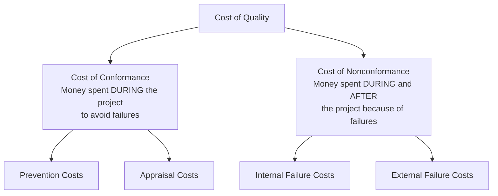
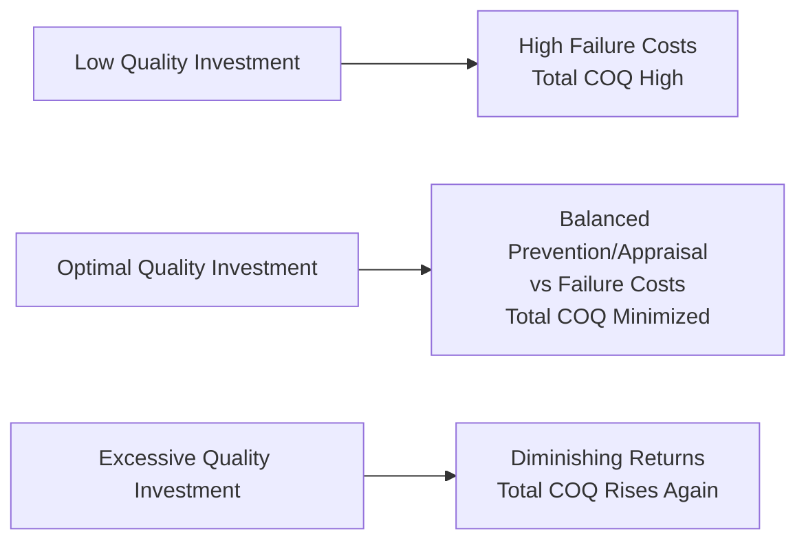

## Cost of Quality

### Definition

Cost of Quality (COQ) is a framework for evaluating the total costs incurred to ensure quality, encompassing both the costs of achieving conformance to requirements (prevention and appraisal) and the costs incurred due to nonconformance (internal and external failure). It is used during Plan Quality Management to inform quality investment decisions and referenced throughout Manage Quality and Control Quality to evaluate the effectiveness of quality processes.

The underlying premise is that spending money to prevent defects is generally less costly than paying for the consequences of defects after they occur — but this relationship has diminishing returns, meaning there is an optimal level of quality investment rather than an assumption that more spending is always better.

### The Four Cost Categories

| Category | Type | Timing | Description | Examples |
| --- | --- | --- | --- | --- |
| **Prevention** | Conformance | Before defects occur | Costs to keep defects out of the product in the first place | Training, documenting processes, equipment selection, quality planning time |
| **Appraisal** | Conformance | During production | Costs to assess/measure quality | Testing, inspections, destructive testing loss, audits |
| **Internal Failure** | Nonconformance | Before delivery to customer | Costs from defects found before the customer receives the product | Rework, scrap, re-testing |
| **External Failure** | Nonconformance | After delivery to customer | Costs from defects found after delivery | Liabilities, warranty work, lost business, product recalls |

### Conformance vs. Nonconformance

**Cost of Conformance** — money spent during the project to avoid failures, generally the more cost-effective investment category. Includes both prevention (proactive, process-focused) and appraisal (detective, inspection-focused) spending.

**Cost of Nonconformance** — money spent during and after the project because of failures. This category typically carries a cost multiplier effect: the later a defect is discovered in the project or product life cycle, the more expensive it becomes to fix.

**The 1-10-100 Rule** (a commonly cited heuristic in quality management): if it costs $1 to prevent a defect during design, it may cost $10 to fix during production/testing, and $100 or more to fix after the product reaches the customer. [Inference: the specific 1-10-100 ratio is a widely used illustrative heuristic rather than a universally measured constant; actual multipliers vary significantly by industry, defect type, and product complexity.]

### Cost of Quality Curve

### Cost of Quality Curve Diagram (svg_diagram)

<svg xmlns="http://www.w3.org/2000/svg" viewBox="0 0 680 280">
<text x="340" y="20" font-size="14" font-weight="bold" text-anchor="middle" fill="#222">Cost of Quality - Optimal Investment Point (svg_diagram)</text>
<line x1="60" y1="240" x2="620" y2="240" stroke="#333" stroke-width="1.5" />
<line x1="60" y1="40" x2="60" y2="240" stroke="#333" stroke-width="1.5" />
<text x="340" y="265" font-size="10" text-anchor="middle" fill="#555">Investment in Prevention/Appraisal</text>
<text x="25" y="140" font-size="10" text-anchor="middle" fill="#555" transform="rotate(-90 25 140)">Cost</text>
<path d="M70,60 C150,90 220,130 300,155 C380,175 450,185 550,195" fill="none" stroke="#dc2626" stroke-width="2" />
<text x="480" y="200" font-size="9" fill="#dc2626">Failure Costs (decreasing)</text>
<path d="M70,220 C150,200 250,175 350,165 C450,160 520,165 580,180" fill="none" stroke="#2563eb" stroke-width="2" />
<text x="440" y="150" font-size="9" fill="#2563eb">Prevention/Appraisal Costs (increasing)</text>
<path d="M70,180 C150,150 220,140 280,138 C360,140 450,155 580,190" fill="none" stroke="#16a34a" stroke-width="3" />
<text x="330" y="120" font-size="9" fill="#16a34a" font-weight="bold">Total COQ (U-shaped)</text>
<circle cx="290" cy="138" r="5" fill="#d97706" />
<text x="290" y="122" font-size="9" text-anchor="middle" fill="#d97706" font-weight="bold">Optimal Point</text>
<line x1="290" y1="138" x2="290" y2="240" stroke="#d97706" stroke-width="1" stroke-dasharray="3,2" />
</svg>

### Worked Example

A software development project evaluates two quality investment scenarios over the product's first year post-launch:

**Scenario A: Minimal Testing Investment**

| Category | Cost |
| --- | --- |
| Prevention (basic coding standards) | $5,000 |
| Appraisal (manual testing, limited coverage) | $15,000 |
| Internal Failure (pre-release bug fixes) | $25,000 |
| External Failure (post-release patches, support tickets, reputation) | $180,000 |
| **Total COQ** | **$225,000** |

**Scenario B: Robust Testing Investment**

| Category | Cost |
| --- | --- |
| Prevention (coding standards, static analysis tooling, developer training) | $20,000 |
| Appraisal (automated test suite, code review process, QA staffing) | $60,000 |
| Internal Failure (pre-release bug fixes, caught earlier and cheaper) | $15,000 |
| External Failure (post-release patches, support tickets) | $25,000 |
| **Total COQ** | **$120,000** |

Despite Scenario B spending $60,000 more on conformance activities (prevention + appraisal: $80,000 vs. $20,000), its total Cost of Quality is **$105,000 lower**, because the reduction in external failure costs ($155,000 saved) far outweighs the additional conformance investment. This illustrates the general principle that under-investment in conformance activities in software development tends to shift costs downstream into far more expensive failure categories, though the specific ratio varies by project and defect severity.

### Applying COQ in Practice

**During Plan Quality Management:**

- Used in cost-benefit analysis to justify investment in prevention/appraisal activities (training programs, testing infrastructure, inspection staffing)
- Informs decisions on quality tool selection and testing rigor level

**During Manage Quality (QA):**

- Process audits and quality improvement initiatives are themselves cost-of-conformance investments, evaluated against their effect on reducing failure costs

**During Control Quality (QC):**

- Actual defect data, rework hours, and warranty claims are tracked and categorized into the four COQ categories to measure whether quality investment is producing the intended cost reduction

### Common Pitfalls

- Treating quality investment as a pure cost center without measuring its offsetting effect on failure costs, leading to under-investment
- Assuming more prevention/appraisal spending is always better — ignoring the diminishing-returns portion of the COQ curve, where additional investment no longer meaningfully reduces failure costs
- Failing to track failure costs (especially external failure costs like reputation damage and lost business) with the same rigor as conformance costs, understating total COQ
- Using COQ analysis only at project initiation and never revisiting it as actual defect and rework data becomes available during execution
- Confusing Cost of Quality with the broader concept of "cost of the quality management plan" — COQ specifically categorizes conformance vs. nonconformance spending, not all quality-related administrative overhead
- Applying a one-size-fits-all COQ ratio across different deliverable types, when defect cost multipliers can vary significantly by component criticality (e.g., safety-critical vs. cosmetic defects)

### Related Topics

- Plan Quality Management
- Managing Quality (Quality Assurance)
- Controlling Quality
- Estimate Costs
- Life Cycle Costing
- Continuous Improvement (Plan-Do-Check-Act)