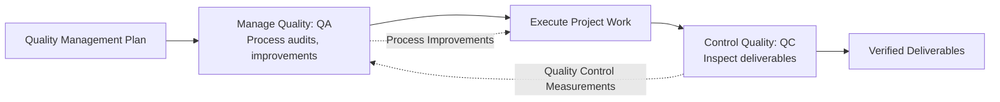
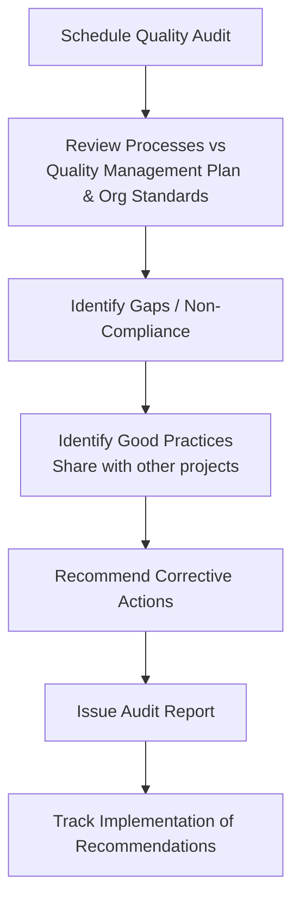

## Managing Quality

### Definition

Manage Quality is the process of translating the quality management plan into executable quality activities that incorporate the organization's quality policies into the project. It is a process within the Executing Process Group, often referred to as **Quality Assurance (QA)**, and is distinct from Control Quality (Quality Control), which operates within the Monitoring and Controlling Process Group.

Manage Quality is a proactive, process-focused activity: it increases the probability of meeting quality objectives and identifying ineffective processes and causes of poor quality, using data generated during Control Quality activities.

### Manage Quality vs. Control Quality

| Aspect | Manage Quality (QA) | Control Quality (QC) |
| --- | --- | --- |
| Process Group | Executing | Monitoring and Controlling |
| Focus | Process-oriented — improving how work is done | Product-oriented — verifying what was produced |
| Nature | Proactive, preventive | Reactive, detective |
| Timing | Throughout the project, continuously | At defined points, typically on deliverables |
| Primary Question | "Are we following the right processes?" | "Does this deliverable meet requirements?" |
| Example Activities | Process audits, quality improvement recommendations | Inspections, testing, control charts |
| Audience | Entire organization/project team (systemic improvement) | Specific deliverables/work products |

### Inputs

**Project Management Plan** — quality management plan (defines the QA approach and standards)

**Project Documents**

- Lessons learned register
- Quality control measurements — results from Control Quality, used as input to evaluate process effectiveness
- Quality metrics
- Risk report

**Organizational Process Assets** — quality management system, quality policy, audit results, historical process performance data

### Tools and Techniques

| Technique | Description |
| --- | --- |
| Data Gathering (Checklists) | Structured lists to verify process steps are followed consistently |
| Data Analysis | Alternatives analysis, document analysis, process analysis, root cause analysis |
| Decision Making | Multicriteria decision analysis to evaluate quality improvement options |
| Data Representation | Affinity diagrams, cause-and-effect (fishbone/Ishikawa) diagrams, flowcharts, histograms, matrix diagrams, scatter diagrams |
| Audits | Structured, independent review to determine whether project activities comply with organizational and project policies, processes, and procedures |
| Design for X (DfX) | Set of technical guidelines applied during design to optimize a specific aspect (e.g., Design for Manufacturing, Design for Reliability, Design for Maintainability) |
| Problem Solving | Systematic approach: define the problem, identify root causes, generate solutions, implement, verify effectiveness |
| Quality Improvement Methods | Plan-Do-Check-Act (PDCA), Six Sigma, Lean, Kaizen |

### Root Cause Analysis and the Fishbone Diagram (svg_diagram)

<svg xmlns="http://www.w3.org/2000/svg" viewBox="0 0 700 320">
<text x="350" y="20" font-size="14" font-weight="bold" text-anchor="middle" fill="#222">Cause-and-Effect (Fishbone/Ishikawa) Diagram (svg_diagram)</text>
<line x1="80" y1="170" x2="600" y2="170" stroke="#333" stroke-width="2" />
<polygon points="600,170 580,160 580,180" fill="#333" />
<rect x="600" y="150" width="90" height="40" rx="4" fill="#fecaca" stroke="#dc2626" />
<text x="645" y="174" font-size="10" text-anchor="middle" fill="#7f1d1d">Effect </text>
<text x="645" y="174" font-size="10" text-anchor="middle" fill="#7f1d1d">Defect</text>
<line x1="150" y1="170" x2="200" y2="80" stroke="#555" stroke-width="1.5" />
<text x="150" y="70" font-size="10" fill="#333">People</text>
<line x1="250" y1="170" x2="300" y2="80" stroke="#555" stroke-width="1.5" />
<text x="255" y="70" font-size="10" fill="#333">Process</text>
<line x1="350" y1="170" x2="400" y2="80" stroke="#555" stroke-width="1.5" />
<text x="355" y="70" font-size="10" fill="#333">Equipment</text>
<line x1="150" y1="170" x2="200" y2="260" stroke="#555" stroke-width="1.5" />
<text x="150" y="280" font-size="10" fill="#333">Materials</text>
<line x1="250" y1="170" x2="300" y2="260" stroke="#555" stroke-width="1.5" />
<text x="255" y="280" font-size="10" fill="#333">Environment</text>
<line x1="350" y1="170" x2="400" y2="260" stroke="#555" stroke-width="1.5" />
<text x="350" y="280" font-size="10" fill="#333">Measurement</text>
</svg>

### Quality Audits

A formal, structured review process:

Audits can be internal (conducted by the organization's own quality team) or external (conducted by an independent third party, often required for regulatory compliance certifications such as ISO 9001).

### Design for X (DfX)

A category of guidelines applied during the design phase to optimize a specific characteristic of the final product. Common variants:

| DfX Variant | Optimization Focus |
| --- | --- |
| Design for Manufacturing (DfM) | Ease and cost-efficiency of production |
| Design for Reliability (DfR) | Long-term dependable performance |
| Design for Maintainability (DfMt) | Ease of future repair/servicing |
| Design for Cost (DfC) | Minimizing total lifecycle cost |
| Design for Assembly (DfA) | Simplifying assembly processes |

DfX techniques link Manage Quality directly to downstream Life Cycle Costing considerations, since design decisions made during Manage Quality activities affect long-term operational and maintenance costs.

### Worked Example

A construction project's Control Quality activities reveal a recurring pattern: 15% of concrete pours over the past two months failed strength testing and required rework.

**Manage Quality (QA) response:**

1. **Data Analysis**: Quality control measurements from Control Quality are reviewed — failures cluster around pours conducted during a specific shift and involving a specific batch supplier
2. **Root Cause Analysis (Fishbone)**: Investigation identifies contributing factors across categories — Materials (variable batch quality from one supplier), People (inconsistent curing procedure adherence on the night shift), Process (no standardized curing checklist)
3. **Process Analysis**: Reveals the curing procedure documentation was inconsistently followed, particularly on the night shift with less experienced crew supervision
4. **Corrective Actions Recommended**:
   - Switch to a qualified alternate concrete supplier for future pours
   - Implement a mandatory curing checklist (Design for Reliability principle) with supervisor sign-off
   - Conduct a quality audit of night-shift procedures specifically
5. **Quality Audit** scheduled to verify the new checklist procedure is being followed correctly across all shifts within two weeks of implementation
6. **Process Improvement Plan** updated to reflect the new curing checklist as standard procedure, and lessons learned register updated to prevent recurrence on future projects

### Outputs

**Quality Reports** — project documents that include quality management issues, recommendations for process/product/resource improvements, and a summary of findings from Control Quality

**Test and Evaluation Documents** — checklists and detailed requirements-verification documents used as inputs to Control Quality

**Change Requests** — recommended corrective actions, preventive actions, or defect repairs resulting from quality issues identified

**Project Management Plan Updates** — quality management plan, scope/schedule/cost baselines if corrective action affects them

**Project Documents Updates** — issue log, lessons learned register, risk register

### Common Pitfalls

- Confusing Manage Quality (process-focused QA) with Control Quality (product-focused QC), leading to a purely inspection-driven quality approach that misses systemic process issues
- Conducting audits reactively only after major defects occur, rather than proactively and periodically as a preventive practice
- Failing to close the loop between Control Quality measurements and Manage Quality process improvements, so recurring defect patterns are never addressed at the root cause
- Treating quality audits as punitive rather than improvement-focused, discouraging honest reporting of process gaps
- Overlooking Design for X considerations during early design phases, missing opportunities to build quality and lifecycle efficiency in at the source rather than inspecting for it later
- Not sharing quality improvement lessons learned across the organization, causing the same process issues to recur on future projects

### Related Topics

- Plan Quality Management
- Controlling Quality
- Cost of Quality
- Root Cause Analysis
- Continuous Improvement (Plan-Do-Check-Act)
- Perform Integrated Change Control