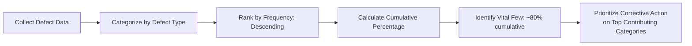
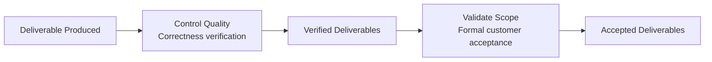

## Controlling Quality

### Definition

Control Quality is the process of monitoring and recording results of executing quality management activities to assess performance and ensure the project outputs are complete, correct, and meet customer expectations. It is a process within the Monitoring and Controlling Process Group, often referred to as **Quality Control (QC)**, and is distinct from Manage Quality (Quality Assurance), which is process-focused and proactive.

Control Quality verifies that deliverables and work meet the quality requirements specified by relevant stakeholders, using measurement tools and statistical techniques to determine conformance.

### Inputs

**Project Management Plan** — quality management plan (defines acceptance criteria, quality metrics, control approach)

**Project Documents**

- Lessons learned register
- Quality metrics
- Test and evaluation documents

**Approved Change Requests** — verification that implemented changes were correctly executed

**Deliverables** — the actual work products being inspected/tested

**Work Performance Data** — raw observations on technical performance, schedule/cost status related to quality activities

**Enterprise Environmental Factors / Organizational Process Assets** — quality standards, templates, historical databases

### Tools and Techniques

| Technique | Description |
| --- | --- |
| Data Gathering | Checklists, check sheets (tally sheets), statistical sampling |
| Data Analysis | Performance reviews, root cause analysis |
| Inspection | Examination of a work product to determine conformance to documented standards |
| Testing/Product Evaluations | Systematic investigation to provide objective information about product quality against requirements |
| Data Representation | Cause-and-effect diagrams, control charts, histograms, scatter diagrams |
| Meetings | Approved change requests review, retrospectives/lessons learned |

### Seven Basic Quality Tools

Control Quality commonly employs the "Seven Basic Quality Tools" (7QC Tools), a standard set of data representation and analysis techniques:

| Tool | Purpose |
| --- | --- |
| Cause-and-Effect Diagram (Fishbone/Ishikawa) | Traces effects (defects) back to root causes across categories |
| Flowchart | Visualizes process steps to identify where defects may enter |
| Check Sheet | Tally sheet for organizing facts to facilitate effective data collection |
| Pareto Diagram | Histogram combined with a cumulative line, showing defect frequency ranked by significance (80/20 rule) |
| Histogram | Bar chart showing the distribution of numerical data |
| Control Chart | Time-series chart showing whether a process is stable/in control |
| Scatter Diagram | Plots two variables to identify possible correlation |

### Control Charts in Detail

Control charts determine whether a process is stable and predictable ("in control") by plotting data points against a central line (mean) and upper/lower control limits, typically set at ±3 standard deviations.

**Key Terms:**

| Term | Definition |
| --- | --- |
| Upper Control Limit (UCL) | Upper boundary of acceptable process variation, typically mean + 3σ |
| Lower Control Limit (LCL) | Lower boundary of acceptable process variation, typically mean - 3σ |
| Specification Limits | Customer/contractual requirements defining acceptability; may differ from control limits |
| Out of Control | A data point falls outside control limits, OR seven consecutive points fall on one side of the mean (**Rule of Seven**) |
| Assignable Cause (Special Cause Variation) | Variation due to an identifiable, non-random factor requiring investigation |
| Common Cause Variation | Normal, expected variation inherent in the process |

**Rule of Seven** — if seven consecutive data points fall on the same side of the mean, the process is considered statistically "out of control" (non-random), even if no individual point falls outside the control limits, since this pattern is highly improbable under normal random variation.

### Control Chart Diagram (svg_diagram)

<svg xmlns="http://www.w3.org/2000/svg" viewBox="0 0 680 280">
<text x="340" y="20" font-size="14" font-weight="bold" text-anchor="middle" fill="#222">Control Chart with UCL/LCL (svg_diagram)</text>
<line x1="60" y1="240" x2="620" y2="240" stroke="#333" stroke-width="1.5" />
<line x1="60" y1="40" x2="60" y2="240" stroke="#333" stroke-width="1.5" />
<line x1="60" y1="80" x2="620" y2="80" stroke="#dc2626" stroke-dasharray="4,2" />
<text x="625" y="84" font-size="9" fill="#dc2626">UCL</text>
<line x1="60" y1="140" x2="620" y2="140" stroke="#16a34a" stroke-width="1.5" />
<text x="625" y="144" font-size="9" fill="#16a34a">Mean</text>
<line x1="60" y1="200" x2="620" y2="200" stroke="#dc2626" stroke-dasharray="4,2" />
<text x="625" y="204" font-size="9" fill="#dc2626">LCL</text>

<polyline points="90,150 140,130 190,145 240,160 290,120 340,155 390,60 440,150 490,145 540,155 590,148" fill="none" stroke="`#2563eb`" stroke-width="2" />

<circle cx="90" cy="150" r="4" fill="`#2563eb`" />

<circle cx="140" cy="130" r="4" fill="`#2563eb`" />

<circle cx="190" cy="145" r="4" fill="`#2563eb`" />

<circle cx="240" cy="160" r="4" fill="`#2563eb`" />

<circle cx="290" cy="120" r="4" fill="`#2563eb`" />

<circle cx="340" cy="155" r="4" fill="`#2563eb`" />

<circle cx="390" cy="60" r="5" fill="`#dc2626`" />

<text x="390" y="50" font-size="9" text-anchor="middle" fill="`#dc2626`">Out of Control</text>

<circle cx="440" cy="150" r="4" fill="`#2563eb`" />

<circle cx="490" cy="145" r="4" fill="`#2563eb`" />

<circle cx="540" cy="155" r="4" fill="`#2563eb`" />

<circle cx="590" cy="148" r="4" fill="`#2563eb`" />

<text x="340" y="260" font-size="10" text-anchor="middle" fill="#555">Sample Number (Time-Ordered)</text>

</svg>

### Pareto Analysis Example

Pareto diagrams apply the 80/20 principle — typically, roughly 80% of problems stem from roughly 20% of root causes — to prioritize corrective action efforts:

| Defect Type | Frequency | Cumulative % |
| --- | --- | --- |
| Surface Scratches | 145 | 48% |
| Dimension Out of Tolerance | 90 | 78% |
| Color Mismatch | 35 | 90% |
| Packaging Damage | 20 | 97% |
| Other | 10 | 100% |

In this example, addressing Surface Scratches and Dimension Out of Tolerance alone (the "vital few") would resolve 78% of total defects, making these the priority for root cause investigation and corrective action, ahead of lower-frequency categories.

### Statistical Sampling

Rather than inspecting 100% of output (often cost-prohibitive), Control Quality frequently uses statistical sampling — selecting a representative subset of the population for inspection, based on an **Acceptable Quality Level (AQL)** and sampling plan (e.g., per ANSI/ASQ Z1.4 or ISO 2859 standards for attribute sampling).

$$\text{Sample Size} = f(\text{lot size, AQL, inspection level})$$

[Inference: statistical sampling plan tables and formulas vary by the specific standard applied (e.g., ANSI/ASQ Z1.4 single vs. double vs. multiple sampling plans); the appropriate sample size is looked up from standardized tables rather than calculated from a single universal formula.]

### Worked Example

A circuit board manufacturer applies Control Quality to a production run of 5,000 units.

1. **Statistical sampling**: AQL of 1.5% selected per organizational quality policy; sampling plan indicates inspecting 200 units from the lot
2. **Inspection results**: 6 defective units found in the sample of 200
3. **Pareto analysis** of defect types among the 6 defects: 4 are solder joint failures, 1 is a component placement error, 1 is a labeling error
4. **Control chart review**: Solder joint failure rate plotted over the last 20 production runs shows the last 8 consecutive points above the mean line — triggering the **Rule of Seven**, indicating an assignable cause despite no individual point exceeding the UCL
5. **Root cause investigation** (feeding back into Manage Quality) identifies a recent solder paste supplier change as the probable assignable cause
6. **Corrective action**: revert to the prior qualified solder paste supplier; re-inspect the next three production runs at increased sampling frequency to confirm the process returns to statistical control

### Outputs

**Quality Control Measurements** — documented results of Control Quality activities, fed back into Manage Quality (QA) for process improvement evaluation

**Verified Deliverables** — goal of Control Quality; deliverables verified for correctness, feeding into Validate Scope for formal acceptance

**Work Performance Information** — quality performance data correlated and contextualized (e.g., trends, categorized defect data)

**Change Requests** — corrective actions or defect repairs resulting from quality issues

**Project Management Plan Updates / Project Documents Updates** — quality management plan, issue log, lessons learned register, risk register

### Relationship to Validate Scope

Control Quality is generally performed before Validate Scope: Control Quality verifies deliverables are **correct** (meet quality requirements), while Validate Scope formalizes **acceptance** by the customer/sponsor. Verified deliverables are a required input to Validate Scope.

### Common Pitfalls

- Confusing Control Quality (QC, product-focused, Monitoring & Controlling) with Manage Quality (QA, process-focused, Executing)
- Relying solely on final inspection (100% detection) rather than statistical process control, missing systemic issues that control charts would reveal earlier
- Ignoring the Rule of Seven and similar non-random patterns because no individual point exceeds the control limits, missing early warning signs of process drift
- Failing to distinguish control limits from specification limits — a process can be statistically "in control" (stable, predictable) while still producing output outside customer specification limits, or vice versa
- Not feeding Quality Control Measurements back into Manage Quality, missing the opportunity for systemic process improvement
- Applying Pareto analysis once and never revisiting it, missing shifts in the dominant defect categories over time as corrective actions take effect

### Related Topics

- Plan Quality Management
- Managing Quality (Quality Assurance)
- Cost of Quality
- Validate Scope
- Root Cause Analysis
- Statistical Process Control