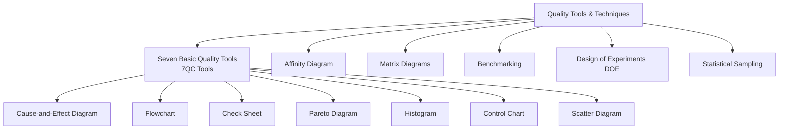
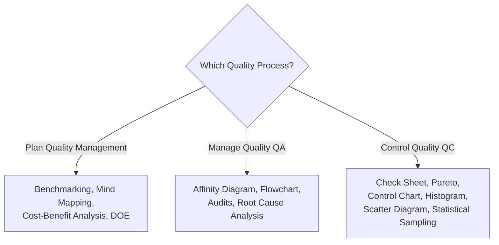

## Quality Tools and Techniques

### Overview

Quality Tools and Techniques encompass the standard set of data gathering, data analysis, and data representation methods used across all three Project Quality Management processes — Plan Quality Management, Manage Quality, and Control Quality. These tools provide structured, often visual, ways to identify quality issues, analyze root causes, and communicate quality performance to stakeholders.

---

### The Seven Basic Quality Tools (7QC Tools)

**1. Cause-and-Effect Diagram (Fishbone/Ishikawa)**

Traces an undesirable effect (defect, problem) back to its possible root causes, typically organized across standard categories: People, Process, Equipment, Materials, Environment, Measurement (sometimes summarized as the "6 M's": Man, Machine, Method, Material, Milieu, Measurement).

**2. Flowchart**

Visual representation of a process, showing the sequence of steps, decision points, and alternative paths. Useful for identifying where in a process defects are most likely to be introduced, or where process steps are missing/redundant.

**3. Check Sheet (Tally Sheet)**

A structured form for collecting and organizing data in real time as it is generated, typically used to record the frequency of specific events or defect types during data collection, feeding directly into Pareto and histogram analysis.

**4. Pareto Diagram**

A specialized histogram combined with a cumulative frequency line, ranking causes/defect types by frequency to identify the "vital few" contributing to the majority of problems (the 80/20 principle).

**5. Histogram**

A bar chart showing the frequency distribution of a numerical variable, useful for understanding the shape, spread, and central tendency of process data (e.g., normal distribution vs. skewed distribution).

**6. Control Chart**

A time-ordered plot of process data against a central line (mean) and upper/lower control limits, used to determine whether a process is stable ("in control") or exhibiting non-random variation requiring investigation.

**7. Scatter Diagram**

Plots two variables against each other to visually assess whether a correlation exists (e.g., temperature vs. defect rate), informing hypotheses about causal relationships for further investigation.

### Seven Basic Quality Tools Overview (svg_diagram)

<svg xmlns="http://www.w3.org/2000/svg" viewBox="0 0 700 340">
<text x="350" y="20" font-size="14" font-weight="bold" text-anchor="middle" fill="#222">Seven Basic Quality Tools (svg_diagram)</text>
<rect x="20" y="45" width="150" height="70" rx="5" fill="#dbeafe" stroke="#2563eb" />
<text x="95" y="75" font-size="10" font-weight="bold" text-anchor="middle" fill="#1e3a8a">Cause-and-Effect</text>
<text x="95" y="92" font-size="8" text-anchor="middle" fill="#1e3a8a">Root cause exploration</text>
<rect x="190" y="45" width="150" height="70" rx="5" fill="#dcfce7" stroke="#16a34a" />
<text x="265" y="75" font-size="10" font-weight="bold" text-anchor="middle" fill="#14532d">Flowchart</text>
<text x="265" y="92" font-size="8" text-anchor="middle" fill="#14532d">Process sequence mapping</text>
<rect x="360" y="45" width="150" height="70" rx="5" fill="#fef3c7" stroke="#d97706" />
<text x="435" y="75" font-size="10" font-weight="bold" text-anchor="middle" fill="#78350f">Check Sheet</text>
<text x="435" y="92" font-size="8" text-anchor="middle" fill="#78350f">Real-time data tally</text>
<rect x="530" y="45" width="150" height="70" rx="5" fill="#fee2e2" stroke="#dc2626" />
<text x="605" y="75" font-size="10" font-weight="bold" text-anchor="middle" fill="#7f1d1d">Pareto Diagram</text>
<text x="605" y="92" font-size="8" text-anchor="middle" fill="#7f1d1d">80/20 prioritization</text>
<rect x="100" y="140" width="150" height="70" rx="5" fill="#ede9fe" stroke="#7c3aed" />
<text x="175" y="170" font-size="10" font-weight="bold" text-anchor="middle" fill="#4c1d95">Histogram</text>
<text x="175" y="187" font-size="8" text-anchor="middle" fill="#4c1d95">Frequency distribution</text>
<rect x="275" y="140" width="150" height="70" rx="5" fill="#cffafe" stroke="#0891b2" />
<text x="350" y="170" font-size="10" font-weight="bold" text-anchor="middle" fill="#164e63">Control Chart</text>
<text x="350" y="187" font-size="8" text-anchor="middle" fill="#164e63">Process stability over time</text>
<rect x="450" y="140" width="150" height="70" rx="5" fill="#fce7f3" stroke="#db2777" />
<text x="525" y="170" font-size="10" font-weight="bold" text-anchor="middle" fill="#831843">Scatter Diagram</text>
<text x="525" y="187" font-size="8" text-anchor="middle" fill="#831843">Correlation between variables</text>
</svg>

---

### Additional Quality Management Tools

**Affinity Diagram**

Organizes large numbers of ideas (typically generated through brainstorming) into related groupings for review and analysis, helping teams identify patterns and major themes among many disparate observations or ideas.

**Matrix Diagrams**

Data analysis technique that uses a matrix structure to show relationships between two, three, or four groups of factors — helpful for showing the strength of relationships between quality factors and organizational responsibilities or process steps.

**Benchmarking**

Comparing actual or planned project practices to those of comparable projects (internal or external to the organization) to identify best practices, generate improvement ideas, and provide a basis for measuring quality performance.

**Design of Experiments (DOE)**

A statistical method for identifying which factors may influence specific variables of a product or process under development or in production, by systematically varying inputs and analyzing the effect on outputs — used to optimize products/processes with fewer experimental trials than testing every combination.

**Statistical Sampling**

Selecting a representative subset (sample) of a population of interest for inspection, based on a defined sampling plan (e.g., AQL-based standards such as ANSI/ASQ Z1.4), rather than inspecting the entire population — used when 100% inspection is cost-prohibitive or destructive.

**Mind Mapping**

Visual technique used to consolidate ideas generated through individual brainstorming sessions into a single map, useful in early quality planning to reflect commonality and differences in understanding and generate new ideas.

### Tool Selection by Process

### Worked Example: Combining Multiple Tools

An electronics assembly line experiences a rise in defective units:

1. **Check Sheet** used on the production floor for two weeks to tally defect occurrences by type and shift
2. **Pareto Diagram** built from check sheet data reveals: Solder defects (52%), Component misalignment (28%), Labeling errors (12%), Other (8%) — solder defects and misalignment together account for 80% of issues
3. **Cause-and-Effect Diagram** built specifically for solder defects, identifying candidate root causes across People (training gaps on night shift), Equipment (aging soldering iron calibration), Materials (new solder paste batch), and Environment (humidity fluctuation in that work area)
4. **Scatter Diagram** plots defect rate against ambient humidity readings for the past month, revealing a visible positive correlation
5. **Control Chart** for solder defect rate over the last 15 shifts shows eight consecutive points above the mean (Rule of Seven), confirming the process has shifted out of statistical control, consistent with a humidity-related assignable cause
6. **Design of Experiments** conducted in a controlled trial, varying humidity and solder paste batch systematically, isolates humidity control as the dominant factor
7. **Corrective action**: install humidity control equipment in the affected work area; re-run check sheets and control chart monitoring for four subsequent shifts to confirm the process returns to statistical control

### Common Pitfalls

- Selecting a tool because it is familiar rather than because it fits the specific quality question being investigated (e.g., using a scatter diagram when a Pareto diagram would better prioritize action)
- Using a Pareto diagram based on too small or unrepresentative a data sample, producing misleading prioritization
- Building a cause-and-effect diagram without validating hypothesized causes against actual data (e.g., via scatter diagrams or DOE), stopping at "likely" causes rather than "confirmed" causes
- Treating control charts as a one-time analysis rather than an ongoing monitoring practice, missing process drift over time
- Applying Design of Experiments without proper statistical design, leading to confounded results where the true influencing factor cannot be isolated
- Skipping check sheets/systematic data collection and relying on anecdotal defect reports, undermining the validity of subsequent Pareto or control chart analysis

### Related Topics

- Plan Quality Management
- Managing Quality (Quality Assurance)
- Controlling Quality
- Cost of Quality
- Root Cause Analysis
- Statistical Process Control