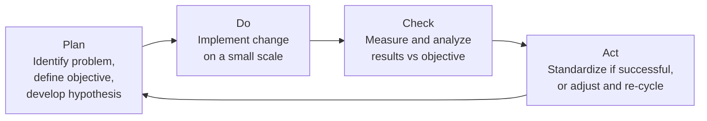
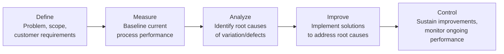

## Continuous Improvement Concepts

### Definition

Continuous Improvement encompasses the philosophies, frameworks, and methodologies used to iteratively enhance processes, products, and services over time, rather than treating quality as a one-time achievement. Within Project Quality Management, continuous improvement principles underpin the Manage Quality process, providing the structured approaches through which process audits, root cause analysis, and quality improvement recommendations translate into lasting organizational capability gains.

### Plan-Do-Check-Act (PDCA) Cycle

The foundational continuous improvement framework, originally developed by Walter Shewhart and popularized by W. Edwards Deming (often called the "Deming Cycle" or "Shewhart Cycle").

| Stage | Activities |
| --- | --- |
| Plan | Identify the problem or improvement opportunity, gather data, define objectives, develop a hypothesis for improvement |
| Do | Implement the planned change, typically on a small scale or pilot basis to limit risk |
| Check | Measure and analyze results against the objective; compare actual outcomes to expected outcomes |
| Act | If successful, standardize and scale the change organization-wide; if unsuccessful, adjust the approach and begin a new cycle |

The cyclical, iterative nature of PDCA is central to continuous improvement — it is explicitly not a one-time linear process, but a recurring loop applied repeatedly to progressively refine processes.

### PDCA Cycle Diagram (svg_diagram)

<svg xmlns="http://www.w3.org/2000/svg" viewBox="0 0 500 500">
<text x="250" y="25" font-size="14" font-weight="bold" text-anchor="middle" fill="#222">PDCA Cycle (svg_diagram)</text>
<circle cx="250" cy="260" r="180" fill="none" stroke="#ccc" stroke-width="1" stroke-dasharray="4,3" />
<rect x="200" y="60" width="100" height="60" rx="6" fill="#dbeafe" stroke="#2563eb" stroke-width="2" />
<text x="250" y="85" font-size="13" font-weight="bold" text-anchor="middle" fill="#1e3a8a">PLAN</text>
<text x="250" y="102" font-size="9" text-anchor="middle" fill="#1e3a8a">Define objective</text>
<rect x="380" y="230" width="100" height="60" rx="6" fill="#dcfce7" stroke="#16a34a" stroke-width="2" />
<text x="430" y="255" font-size="13" font-weight="bold" text-anchor="middle" fill="#14532d">DO</text>
<text x="430" y="272" font-size="9" text-anchor="middle" fill="#14532d">Implement change</text>
<rect x="200" y="400" width="100" height="60" rx="6" fill="#fef3c7" stroke="#d97706" stroke-width="2" />
<text x="250" y="425" font-size="13" font-weight="bold" text-anchor="middle" fill="#78350f">CHECK</text>
<text x="250" y="442" font-size="9" text-anchor="middle" fill="#78350f">Measure results</text>
<rect x="20" y="230" width="100" height="60" rx="6" fill="#fee2e2" stroke="#dc2626" stroke-width="2" />
<text x="70" y="255" font-size="13" font-weight="bold" text-anchor="middle" fill="#7f1d1d">ACT</text>
<text x="70" y="272" font-size="9" text-anchor="middle" fill="#7f1d1d">Standardize/Adjust</text>
<path d="M300,90 A180,180 0 0,1 430,230" fill="none" stroke="#666" stroke-width="2" marker-end="url(#arrowhead)" />
<path d="M430,290 A180,180 0 0,1 300,430" fill="none" stroke="#666" stroke-width="2" marker-end="url(#arrowhead)" />
<path d="M200,430 A180,180 0 0,1 70,290" fill="none" stroke="#666" stroke-width="2" marker-end="url(#arrowhead)" />
<path d="M70,230 A180,180 0 0,1 200,90" fill="none" stroke="#666" stroke-width="2" marker-end="url(#arrowhead)" />
</svg>

### Kaizen

A Japanese term meaning "change for the better," Kaizen is a philosophy emphasizing small, incremental, continuous improvements made by everyone in the organization — not just management or dedicated quality teams. Key principles:

- Improvements are small, frequent, and low-risk rather than large, infrequent, and disruptive
- Every employee, at every level, is expected to identify and suggest improvement opportunities
- Focus on eliminating waste (see Lean below) and improving standardized work
- Often implemented through regular, structured "Kaizen events" — short, focused improvement workshops targeting a specific process

### Six Sigma

A data-driven methodology aimed at reducing process variation and defects, targeting a defect rate of 3.4 defects per million opportunities (corresponding to a process operating within six standard deviations of the mean relative to specification limits).

**DMAIC Cycle** (the Six Sigma equivalent of PDCA for improving existing processes):

| Six Sigma Level | Terminology |
| --- | --- |
| Practitioners | Green Belt, Black Belt, Master Black Belt (indicating training/expertise level) |
| Sponsor | Champion (executive sponsor of Six Sigma initiatives) |
| New process/product design | DMADV (Define, Measure, Analyze, Design, Verify) — used instead of DMAIC when designing a new process rather than improving an existing one |

### Lean

A methodology focused on maximizing customer value while minimizing waste, originally derived from the Toyota Production System. Lean identifies eight categories of waste (often remembered by the acronym **DOWNTIME**):

| Waste Type | Description |
| --- | --- |
| Defects | Errors requiring rework or scrap |
| Overproduction | Producing more than needed, or before it's needed |
| Waiting | Idle time between process steps |
| Non-utilized talent | Underusing team members' skills and ideas |
| Transportation | Unnecessary movement of materials/products |
| Inventory | Excess materials/work-in-progress beyond what's needed |
| Motion | Unnecessary movement of people |
| Extra-processing | Doing more work than the customer requires or values |

### Comparative Framework

| Framework | Primary Focus | Typical Scope | Cycle/Structure |
| --- | --- | --- | --- |
| PDCA | General-purpose iterative improvement | Any process, any scale | Plan-Do-Check-Act |
| Kaizen | Cultural philosophy of continuous small improvements | Organization-wide, employee-driven | Ongoing, incremental |
| Six Sigma | Statistical reduction of process variation/defects | Complex processes with quantifiable defect rates | DMAIC (existing) / DMADV (new) |
| Lean | Elimination of waste, maximizing customer value | Production/delivery workflows | Value stream mapping, waste identification |

These frameworks are frequently combined in practice — "Lean Six Sigma" merges waste elimination principles with statistical variation reduction, and Kaizen events are often used as the "Do" phase within a broader PDCA or DMAIC initiative.

### Worked Example

A software development team's Control Quality data shows a persistent 18% post-release defect rate.

1. **Define (Six Sigma DMAIC)**: Problem scoped as "reduce post-release defect rate from 18% to under 5% within two quarters"
2. **Measure**: Baseline data collected — defect density per release, defect categories, time-to-detection
3. **Analyze**: Root cause analysis (cause-and-effect diagram, Pareto analysis) reveals 60% of defects stem from insufficient integration testing coverage
4. **Improve**: Team implements automated integration test suite expansion; a **Kaizen event** is run with developers and QA to redesign the testing checklist collaboratively
5. **Control**: Control charts established to monitor weekly defect rates; **PDCA cycle** initiated for ongoing refinement — each subsequent sprint retrospective functions as a mini "Check" and "Act" phase
6. **Lean waste identification**: Team identifies "Waiting" waste in the deployment pipeline (manual approval bottleneck) and "Extra-processing" waste (redundant manual regression testing now covered by the new automated suite), streamlining the overall release process alongside the defect reduction effort

Within two quarters, the combined DMAIC-Kaizen-PDCA approach reduces the defect rate to 4.2%, and the automated testing practice is standardized as the new baseline process (the "Act"/"Control" phase output).

### Common Pitfalls

- Treating continuous improvement as a one-time project rather than an ongoing organizational capability, abandoning the cycle after the first successful "Act" phase
- Implementing Six Sigma-level statistical rigor on processes too small or infrequent to generate meaningful data, adding overhead without proportional benefit
- Running Kaizen events without follow-through on implementation, generating ideas that are never acted upon (undermining future employee engagement in improvement initiatives)
- Confusing Lean's waste elimination with indiscriminate cost-cutting, potentially removing genuinely value-adding activities
- Applying PDCA at too large a scale for the first cycle, increasing risk and making it hard to isolate which specific change drove the observed result
- Failing to standardize successful improvements (the "Act" step), so gains are not sustained and processes drift back toward prior performance over time

### Related Topics

- Managing Quality (Quality Assurance)
- Controlling Quality
- Cost of Quality
- Quality Tools and Techniques
- Root Cause Analysis
- Statistical Process Control