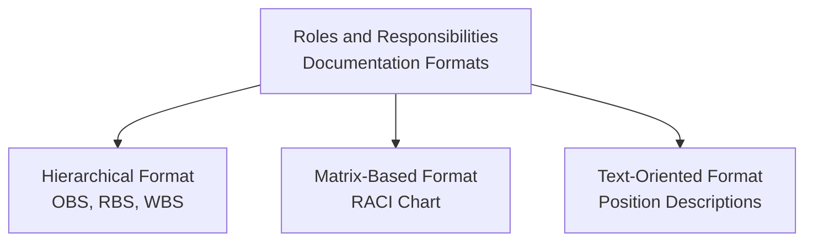

## Planning Resource Management

### Definition

Plan Resource Management is the process of defining how to estimate, acquire, manage, and utilize physical and team resources for the project. It is the first process within the Project Resource Management knowledge area and produces the Resource Management Plan and the Team Charter, both subsidiary components of the overall Project Management Plan.

This process addresses both categories of project resources: **physical resources** (equipment, materials, facilities, infrastructure) and **team resources** (human resources performing project work).

### Inputs

**Project Charter** — high-level resource requirements and constraints informing the resource management approach

**Project Management Plan**

- Quality management plan — resource requirements needed to meet quality standards
- Scope baseline — WBS, WBS dictionary defining deliverables requiring resources

**Project Documents**

- Project schedule — activity timing affecting resource acquisition/release timing
- Requirements documentation
- Risk register — resource-related risks
- Stakeholder register — stakeholders with influence over resource decisions

**Enterprise Environmental Factors** — organizational culture and structure, existing human resource administration policies, marketplace conditions, geographic distribution of resources

**Organizational Process Assets** — HR policies, templates, historical information, lessons learned repositories

### Tools and Techniques

| Technique | Description |
| --- | --- |
| Expert Judgment | Input from specialists in organizational design, resource management, team building |
| Data Representation | Hierarchical charts (RBS, OBS), responsibility assignment matrices (RACI), text-oriented formats (position descriptions) |
| Organizational Theory | Understanding of how people, teams, and organizational units behave, applied to plan resource management efficiently |
| Meetings | Planning sessions with team, sponsor, and functional/resource managers |

### Roles and Responsibilities Documentation Formats

| Format | Description | Best For |
| --- | --- | --- |
| **Hierarchical** | Organization Breakdown Structure (OBS) arranged by existing department/unit; Resource Breakdown Structure (RBS) arranged by resource type/category | Visualizing resource categories and reporting relationships |
| **Matrix-Based (RACI)** | Shows connections between work packages/activities and team members using Responsible, Accountable, Consult, Inform designations | Clarifying accountability for specific deliverables/activities |
| **Text-Oriented** | Detailed position descriptions covering responsibilities, authority, competencies, qualifications | Documenting detailed role requirements for complex or specialized positions |

### RACI Matrix Example

| Activity | Project Manager | Business Analyst | Developer | QA Lead | Sponsor |
| --- | --- | --- | --- | --- | --- |
| Define Requirements | A | R | C | C | I |
| Design Architecture | I | C | R/A | C | I |
| Develop Code | I | I | R | C | I |
| Test & Validate | I | C | C | R/A | I |
| Approve Release | A | I | I | C | R |

**R** = Responsible (does the work), **A** = Accountable (owns the outcome, only one per activity), **C** = Consulted (provides input), **I** = Informed (kept updated)

### Resource Management Plan Components

| Component | Description |
| --- | --- |
| Identification of resources | Methods for identifying and quantifying team and physical resources needed |
| Acquiring resources | Guidance on how to acquire team and physical resources |
| Roles and responsibilities | Role, authority, responsibility, and competency requirements per team member |
| Project organization charts | Graphical display of project team members and reporting relationships |
| Project team resource management | How team resources will be defined, staffed, managed, and eventually released |
| Training | Strategies for training team members |
| Team development | Methods for developing team performance (e.g., Tuckman's model, team-building activities) |
| Resource control | How physical resources will be controlled (availability, allocation tracking) |
| Recognition plan | How and when recognition/rewards will be given to team members |

### Team Charter

A distinct output establishing team values, agreements, and operating guidelines:

- Team values — shared beliefs guiding team behavior
- Communication guidelines — how/when the team communicates
- Decision-making criteria and process — how decisions will be made and by whom
- Conflict resolution process — agreed approach for handling disagreements
- Meeting guidelines — cadence, format, and expectations for team meetings
- Team agreements — norms around working hours, availability, quality standards

The Team Charter is typically co-created with the team early in the project (often during a kickoff or chartering workshop), fostering ownership and buy-in rather than being imposed unilaterally by the project manager.

### Organizational Theory Concepts

Plan Resource Management draws on organizational theory to inform structural and behavioral decisions:

- **Organizational structure impact** — functional, matrix (weak/balanced/strong), or projectized structures affect resource availability and the project manager's authority level
- **Motivation theories** — understanding factors that influence team performance (e.g., Maslow's hierarchy of needs, Herzberg's hygiene/motivator theory, McGregor's Theory X/Y) informs recognition and team development approaches
- **Team development stages** — awareness of models such as Tuckman's ladder (forming, storming, norming, performing, adjourning) shapes expectations for team performance over time

### Worked Example

A cross-functional product launch project draws resources from Engineering, Marketing, and Operations departments in a matrix organizational structure. During Plan Resource Management:

1. **Resource identification**: RBS created categorizing resources into Human (by skill: developers, designers, marketers) and Physical (testing lab equipment, marketing production tools)
2. **Roles and responsibilities**: RACI matrix developed mapping each major deliverable (product spec, marketing campaign, launch readiness review) to responsible/accountable parties across departments
3. **Acquisition approach**: Since the organization uses a matrix structure, resources will be negotiated with functional managers rather than dedicated full-time to the project; a pre-assignment agreement is documented for two key specialists
4. **Team Charter**: Co-created in a kickoff workshop — team agrees on weekly stand-up cadence, a documented escalation path for cross-departmental conflicts, and a shared decision log
5. **Training needs identified**: Marketing team requires training on the new product's technical capabilities before campaign development
6. **Recognition plan**: Milestone-based recognition tied to launch readiness gates, coordinated with functional managers to ensure alignment with departmental performance review cycles

This becomes the documented Resource Management Plan and Team Charter, referenced throughout Estimate Activity Resources, Acquire Resources, Develop Team, Manage Team, and Control Resources.

### Common Pitfalls

- Treating the Resource Management Plan as boilerplate rather than tailoring it to the actual organizational structure (functional/matrix/projectized) the project operates within
- Failing to clarify accountability (the single "A" in RACI) for key deliverables, leading to diffused responsibility and delayed decisions
- Imposing a Team Charter unilaterally rather than co-creating it with the team, reducing genuine buy-in
- Underestimating the influence of organizational structure on resource authority — a project manager in a weak matrix structure has limited authority to acquire/direct resources compared to a projectized structure
- Ignoring physical resource planning in favor of focusing solely on human resources, missing equipment/material acquisition lead times
- Not revisiting the Resource Management Plan as the project evolves, particularly when organizational priorities shift and resource contention increases

### Related Topics

- Estimate Activity Resources
- Acquire Resources
- Developing the Project Team
- Managing the Project Team
- Controlling Resources
- Organizational Structures (Functional, Matrix, Projectized)