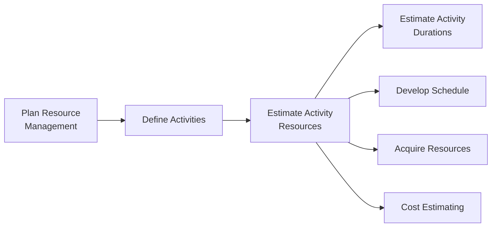
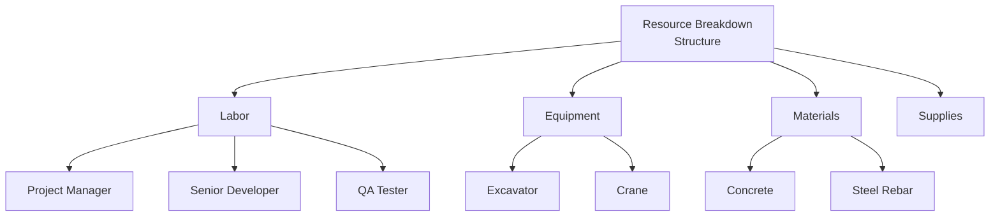

## Estimating Activity Resources

### Definition and Purpose

Estimating Activity Resources is the process of estimating team resources and the type and quantities of materials, equipment, and supplies necessary to perform each activity within a project. This process belongs to the Project Resource Management knowledge area and is classified as a planning process.

**Key Points**

- Determines what resources (people, equipment, materials, supplies) are needed for each schedule activity
- Produces quantified resource requirements that feed directly into cost estimating and schedule development
- Is performed iteratively throughout the project as scope, activity definitions, and available resources evolve
- Works in close coordination with Estimate Activity Durations, since resource availability and skill level directly affect how long an activity takes

### Position in the Process Flow

This process typically occurs after Define Activities and Sequence Activities, and before or in parallel with Estimate Activity Durations. It is tightly linked to Plan Resource Management (which sets policies and approaches) and later feeds Acquire Resources (where the estimated resources are actually obtained).

### Inputs

- **Project Management Plan**
  - Resource Management Plan: defines how project resources should be categorized, allocated, managed, and released
  - Scope Baseline: WBS, WBS dictionary, and scope statement clarify deliverable-level detail needed to identify resource needs
- **Project Documents**
  - Activity Attributes and Activity List: describe the work to be resourced
  - Assumption Log: assumptions about resource availability, skill levels, and quantities
  - Cost Estimates: influence resource choice (e.g., renting vs. buying equipment)
  - Resource Calendars: identify working days, shifts, and availability windows for specific resources
  - Risk Register: risks that could affect resource type, availability, or quantity
- **Enterprise Environmental Factors (EEFs)**
  - Resource location and availability
  - Marketplace conditions for materials/equipment
  - Organizational skill/competency data
- **Organizational Process Assets (OPAs)**
  - Historical information on resource types used for similar work
  - Policies regarding staffing and equipment rental/purchase
  - Lessons learned from similar prior projects

### Tools and Techniques

**Expert Judgment**

Individuals or groups with specialized knowledge in resource planning, logistics, or the specific technical domain provide input on realistic resource requirements.

**Bottom-Up Estimating**

Estimating resource needs at the most granular (work package or activity) level, then aggregating or "rolling up" to the higher WBS levels. This is generally more accurate than top-down approaches but requires more time and detailed activity decomposition.

**Analogous Estimating**

Uses resource information from a similar past project or activity as a basis for the current estimate. Faster but less accurate; most useful when historical data is reliable and the past and current activities are genuinely comparable. [Inference: accuracy trade-off is domain- and data-quality-dependent, not a fixed universal ratio.]

**Parametric Estimating**

Uses a statistical or mathematical relationship between historical data and other variables to calculate resource quantities. For example, if it is known that a certain crew installs 50 linear meters of cable per day, the crew-days needed for 500 meters can be parametrically derived.

$$\text{Resource Units Needed} = \frac{\text{Total Work Quantity}}{\text{Productivity Rate per Unit Resource}}$$

**Data Analysis — Alternatives Analysis**

Evaluating different options for fulfilling resource needs: make-vs-buy decisions, renting vs. purchasing equipment, varying team size/skill mix, or using different technology or methods.

**Project Management Information System (PMIS)**

Scheduling software with resource management features can help plan, organize, and manage resource pools, and develop resource estimates.

**Meetings**

Project managers may hold meetings with functional managers, team members, and stakeholders to jointly estimate resource needs, particularly for cross-functional or shared resources.

### Outputs

**Resource Requirements**

Identifies the types and quantities of resources required for each work package or activity, which can then be aggregated to determine estimated resources for each WBS branch and for the project as a whole. Typically includes the basis of estimate (assumptions used, methods applied, ranges of accuracy, confidence level).

**Basis of Estimates**

Supporting detail describing how the resource estimates were derived, including assumptions, constraints, methods used, and the range of possible estimates (e.g., -10% to +25%).

**Resource Breakdown Structure (RBS)**

A hierarchical representation of resources by category (e.g., labor, materials, equipment, supplies) and type (e.g., by skill level, grade, or size). Analogous in structure to a WBS, but organized around resource classification rather than deliverables.

**Project Document Updates**

- Activity Attributes: updated with resource requirements per activity
- Assumption Log: updated with new assumptions about productivity rates, availability, etc.
- Lessons Learned Register: updated with insights on estimating techniques that worked well or poorly

### Estimating Techniques Compared

| Technique | Speed | Accuracy | Data Needed | Best Used When |
| --- | --- | --- | --- | --- |
| Analogous | Fast | Lower | Historical project data | Early planning, limited detail available |
| Parametric | Moderate | Moderate–High | Statistical/productivity data | Repetitive, measurable work (e.g., unit production rates) |
| Bottom-Up | Slow | Highest | Detailed activity decomposition | Detailed planning, high-precision needs |
| Expert Judgment | Fast | Variable | Access to subject matter experts | Novel, complex, or poorly documented work |

### Worked Example

**Example**

A project requires installing 1,200 square meters of drywall.

- Historical productivity data (parametric input): one two-person crew installs 60 square meters per 8-hour day.
- Calculation:

$$\text{Crew-days required} = \frac{1200 \text{ m}^2}{60 \text{ m}^2/\text{day}} = 20 \text{ crew-days}$$

- If two crews work in parallel, elapsed duration:

$$\text{Duration} = \frac{20 \text{ crew-days}}{2 \text{ crews}} = 10 \text{ working days}$$

- Resource Requirement output: 2 two-person drywall crews for 10 working days, plus associated material quantities (drywall sheets, screws, joint compound) computed from the same 1,200 m² baseline, with a stated basis of estimate noting the productivity rate source and a ±15% contingency for site conditions.

### Considerations for Shared and Constrained Resources

When resources are shared across multiple projects or activities (common in matrix organizations), resource calendars and resource leveling considerations should inform the estimate. Estimating resource requirements without checking calendar availability can produce a technically correct quantity that is not actually obtainable within the planned timeframe. [Inference: the degree of impact depends on the organization's resource allocation practices and portfolio load, which vary by context.]

Common constraint factors to account for during estimation:

- Resource calendars (holidays, shifts, part-time allocation)
- Competing project demands on the same resource pool
- Skill/certification requirements limiting the substitutable resource pool
- Lead times for procured materials or specialized equipment

### Relationship to Cost and Schedule Baselines

Because Estimate Activity Resources output directly feeds Estimate Costs and Estimate Activity Durations, an error in resource type or quantity here propagates downstream into both the cost baseline and schedule baseline. This is one reason PMI treats resource estimating as a distinct, formalized process rather than folding it directly into duration or cost estimating.

**Next Steps**

- Estimate Activity Durations
- Develop Schedule
- Plan Resource Management
- Acquire Resources
- Estimate Costs
- Resource Breakdown Structure (RBS) construction in depth
- Resource Leveling and Resource Smoothing techniques
- Control Resources (monitoring process)