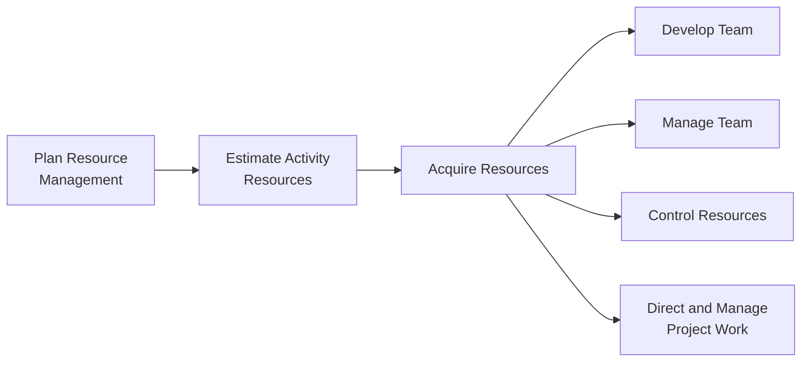
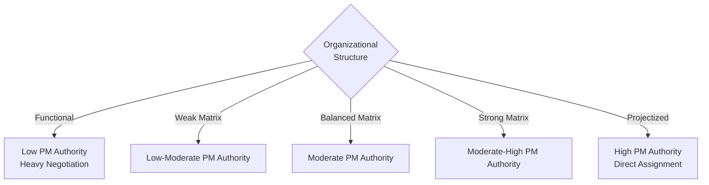

## Acquiring Resources

### Definition and Purpose

Acquire Resources is the process of obtaining team members, facilities, equipment, materials, supplies, and other resources necessary to complete project work. This is an executing process within Project Resource Management, and it is the point at which planned resource requirements are converted into actual, committed resources assigned to the project.

**Key Points**

- Bridges planning (Plan Resource Management, Estimate Activity Resources) and actual project execution
- Covers both internal (pre-assigned or negotiated from within the organization) and external (procured, contracted, outsourced) resources
- Responsibility for negotiation and decision-making may sit with the project manager, but often requires collaboration with functional managers, procurement, and other parts of management
- Is repeated periodically or whenever new resource needs arise, since not all resources are acquired at once

### Position in the Process Flow

### Inputs

- **Project Management Plan**
  - Resource Management Plan: guidance on how to acquire, allocate, and release resources
  - Procurement Management Plan: relevant when resources must be obtained through external contracts
  - Cost Baseline: constrains what resource acquisition options are financially viable
- **Project Documents**
  - Project Schedule: indicates when resources are needed
  - Resource Calendars: documents time periods each resource is available
  - Resource Requirements: quantities and types identified during Estimate Activity Resources
  - Stakeholder Register: helps identify stakeholders with an interest in or influence over resource decisions
- **Enterprise Environmental Factors (EEFs)**
  - Existing information on organizational resource availability
  - Marketplace conditions
  - Organizational structure (functional, matrix, projectized) affects how much authority the PM has to acquire resources
- **Organizational Process Assets (OPAs)**
  - Policies and procedures for acquiring, allocating, and assigning resources
  - Historical information from prior similar acquisitions

### Tools and Techniques

**Decision Making — Multicriteria Decision Analysis**

When selecting among resource options (e.g., candidate team members, equipment vendors), criteria such as availability, cost, ability/skill level, experience, and location are weighted and scored to identify the best fit.

$$\text{Score}_i = \sum_{j=1}^{n} w_j \times r_{ij}$$

Where $w_j$ is the weight for criterion $j$, and $r_{ij}$ is the rating of option $i$ on criterion $j$.

**Interpersonal and Team Skills — Negotiation**

Used heavily in this process because resources are often shared or contested:

- Negotiating with functional managers to secure staff with the needed skills, ensuring they are available at the right time and released when no longer needed
- Negotiating with other project management teams within the performing organization when competing for the same limited resources
- Negotiating with external organizations and suppliers for material, equipment, or contracted staff

**Pre-Assignment**

When physical or team resources are determined in advance (e.g., promised as part of a competitive proposal, specified in the project charter, or defined internally before the project starts), they are assigned without going through a competitive selection process.

**Virtual Teams**

Groups of people with a shared goal who fulfill their roles with little or no time spent meeting face-to-face, enabled by technology. Considerations include time zone differences, cultural differences, communication technology, and organizational policy compliance.

### Outputs

**Physical Resource Assignments**

Documentation of the material, equipment, supplies, locations, and other physical resources used during the project.

**Project Team Assignments**

Documentation of team members and their roles/responsibilities on the project; may include a team directory, memos to team members, and names inserted into other parts of the project management plan (e.g., organization charts and schedules).

**Resource Calendars**

Identifies the working days, shifts, and availability of each specific resource during the period of activity duration; updated once resources are actually acquired and their real availability windows are confirmed.

**Change Requests**

If acquiring resources deviates from what was planned (e.g., a needed resource is unavailable, forcing a schedule or scope change), a change request may be submitted through Perform Integrated Change Control.

**Project Management Plan Updates**

- Resource Management Plan: updated to reflect actual acquisition experience and any new roles/responsibilities
- Cost Baseline: updated if actual acquisition costs differ from estimates

**Project Document Updates**

- Lessons Learned Register: challenges or successes in acquiring resources
- Resource Breakdown Structure: updated with confirmed resource assignments
- Resource Requirements: updated based on what was actually obtained versus what was estimated
- Risk Register: new risks identified during acquisition (e.g., a key resource falling through)
- Stakeholder Register: updates based on new stakeholders introduced through resource acquisition (e.g., vendors, functional managers)

### Internal vs. External Acquisition

| Factor | Internal Acquisition | External Acquisition |
| --- | --- | --- |
| Mechanism | Negotiation with functional/resource managers | Procurement contracts, vendor agreements |
| Speed | Often faster if pre-assigned | Slower; involves solicitation, contracting |
| Cost Visibility | Usually indirect, absorbed by department budgets | Direct, contractually defined cost |
| Control | Subject to organizational structure and competing priorities | Subject to contract terms and supplier performance |
| Governed By | Resource Management Plan | Resource Management Plan + Procurement Management Plan |

### Organizational Structure Influence

The degree of authority a project manager has in acquiring resources is heavily shaped by organizational structure:

- **Functional Organization**: PM has little to no authority; resources are controlled by functional managers, and negotiation is essential
- **Matrix Organization** (weak/balanced/strong): Shared authority between PM and functional managers; negotiation intensity varies with matrix strength
- **Projectized Organization**: PM has high or full authority over resource acquisition, since team members typically report directly to the PM

### Worked Example

**Example**

A software project requires one senior backend developer for 3 months, starting in 6 weeks. Two internal candidates are identified from the resource pool, along with the option to contract an external freelancer.

Using multicriteria decision analysis with weighted scoring (1–5 scale):

| Criterion | Weight | Candidate A (Internal) | Candidate B (Internal) | Candidate C (External) |
| --- | --- | --- | --- | --- |
| Skill Match | 0.4 | 4 | 5 | 4 |
| Availability | 0.3 | 3 | 5 | 5 |
| Cost | 0.2 | 5 | 4 | 2 |
| Domain Knowledge | 0.1 | 5 | 3 | 2 |

$$\text{Score}_B = (0.4 \times 5) + (0.3 \times 5) + (0.2 \times 4) + (0.1 \times 3) = 4.6$$

Candidate B scores highest (4.6), suggesting the PM negotiate with that resource's functional manager first, with Candidate A as a fallback and the external freelancer reserved as a contingency if internal negotiation fails.

### Common Challenges

- **Resource unavailability**: A planned resource is reassigned to another project or leaves the organization, requiring re-negotiation or schedule adjustment
- **Skill mismatch**: A resource is technically available but lacks the required competency level, increasing training time or quality risk
- **Competing priorities**: Multiple project managers competing for the same limited pool of specialized staff or equipment
- **Compliance and regulatory constraints**: Some resources (e.g., certified operators, licensed professionals) impose legal or contractual acquisition constraints. [Inference: applicability varies significantly by industry and jurisdiction.]

**Next Steps**

- Develop Team
- Manage Team
- Control Resources
- Plan Resource Management
- Conduct Procurements
- Resource Management Plan components in depth
- Team Charter development