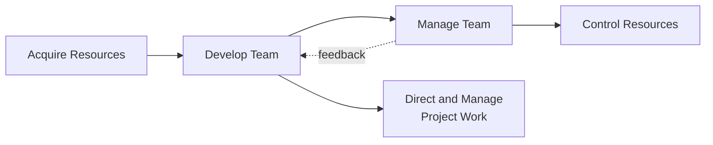
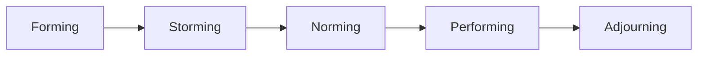

## Team Development and Performance

### Definition and Purpose

Team Development and Performance corresponds to the Develop Team process in Project Resource Management: the process of improving competencies, team member interaction, and the overall team environment to enhance project performance. This is an executing process, and its central output is improved team performance, which directly supports better project outcomes across schedule, cost, and quality.

**Key Points**

- Focuses on both individual competency growth and collective team cohesion
- Aims to improve knowledge, skills, trust, cohesion, and overall project performance
- Requires ongoing effort throughout the project, not a one-time activity
- Effectiveness is typically assessed through team performance assessments and formal/informal feedback loops

### Position in the Process Flow

### Inputs

- **Project Management Plan**
  - Resource Management Plan: guidance on rewards, feedback, training, and team development approaches
- **Project Documents**
  - Lessons Learned Register: earlier team-development insights from the same project
  - Project Schedule: identifies when team members are needed and for how long
  - Project Team Assignments: identifies the roles and people forming the team
  - Resource Calendars: identifies team member availability for training and team-building activities
  - Team Charter: team values, agreements, and operating guidelines established at team formation
- **Enterprise Environmental Factors (EEFs)**
  - HR management policies
  - Team member skill and competency data
- **Organizational Process Assets (OPAs)**
  - Historical information and lessons learned about team development from past projects

### Tacit Model: Tuckman's Ladder

A foundational reference model for team development stages, commonly used to understand where a team currently is and what leadership behavior best fits that stage.

| Stage | Characteristics | PM Focus |
| --- | --- | --- |
| Forming | Team meets, learns about the project and roles; polite, cautious | Clarify goals, roles, expectations |
| Storming | Conflict emerges over approach, control, or work styles | Facilitate conflict resolution, reinforce team charter |
| Norming | Team begins to work together, trust builds | Reinforce collaboration norms, recognize progress |
| Performing | Team functions as a well-organized, interdependent unit | Delegate, empower, remove obstacles |
| Adjourning | Team completes work and disbands (common in project-based teams) | Recognize contributions, support transition |

Teams do not always progress linearly; a change in membership or a major project shift can cause regression to an earlier stage. [Inference: real-world team progression is rarely perfectly sequential and depends heavily on team composition changes and external pressures.]

### Tools and Techniques

**Colocation**

Placing many or all active project team members in the same physical location to enhance the ability to perform as a team; may involve a dedicated "war room" or team space.

**Virtual Teams**

Where colocation is not feasible, technology-enabled collaboration is used; requires deliberate attention to communication norms, since informal cues present in colocated settings are reduced.

**Communication Technology**

Shared portals, video conferencing, audio conferencing, and email/chat systems to support collaboration, especially for dispersed or virtual teams.

**Interpersonal and Team Skills**

- **Conflict Management**: Addressing disagreements early and constructively before they damage team cohesion
- **Influencing**: Gathering relevant information to address issues and reach agreements while maintaining mutual trust
- **Motivation**: Providing a reason to care about achieving a goal, aligned with team members' individual needs and values
- **Negotiation**: Reaching agreements that satisfy the needs of the team as well as the project
- **Team Building**: Activities and processes intended to improve team relationships and the overall social climate of the team

**Recognition and Rewards**

Formal and informal acknowledgment and rewarding of desirable behavior; effective reward systems tie recognition to behavior the organization actually wants to reinforce (achievable goals, meaningful measures). Cultural differences must be considered when designing reward structures, since what is motivating in one context may not translate well to another. [Inference: the specific efficacy of reward types varies by team culture and individual motivators, which cannot be generalized universally.]

**Training**

Activities designed to enhance the competencies of project team members; can be formal (classroom, online, on-the-job) or informal (mentoring, coaching).

**Individual and Team Assessments**

Tools that give the project manager and team insight into areas of strength and weakness (e.g., attitudinal surveys, structured interviews, ability tests, focus groups). Provides greater insight into team member preferences, aspirations, how they process and organize information, and how they make decisions and interact with people.

### Outputs

**Team Performance Assessments**

Evaluations of team effectiveness, including indicators such as:

- Improvements in skills that allow individuals to perform assignments more effectively
- Improvements in competencies that help the team perform better as a whole
- Reduced staff turnover rate
- Increased team cohesiveness

**Change Requests**

If team development reveals the need for changes to the project management plan or baselines (e.g., additional training time affecting schedule), a change request may be submitted.

**Project Management Plan Updates**

- Resource Management Plan: updated based on effectiveness of development approaches used

**Project Document Updates**

- Lessons Learned Register: what worked and didn't work in developing the team
- Project Schedule: updated to reflect training time or team-building activities
- Project Team Assignments: updated based on any changes resulting from development activities
- Resource Calendars: updated availability due to training commitments
- Team Charter: revisited and potentially revised as the team matures

**Enterprise Environmental Factors Updates**

- Employee development plan records
- Skill assessments

### Motivation Theory Context

Common motivation frameworks referenced when designing team development approaches:

| Theory | Core Idea |
| --- | --- |
| Maslow's Hierarchy of Needs | Motivation progresses through physiological, safety, social, esteem, and self-actualization needs |
| Herzberg's Two-Factor Theory | Distinguishes hygiene factors (prevent dissatisfaction) from motivators (drive satisfaction) |
| McGregor's Theory X and Y | Contrasts assumptions of inherently unmotivated workers (X) vs. self-motivated workers (Y) |
| McClelland's Theory of Needs | Individuals are driven by needs for achievement, affiliation, or power in varying degrees |

These are widely referenced in management literature as frameworks for understanding motivation; their direct predictive power for any specific individual is [Speculation] beyond the general framework itself.

### Worked Example

**Example**

A newly formed 6-person cross-functional project team shows signs of the Storming stage: disagreements over work allocation and conflicting opinions on technical approach.

Actions taken by the PM:

1. Facilitate a structured retrospective focused on process, not blame, using the team charter as the shared reference point
2. Apply conflict management techniques, specifically a collaborative/problem-solving approach rather than avoidance or forcing
3. Reinforce roles and decision-making authority clarified during Forming
4. Introduce a lightweight team-building exercise focused on shared technical decision-making practices

Result tracked via team performance assessment: reduced number of unresolved technical disputes per sprint, and a self-reported team cohesion score used as an informal metric — noting that self-reported metrics carry inherent subjectivity and should be triangulated with observed behavioral indicators. [Inference: the specific metric design and its reliability depend on how the assessment instrument is constructed.]

### Common Pitfalls

- Treating team building as a single event (e.g., one workshop) rather than an ongoing process
- Applying uniform recognition/reward approaches without accounting for individual or cultural differences in what is motivating
- Ignoring early Storming-stage conflict, allowing dysfunction to become entrenched
- Failing to update the Resource Management Plan or Team Charter as the team's real dynamics diverge from initial assumptions

**Next Steps**

- Manage Team
- Control Resources
- Conflict Management techniques in depth
- Team Charter development
- Emotional Intelligence in project leadership
- Servant Leadership and its application to team performance