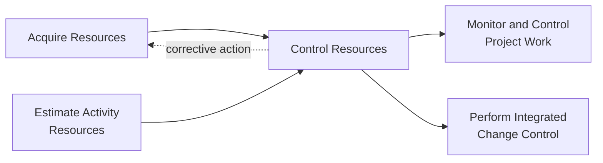
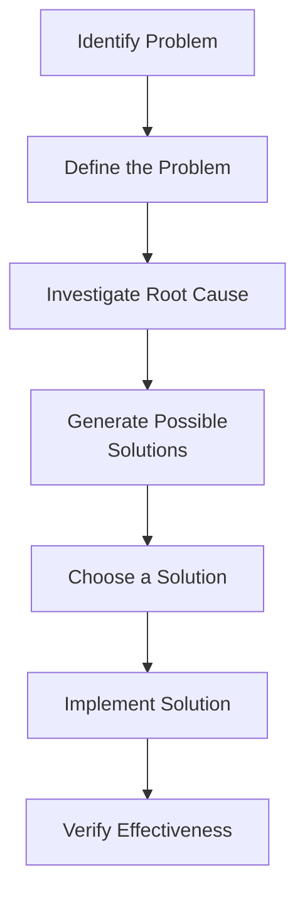

## Controlling Resources

### Definition and Purpose

Control Resources is the process of ensuring that physical resources assigned and allocated to the project are available as planned, as well as monitoring the planned versus actual utilization of resources and taking corrective action as necessary. This is a monitoring and controlling process, and unlike Manage Team (which addresses people), Control Resources primarily addresses physical/material resources: equipment, materials, supplies, and facilities.

**Key Points**

- Focuses primarily on physical resources, distinguishing it from Manage Team, which handles team member performance and interpersonal issues
- Ensures resources are available when and where needed, in the right quantity and condition
- Tracks actual resource utilization against the plan and identifies variances
- Feeds corrective/preventive actions back into the overall Monitor and Control Project Work process

### Position in the Process Flow

### Inputs

- **Project Management Plan**
  - Resource Management Plan: guidance on how physical resources should be assigned, managed, monitored, and released
- **Project Documents**
  - Issue Log: documents resource-related issues as they arise
  - Lessons Learned Register: earlier lessons on resource control from the same project
  - Physical Resource Assignments: documents which resources are assigned where
  - Project Schedule: identifies when resources are required
  - Resource Breakdown Structure: hierarchical view of resource categories for tracking
  - Resource Requirements: baseline against which actual utilization is compared
  - Risk Register: identifies risks related to resource availability, supply chain, or condition
- **Work Performance Data**
  - Raw observations on resource usage, including quantities actually used, delivery timing, and condition
- **Agreements**
  - Contracts with suppliers/vendors specifying delivery schedules, quantities, and quality/performance terms
- **Organizational Process Assets (OPAs)**
  - Policies regarding resource allocation, control, and release
  - Historical information from similar past projects

### Tools and Techniques

**Data Analysis**

- **Alternatives Analysis**: Evaluating options when a resource variance or shortage is identified (e.g., expediting delivery, substituting materials, adjusting the schedule, reallocating equipment from a lower-priority activity)
- **Cost-Benefit Analysis**: Determining the most cost-effective corrective action when a resource-related deviation occurs
- **Performance Reviews**: Measuring, comparing, and analyzing planned resource utilization against actual utilization

**Problem Solving**

A structured approach to identifying the resource problem, defining and analyzing its root cause, and generating and selecting a solution:

**Interpersonal and Team Skills**

- **Negotiation**: Renegotiating resource allocation when conflicts or shortages arise across competing project activities
- **Influencing**: Working with parties who control resources but are not under the direct authority of the PM

**Project Management Information System (PMIS)**

Scheduling, resource management, and reporting software capabilities used to monitor resource allocation, availability, and utilization against the plan.

### Outputs

**Work Performance Information**

Processed and analyzed data comparing how resources are actually being consumed and utilized against the plan, forming the basis for control decisions and status reporting.

**Change Requests**

Requests for corrective or preventive action arising from resource variances, submitted through Perform Integrated Change Control. Examples include requests to expedite a shipment, substitute a resource, or extend a schedule activity due to resource shortfall.

**Project Management Plan Updates**

- Resource Management Plan: updated based on lessons learned in controlling resources
- Schedule Baseline / Cost Baseline: updated if approved changes affect timing or cost due to resource issues

**Project Document Updates**

- Assumption Log: updated with new assumptions related to resource availability or condition
- Issue Log: new issues logged and existing ones updated
- Lessons Learned Register: insights on effective/ineffective resource control approaches
- Physical Resource Assignments: updated to reflect actual usage, reallocation, or substitution
- Resource Breakdown Structure: updated as resources are consumed, reallocated, or released

### Resource Control Metrics and Indicators

| Indicator | What It Measures | Typical Use |
| --- | --- | --- |
| Utilization Rate | Actual resource usage vs. planned capacity | Detecting under- or over-utilization |
| Resource Variance | Difference between planned and actual resource consumption | Triggering corrective action thresholds |
| On-Time Delivery Rate | Percentage of resource deliveries meeting planned dates | Supplier/vendor performance tracking |
| Resource Availability Rate | Percentage of time a resource was available when needed | Identifying availability bottlenecks |

$$\text{Utilization Rate} = \frac{\text{Actual Resource Usage}}{\text{Planned Resource Capacity}} \times 100\%$$

### Worked Example

**Example**

A construction project plans to use 2 concrete mixers for 15 days at a combined planned usage of 240 machine-hours. At the midpoint check (day 8), work performance data shows only 96 machine-hours logged against a planned 128 machine-hours for that point.

$$\text{Utilization Rate} = \frac{96}{128} \times 100\% = 75\%$$

A performance review flags a 25% shortfall. Root cause investigation (problem solving technique) reveals one mixer has been intermittently down for maintenance. Alternatives analysis identifies three options: rent a temporary replacement mixer, extend the equipment rental period at added cost, or resequence dependent activities to reduce short-term mixer demand. A cost-benefit analysis favors renting a temporary unit for the remaining project duration, and a change request is submitted to formalize the added rental cost and updated resource assignment.

### Control Resources vs. Manage Team

| Aspect | Control Resources | Manage Team |
| --- | --- | --- |
| Focus | Physical resources (equipment, materials, supplies, facilities) | Team members (people) |
| Primary Concern | Availability, utilization, condition | Performance, conflict, motivation, feedback |
| Typical Tools | Data analysis, PMIS, alternatives analysis | Emotional intelligence, conflict management, feedback |
| Output Emphasis | Change requests, physical resource assignment updates | Change requests, team performance improvements |

### Common Pitfalls

- Confusing Control Resources with Manage Team, leading to gaps in physical resource oversight
- Relying solely on planned quantities without monitoring actual condition or supplier reliability
- Delayed root-cause investigation, allowing minor variances to compound into larger schedule or cost impacts
- Failing to update the Resource Breakdown Structure and Physical Resource Assignments after corrective actions are implemented, causing planning data to drift out of sync with reality

**Related Topics**

- Manage Team
- Acquire Resources
- Estimate Activity Resources
- Perform Integrated Change Control
- Monitor and Control Project Work
- Supplier/Vendor Performance Management
- Root Cause Analysis techniques