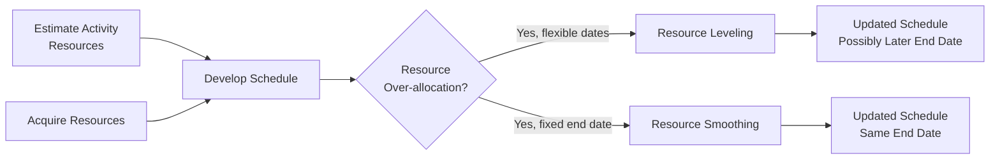
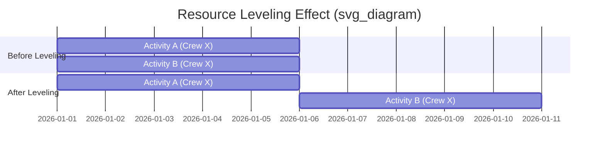

## Resource Leveling and Smoothing

### Definition and Purpose

Resource Leveling and Resource Smoothing are two related but distinct resource optimization techniques used during schedule development to address situations where resource demand exceeds availability or where resource usage needs to be balanced across a project. Both are data analysis techniques applied primarily within the Develop Schedule process, but they draw directly on outputs from Estimate Activity Resources and Acquire Resources.

**Key Points**

- Both techniques adjust the schedule model based on resource constraints, but they differ in whether the project end date can move
- Resource Leveling can change the critical path and the project end date
- Resource Smoothing keeps the project end date and critical path fixed, adjusting only within available float
- Both rely on having a resource-loaded schedule (activities linked to specific resource assignments and quantities) as a prerequisite

### Position in the Process Flow

### Resource Leveling

**Definition**

A technique in which start and finish dates are adjusted based on resource constraints, with the goal of balancing the demand for resources against the available supply. Used when shared or critical resources are only available at certain times, are only available in limited quantities, or are over-allocated (assigned to more than one activity during the same time period).

**Key Characteristics**

- Can be used when shared or critically required resources are only available at certain times or in limited quantities
- Often results in a change to the original critical path, and frequently extends the project end date
- Applied when resource availability constraints are non-negotiable (e.g., only one crane is physically available)

**Common Leveling Approaches**

- Delaying the start of an activity so its resource demand does not overlap with another activity using the same resource
- Splitting an activity so work resumes when the resource becomes free
- Resequencing lower-priority activities behind higher-priority ones competing for the same resource

### Resource Smoothing

**Definition**

A technique that adjusts the activities of a schedule model so that resource requirements do not exceed predefined resource limits, but does so only within the available free and total float, so that the project end date and the critical path are not delayed.

**Key Characteristics**

- Preserves the original critical path and project completion date
- Because it is constrained to using only available float, resources may not be fully optimized in every case, and some resource over-allocation may remain unresolved if there is insufficient float to absorb it
- Applied when the deadline is fixed and cannot move, but some flexibility exists in non-critical activities

### Leveling vs. Smoothing Comparison

| Aspect | Resource Leveling | Resource Smoothing |
| --- | --- | --- |
| Project End Date | Can change (often extends) | Remains fixed |
| Critical Path | Can change | Remains unchanged |
| Float Usage | May exceed available float | Limited strictly to available float |
| When Used | Resource availability is a hard constraint | Deadline is a hard constraint |
| Risk of Unresolved Over-allocation | Low (schedule adjusts to resolve it) | Possible if float is insufficient |

### Illustrative Diagram: Leveling Effect on Schedule

Note: Gantt-style mermaid syntax is used here to illustrate the before/after resource conflict resolution conceptually; actual rendering environment support for the `gantt` diagram type may vary. [Unverified: rendering fidelity of this specific diagram type depends on the Mermaid version and renderer used.]

### Tools and Techniques Context

Resource leveling and smoothing are generally executed using:

- **Project Management Information System (PMIS)** with built-in resource leveling algorithms (common in most modern scheduling tools)
- **Manual adjustment** for smaller projects or where automated leveling produces schedule results that require human judgment to refine
- **What-if scenario analysis**, testing different leveling/smoothing configurations before committing to one

### Inputs Typically Used

- Schedule Network Diagram
- Resource Calendars (availability windows)
- Resource Requirements (from Estimate Activity Resources)
- Activity Duration Estimates
- Project Schedule (working draft prior to leveling/smoothing)
- Resource Breakdown Structure

### Outputs / Effects

- **Schedule Baseline updates**: reflecting new start/finish dates after leveling
- **Project Schedule Network Diagram updates**: reflecting any changed dependencies or resequencing
- **Resource Requirement adjustments**: refined based on when resources will actually be consumed
- Possible **Change Requests** if leveling extends the project end date beyond the approved baseline

### Worked Example

**Example**

Two activities, Activity A (5 days) and Activity B (5 days), are both scheduled to start on Day 1 and both require the same single specialized crew (Crew X), which cannot work on two activities simultaneously.

**Resource Leveling Approach** (assume no hard deadline):

- Activity A proceeds Day 1–5 as planned
- Activity B is delayed to start Day 6, finishing Day 10
- Result: project duration for this segment extends from 5 days to 10 days, but the resource conflict is fully resolved

**Resource Smoothing Approach** (assume Activity B has 5 days of float and a fixed project deadline):

- Activity A proceeds Day 1–5 as planned (on the critical path)
- Activity B is shifted to start Day 6, still finishing within its available float and without pushing the project end date
- Result: resource conflict resolved with no impact to project completion date, because sufficient float existed

If Activity B had only 2 days of float instead of 5, smoothing alone could not fully resolve the conflict without either accepting some remaining over-allocation or reverting to leveling (which would then affect the end date).

### When to Choose Which Technique

| Scenario | Recommended Technique |
| --- | --- |
| Fixed contractual deadline, some schedule float exists | Resource Smoothing |
| Critical, unique resource (e.g., single piece of specialized equipment) with hard availability limits | Resource Leveling |
| Resource constraint cannot be resolved within available float | Resource Leveling (accept schedule impact) |
| Multiple lower-priority activities competing for a shared but flexible resource | Resource Smoothing (if float allows) |

### Common Pitfalls

- Applying resource leveling without communicating the resulting schedule extension to stakeholders, causing baseline conflicts
- Assuming resource smoothing can always fully resolve over-allocation; it cannot if available float is insufficient
- Failing to update the Resource Breakdown Structure and resource calendars after leveling/smoothing, leaving planning documents out of sync with the adjusted schedule
- Over-relying on PMIS auto-leveling algorithms without reviewing whether the resulting sequence still makes logical and practical sense [Inference: the degree of manual review needed depends on the sophistication and configuration of the specific scheduling tool used.]

**Related Topics**

- Develop Schedule
- Estimate Activity Resources
- Critical Path Method
- Schedule Network Analysis
- Control Resources
- Float and Total Float Calculation