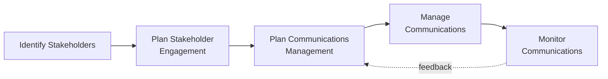

## Planning Communications Management

### Definition and Purpose

Plan Communications Management is the process of developing an appropriate approach and plan for project communications activities based on the information needs of each stakeholder or group, available organizational assets, and the needs of the project. This is a planning process within Project Communications Management, and it establishes the documented strategy that governs all subsequent Manage Communications and Monitor Communications activities.

**Key Points**

- Determines who needs what information, when they need it, in what format, and through what medium
- Directly builds on the Stakeholder Register and Stakeholder Engagement Plan, since communication needs are stakeholder-driven
- Produces the Communications Management Plan, the central artifact governing all project communication
- Should be revisited whenever the stakeholder community, project phase, or organizational context changes materially

### Position in the Process Flow

### Inputs

- **Project Charter**
  - Identifies key stakeholders and high-level communication expectations set at project authorization
- **Project Management Plan**
  - Resource Management Plan: identifies roles and responsibilities relevant to communication assignments
  - Stakeholder Engagement Plan: strategies for engaging stakeholders, which directly inform communication approach
- **Project Documents**
  - Requirements Documentation: may specify formal communication or reporting requirements
  - Stakeholder Register: provides the list of stakeholders along with their information needs, expectations, and influence/interest levels
- **Enterprise Environmental Factors (EEFs)**
  - Organizational culture, structure, and geographic distribution
  - Government or industry standards/regulations on communication and reporting
  - Established communication technology and infrastructure
- **Organizational Process Assets (OPAs)**
  - Historical information and lessons learned from prior projects
  - Existing organizational policies, procedures, and templates for communication

### Tools and Techniques

**Expert Judgment**

Input from individuals with specialized knowledge in areas such as organizational politics, corporate communication policy, media relations, or legal/regulatory reporting requirements.

**Communication Requirements Analysis**

Determines the information needs of project stakeholders through interviews, workshops, and analysis of lessons learned from prior projects. A commonly cited formula estimates the number of potential communication channels in a project:

$$\text{Number of Channels} = \frac{n(n-1)}{2}$$

Where $n$ is the number of stakeholders/team members involved. This formula illustrates why communication complexity grows non-linearly as team size increases, reinforcing the need for a deliberate plan rather than ad hoc information-sharing.

**Communication Technology**

Factors influencing choice of technology include:

- Urgency of the need for information
- Availability and reliability of technology
- Ease of use
- Project environment (colocated vs. distributed team)
- Sensitivity and confidentiality of the information

**Communication Models**

The basic sender-receiver communication model describes how a message travels from sender to receiver, and includes considerations such as noise (anything that interferes with the transmission or understanding of the message), encoding, decoding, and feedback loops.

**Communication Methods**

- **Interactive Communication**: Multidirectional exchange of information in real time (meetings, phone calls, video conferencing)
- **Push Communication**: Information sent to specific recipients who need it, without guarantee it was received or understood (emails, reports, memos, faxes)
- **Pull Communication**: Used for large, complex audiences or large volumes of information, requiring recipients to access content at their own discretion (intranet sites, e-learning, knowledge repositories)

**Interpersonal and Team Skills**

- **Communication Styles Assessment**: Identifying preferred communication methods, formats, and content for planned communication activities
- **Political Awareness**: Understanding power relationships within and around the organization
- **Cultural Awareness**: Understanding differences among individuals, groups, and organizations, and adapting the communication strategy accordingly

**Data Representation**

- **Stakeholder Engagement Assessment Matrix**: Compares current versus desired stakeholder engagement levels (unaware, resistant, neutral, supportive, leading) to inform tailored communication approaches

**Meetings**

Face-to-face or virtual discussions to define the appropriate approach for stakeholder communications.

### Outputs

**Communications Management Plan**

The central deliverable of this process, typically documenting:

- Stakeholder communication requirements
- Information to be communicated (language, format, content, level of detail)
- Escalation processes and reason for distribution
- Time frame and frequency for distribution
- Person responsible for communicating and authorizing release of confidential information
- Person or groups who will receive communications, including their information needs, requirements, and expectations
- Methods or technologies used to convey information (memos, email, press releases, social media)
- Resources allocated for communication activities, including time and budget
- Glossary of common terminology
- Flow charts of information flow, workflows, sequence of authorization, list of reports, meeting plans
- Constraints derived from specific legislation, regulation, technology, or organizational policies

**Project Management Plan Updates**

- Stakeholder Engagement Plan: updated as communication approaches are further refined

**Project Document Updates**

- Project Schedule: updated to reflect communication activities and reporting deadlines
- Stakeholder Register: updated with refined communication requirements per stakeholder

### Communication Method Selection Matrix

| Method Type | Example | Best Used When |
| --- | --- | --- |
| Interactive | Video call, stand-up meeting | Immediate clarification or discussion needed; two-way dialogue essential |
| Push | Status report email, memo | Information needs to reach a defined audience but immediate response is not required |
| Pull | Intranet portal, shared knowledge base | Large audience, large volume of information, self-service access is appropriate |

### Worked Example

**Example**

A project has 8 team members and stakeholders directly exchanging communications.

$$\text{Number of Channels} = \frac{8 \times (8-1)}{2} = 28$$

This relatively high channel count for a modest group size illustrates why the Communications Management Plan should formally define standard reporting formats and defined escalation paths, rather than allowing all 28 potential channels to operate informally and inconsistently.

Based on a Stakeholder Engagement Assessment Matrix, the sponsor is currently "Neutral" but desired at "Leading." The plan therefore specifies:

- Weekly one-on-one interactive briefings (push toward increasing engagement)
- Direct access to a real-time project dashboard (pull method for ongoing visibility)
- Explicit designation of the PM as the person authorized to escalate risks directly to the sponsor

### Communications Planning Considerations

- **Stakeholder Language and Format Preferences**: Some communications may need translation or localized formatting for international stakeholders
- **Cultural Differences**: Communication style, directness, and hierarchy expectations can vary significantly across cultures and must be reflected in the plan [Inference: the specific adaptations required are highly context-dependent and cannot be generalized into a single universal rule set]
- **Regulatory/Legal Requirements**: Certain industries mandate specific reporting formats, frequencies, or retention periods
- **Confidentiality and Security**: Sensitive communications require defined access controls and authorization chains

### Common Pitfalls

- Treating the Communications Management Plan as a one-time document rather than revisiting it as stakeholders and project phases change
- Defaulting to push communication (e.g., mass emails) for information that actually requires interactive, two-way exchange
- Failing to account for the non-linear growth of communication channels as team/stakeholder count increases, resulting in an unstructured, ad hoc communication environment
- Overlooking cultural and language considerations in globally distributed teams

**Next Steps**

- Manage Communications
- Monitor Communications
- Plan Stakeholder Engagement
- Identify Stakeholders
- Communication Models and Noise in depth
- Stakeholder Engagement Assessment Matrix construction