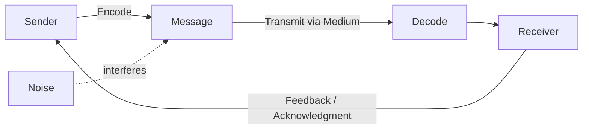
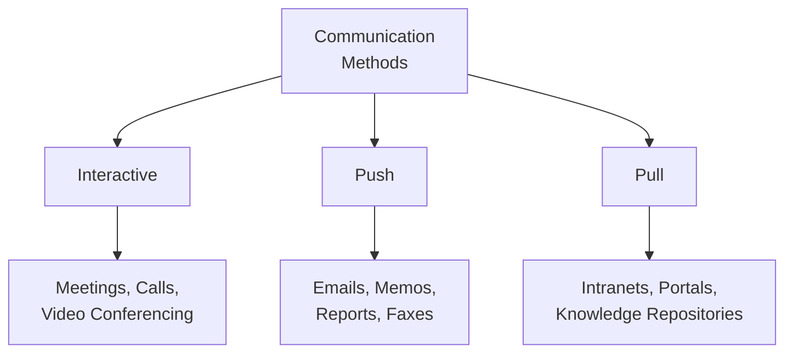

## Communication Models and Methods

### Definition and Purpose

Communication Models and Methods refer to the theoretical frameworks that describe how information is transmitted, received, and understood between parties, and the practical methods used to actually convey that information within a project. These concepts are core supporting tools and techniques within Project Communications Management, applied primarily during Plan Communications Management and executed during Manage Communications.

**Key Points**

- Communication models describe the mechanics and dynamics of how a message moves from sender to receiver
- Communication methods describe the practical delivery mechanism chosen based on the nature of the message and audience
- Selecting the wrong model assumption or wrong method for a given situation is a common source of project miscommunication
- Effective project communication management requires understanding both the theory (models) and the practical options (methods) to make deliberate choices rather than defaulting to convenience

### Communication Models

**Basic Sender-Receiver Model**

The foundational model describes the exchange of information between two parties: a sender and a receiver.

**Key Model Components**

- **Encode**: The sender translates thoughts or ideas into language, symbols, or format understandable by the receiver
- **Transmit the Message**: The sender sends the message via a chosen channel; effectiveness may be affected by technology, distance, and lack of background information
- **Medium**: The method used to convey the message (email, verbal, written report, video)
- **Decode**: The receiver translates the message back into meaningful thoughts or ideas
- **Acknowledge**: The receiver may signal receipt of the message, without necessarily agreeing with or fully understanding it
- **Feedback/Response**: The receiver encodes thoughts into a message and transmits it back to the original sender
- **Noise**: Anything that interferes with the transmission, receipt, or understanding of the message (technical disruption, semantic differences, distance, distractions, cultural differences)

**Cross-Cultural Communication Model Extension**

When sender and receiver come from different cultural or organizational backgrounds, additional interpretation layers are introduced — encoding assumptions, idiomatic expressions, and non-verbal cues may not translate directly, increasing the effective "noise" in the exchange. [Inference: the magnitude of this effect varies substantially depending on the specific cultural pairing and context and cannot be generalized numerically.]

### Communication Methods

**Interactive Communication**

Multidirectional exchange of information in real time, involving two or more parties performing a multidirectional exchange. This is considered the most efficient way to ensure a common understanding among participants on specified topics.

- Examples: meetings, phone calls, instant messaging, video conferencing, some forms of social media

**Push Communication**

Information sent or distributed directly to specific recipients who need to receive it. This ensures distribution of the information but does not ensure it actually reached or was understood by the intended audience.

- Examples: letters, memos, reports, emails, faxes, voice mails, press releases

**Pull Communication**

Used for large, complex volumes of information or for very large audiences, and requires recipients to access content at their own discretion, following appropriate security procedures.

- Examples: intranet sites, e-learning, lessons learned databases, knowledge repositories

### Method Selection Framework

| Factor | Favors Interactive | Favors Push | Favors Pull |
| --- | --- | --- | --- |
| Urgency | High | Moderate | Low |
| Audience Size | Small | Defined/targeted | Large/undefined |
| Need for Immediate Feedback | High | Low | Low |
| Information Complexity | High (needs clarification) | Low–Moderate | Variable, self-paced |
| Confirmation of Receipt Needed | Naturally confirmed | Not guaranteed | Not guaranteed |

### Additional Communication Considerations

**Communication Dimensions**

- **Internal** (within the project) vs. **External** (customers, vendors, other stakeholders, media, public)
- **Formal** (reports, briefings) vs. **Informal** (emails, ad hoc discussions)
- **Vertical** (up/down the organizational hierarchy) vs. **Horizontal** (with peers)
- **Official** (newsletters, annual reports) vs. **Unofficial** (off-the-record communications)
- **Written and Oral** vs. **Verbal and Non-Verbal** (voice inflection, body language)

**Non-Verbal Communication**

Studies referenced in project management and communication literature suggest a significant portion of communication meaning is conveyed through tone and body language rather than words alone in face-to-face settings; the precise proportions attributed to this vary by source and original study context. [Unverified: specific percentage breakdowns are frequently cited in secondary/tertiary sources without consistent attribution to a single rigorously replicated study.]

**Paralingual**

Pitch, tone, and inflection of voice used to convey emotion in a verbal message, independent of the actual words used.

### Communication Technology Selection Factors

When choosing a specific technology to support a communication method, the following factors are considered:

- **Urgency of the need for information**: Does the situation demand immediate updates, or is periodic distribution sufficient?
- **Availability of technology**: Is the necessary infrastructure already in place, or does it need to be established?
- **Ease of use**: Is the technology appropriate for project participants, or is training required?
- **Project environment**: Does the team meet face-to-face or operate in a virtual environment?
- **Sensitivity and confidentiality of the information**: Is the content sensitive, and does this require specific security measures?

### Worked Example

**Example**

A project team spans three time zones (US, UK, and Philippines) and must communicate a critical schedule change affecting all stakeholders.

Method selection reasoning:

1. **Interactive** — A live video call is scheduled for the core leads to discuss the change and answer questions in real time, given the urgency and complexity of the impact.
2. **Push** — Immediately following the call, a formal email memo summarizing the schedule change, rationale, and revised dates is sent to all stakeholders, ensuring a documented record reaches every recipient regardless of call attendance.
3. **Pull** — The updated schedule baseline and supporting documentation are posted to the project's shared knowledge repository/intranet site for any stakeholder to reference at their convenience going forward.

This layered approach uses all three methods deliberately: interactive for immediate clarity and feedback, push for guaranteed initial distribution, and pull for durable ongoing reference — rather than relying on a single method to serve all these differing needs.

### Common Pitfalls

- Using push communication (e.g., a single email) for complex or sensitive information that actually requires interactive dialogue to ensure understanding
- Assuming that sending a message (push) is equivalent to the message being received, read, and understood
- Overlooking "noise" sources such as cultural differences, jargon, or technical disruptions when planning cross-team or cross-organizational communication
- Failing to match communication technology to the actual constraints of the environment (e.g., assuming reliable high-bandwidth video access in all locations)

**Related Topics**

- Plan Communications Management
- Manage Communications
- Monitor Communications
- Cultural and Political Awareness in project communication
- Stakeholder Engagement Assessment Matrix
- Meeting Management best practices