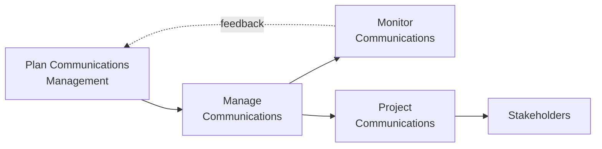

## Managing Communications

### Definition and Purpose

Manage Communications is the process of ensuring timely and appropriate collection, creation, distribution, storage, retrieval, management, monitoring, and the ultimate disposition of project information. This is an executing process within Project Communications Management, and it is where the Communications Management Plan is actually put into action.

**Key Points**

- Translates the planned communication strategy into real, ongoing communication activity throughout the project
- Covers the full lifecycle of project information: creation, collection, distribution, storage, retrieval, and disposition
- Produces project communications (the actual artifacts: reports, updates, presentations) as its primary output
- Requires continuous adaptation as stakeholder needs, project phase, and issues evolve

### Position in the Process Flow

### Inputs

- **Project Management Plan**
  - Resource Management Plan: identifies roles responsible for specific communications
  - Communications Management Plan: the primary guiding document for this process
  - Stakeholder Engagement Plan: strategies that shape how and when to communicate with specific stakeholders
- **Project Documents**
  - Change Log: communicated to relevant stakeholders as approved changes occur
  - Issue Log: communicated to stakeholders affected by or responsible for open issues
  - Quality Report: communicated as part of quality management updates
  - Risk Report: communicated to keep stakeholders informed of risk exposure
  - Stakeholder Register: identifies who should receive which communications
- **Work Performance Reports**
  - Compiled from Work Performance Information, physically or electronically distributed for decision-making and awareness
- **Enterprise Environmental Factors (EEFs)**
  - Organizational culture, structure, and geographic distribution
  - Government or industry standards/regulations
  - Communication technology and infrastructure currently in place
- **Organizational Process Assets (OPAs)**
  - Policies, procedures, and templates governing communication
  - Historical information from similar past projects

### Tools and Techniques

**Communication Technology**

The specific technology in use (email, video conferencing, portals, social media) is selected and applied based on urgency, availability, ease of use, project environment, and confidentiality sensitivity, as established during Plan Communications Management.

**Communication Methods**

Interactive, push, and pull methods are applied according to the guidance and audience needs defined in the Communications Management Plan.

**Communication Skills**

- **Communication Competence**: A combination of tailored communication skills regarding what information is communicated, how it's communicated, and to whom
- **Feedback**: Information about reactions to communications, deliverables, or project situations, used to establish an ongoing dialogue with stakeholders
- **Nonverbal**: Approximately physical gestures, tone of voice, and facial expressions play a role, particularly in interactive/face-to-face communication
- **Presentations**: Formal delivery of information, requiring preparation of content, delivery of the message, and handling of questions and discussion

**Project Reporting**

The act of collecting and distributing project information, including status reports, progress measurements, and forecasts.

**Interpersonal and Team Skills**

- **Active Listening**: Confirming understanding, clarifying, and acknowledging while removing barriers that adversely affect comprehension
- **Conflict Management**: Timely resolution of communication-related disagreements, such as differing interpretations of the same information
- **Cultural Awareness**: Understanding differences between individuals, groups, and organizations, and adapting the communication strategy to be culturally appropriate
- **Meeting Management**: Preparing an agenda, ensuring invitation of the right representative or delegate, and managing conflicts before, during, and after the meeting
- **Networking**: Interacting with others to exchange information and develop contacts, both formally and informally
- **Political Awareness**: Understanding power relationships and being deliberate in how information is framed and delivered

**Project Management Information System (PMIS)**

Standard tool sets available to capture, store, and distribute information to stakeholders (document management systems, web interfaces to scheduling and resource management software, portals, dashboards).

### Outputs

**Project Communications**

The various formal or informal communications developed and distributed, including status reports, presentations, meeting minutes, and other artifacts specified in the Communications Management Plan. Attributes typically include: sender, intended recipients, and method/technology used for transmission.

**Project Management Plan Updates**

- Communications Management Plan: updated as needs, formats, or technology shift
- Stakeholder Engagement Plan: updated based on the effectiveness of communications with specific stakeholders

**Project Document Updates**

- Issue Log: updated with new or resolved communication-related issues
- Lessons Learned Register: insights on effective/ineffective communication approaches
- Project Schedule: updated to reflect scheduled communication activities
- Risk Register: new risks related to communication gaps or breakdowns
- Stakeholder Register: updated based on new information or engagement changes

**Organizational Process Assets Updates**

- Meeting minutes, project reports, presentations, and other project records added to the organizational knowledge base

### Communication Skills Applied in Practice

| Skill | Application Example |
| --- | --- |
| Active Listening | Restating a stakeholder's concern before responding, to confirm accurate understanding |
| Feedback | Soliciting reactions to a status report to check comprehension and gauge sentiment |
| Meeting Management | Circulating an agenda in advance, assigning a timekeeper, and distributing minutes promptly afterward |
| Political Awareness | Framing a schedule delay message differently for the sponsor versus the delivery team, based on each audience's concerns |
| Networking | Maintaining informal relationships with key stakeholders outside of formal reporting channels to surface issues early |

### Worked Example

**Example**

A project is in an active execution phase, and the Communications Management Plan specifies weekly status reports (push), a bi-weekly stakeholder steering committee meeting (interactive), and continuous access to a live project dashboard (pull).

Execution of Manage Communications for one weekly cycle:

1. **Collection**: PM gathers Work Performance Data from the team (task completion status, hours logged, open issues) via the PMIS
2. **Creation**: Work Performance Reports are compiled into a status report using the organization's approved template (OPA)
3. **Distribution**: Report is emailed (push) to the full stakeholder list per the Stakeholder Register; dashboard (pull) is refreshed automatically
4. **Feedback Loop**: One stakeholder replies with a clarifying question about a flagged risk; the PM addresses this directly via a short interactive call, and updates the Issue Log to capture the exchange
5. **Storage**: Report and any resulting correspondence are archived to the document management system per organizational retention policy, forming part of Organizational Process Assets Updates

### Communication Effectiveness Considerations

- **Redundancy vs. Overload**: Communicating too little risks stakeholders missing critical information; communicating excessively can cause important messages to be lost in volume. [Inference: the precise balance point is highly context- and stakeholder-dependent, not a fixed rule.]
- **Consistency of Message**: Ensuring the same underlying facts are communicated consistently across different formats and audiences to avoid confusion or perceived contradictions
- **Timeliness**: Information that arrives too late to inform a decision loses much of its value, even if otherwise accurate and complete

### Common Pitfalls

- Distributing information (push) without any mechanism to confirm it was understood, mistaking distribution for successful communication
- Neglecting to update the Communications Management Plan when stakeholder needs or organizational technology change mid-project
- Failing to apply active listening and feedback techniques during interactive communication, resulting in one-directional "reporting" rather than genuine dialogue
- Under-using organizational process asset templates, leading to inconsistent report formats that confuse recipients over time

**Next Steps**

- Monitor Communications
- Plan Communications Management
- Communication Models and Methods
- Manage Stakeholder Engagement
- Meeting Management best practices
- Conflict Management techniques