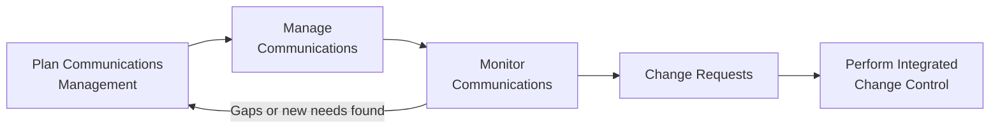

## Monitoring Communications

### Definition and Purpose

Monitor Communications is the process of ensuring the information needs of the project and its stakeholders are met. This is a monitoring and controlling process within Project Communications Management, and it closes the loop between the planned communication strategy and its actual effectiveness, determining whether the approach defined in Plan Communications Management and executed via Manage Communications is genuinely working.

**Key Points**

- Assesses whether project communications are actually meeting stakeholder information needs, not just whether communications are being sent
- May trigger a revisit of Plan Communications Management when gaps, ineffectiveness, or changed needs are identified
- Relies heavily on stakeholder feedback, both solicited and observed
- Is an iterative process performed throughout the project life cycle, not a single end-of-project review

### Position in the Process Flow

### Inputs

- **Project Management Plan**
  - Resource Management Plan: identifies who is responsible for what communications
  - Communications Management Plan: the baseline against which actual communication effectiveness is measured
  - Stakeholder Engagement Plan: desired engagement levels used as a comparison point
- **Project Documents**
  - Issue Log: documents unresolved communication-related issues to investigate
  - Lessons Learned Register: earlier insights on what communication approaches worked or failed
  - Project Communications: the actual communications produced, used as the raw material for review
- **Work Performance Data**
  - Raw data on which communications were sent, types of feedback received, and observed stakeholder responses
- **Enterprise Environmental Factors (EEFs)**
  - Organizational culture and communication norms
  - Established government/industry regulations affecting reporting requirements
- **Organizational Process Assets (OPAs)**
  - Historical information and lessons learned regarding communication monitoring from past projects

### Tools and Techniques

**Expert Judgment**

Input from individuals or groups with specialized training or knowledge in areas such as communication assessment, media relations, or organizational dynamics.

**Project Management Information System (PMIS)**

Used to capture, store, and provide distribution feedback for stakeholder communications, along with metrics such as open rates, portal access logs, and distribution confirmations where available.

**Data Representation**

- **Stakeholder Engagement Assessment Matrix**: Used again here to compare desired vs. actual engagement levels, revealing whether the communication approach is successfully moving stakeholders toward the desired engagement state (e.g., from Neutral to Supportive)

**Interpersonal and Team Skills**

- **Observation/Conversation**: Direct conversations and observation of team and stakeholder interactions to gauge whether communications are landing effectively, surfacing issues that formal feedback mechanisms might miss

**Meetings**

Discussions (virtual or face-to-face) used to determine the most appropriate way to update and communicate project performance, and to respond to requests from stakeholders for information.

### Outputs

**Work Performance Information**

Processed and analyzed data on how project communications are performing relative to the plan; forms the basis for determining whether the current communication approach is effective or requires adjustment.

**Change Requests**

If monitoring reveals that current communication approaches are not meeting stakeholder needs, a change request may be submitted through Perform Integrated Change Control to modify the Communications Management Plan or related processes.

**Project Management Plan Updates**

- Communications Management Plan: updated based on identified gaps or changed stakeholder needs
- Stakeholder Engagement Plan: updated based on observed vs. desired engagement levels

**Project Document Updates**

- Issue Log: updated with new communication-related issues or resolution of existing ones
- Lessons Learned Register: insights on which monitoring techniques were effective at identifying communication problems
- Stakeholder Register: updated based on observed engagement or newly identified information needs

### Key Monitoring Questions

| Monitoring Focus | Guiding Question |
| --- | --- |
| Reach | Are communications actually reaching all intended stakeholders? |
| Comprehension | Is the information being understood as intended? |
| Timeliness | Is information arriving in time to support decisions? |
| Engagement Trend | Are stakeholders moving toward the desired engagement level over time? |
| Format Fit | Is the format/medium suited to the audience's preferences and needs? |
| Feedback Loop | Is there a working mechanism for stakeholders to raise concerns about communication itself? |

### Worked Example

**Example**

Midway through a project, the Stakeholder Engagement Assessment Matrix shows the operations department stakeholder group was targeted to move from "Neutral" to "Supportive" through bi-weekly briefings (interactive) and a shared dashboard (pull). At the midpoint review:

- Observation/conversation reveals operations staff rarely access the dashboard, and briefing attendance has been declining
- Work Performance Information shows the group's actual engagement level remains "Neutral," not the desired "Supportive"

Root cause discussion (via a monitoring meeting) surfaces that briefings are scheduled at a time conflicting with operations' shift handover, and the dashboard's technical framing does not match the group's information needs (they need operational impact summaries, not raw technical metrics).

Resulting outputs:

- **Change Request**: Reschedule briefings to a compatible time slot
- **Communications Management Plan Update**: Add a simplified operational-impact summary view tailored to this stakeholder group
- **Stakeholder Register Update**: Revise recorded communication preferences for the operations group
- **Lessons Learned Register Update**: Document that technical dashboards are insufficient alone for non-technical stakeholder groups

### Monitor Communications vs. Manage Communications

| Aspect | Manage Communications | Monitor Communications |
| --- | --- | --- |
| Process Type | Executing | Monitoring and Controlling |
| Primary Focus | Producing and distributing communications | Assessing whether communications are effective |
| Key Question | "Did we send it?" | "Did it actually meet the need?" |
| Typical Trigger for Action | Scheduled reporting cycle | Feedback, observation, or performance data revealing a gap |

### Common Pitfalls

- Equating the volume or frequency of communications sent with communication effectiveness
- Relying solely on formal feedback mechanisms (surveys, explicit requests) while ignoring softer signals like declining meeting attendance or low portal engagement
- Failing to close the loop back to Plan Communications Management when a persistent gap is identified, resulting in repeated ineffective communication cycles
- Not distinguishing between a communication delivery failure (technical/logistical) and a communication design failure (wrong content, format, or timing for the audience)

**Related Topics**

- Manage Communications
- Plan Communications Management
- Manage Stakeholder Engagement
- Monitor Stakeholder Engagement
- Perform Integrated Change Control
- Stakeholder Engagement Assessment Matrix