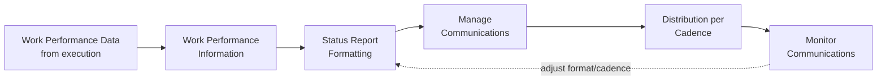
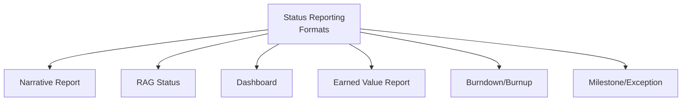
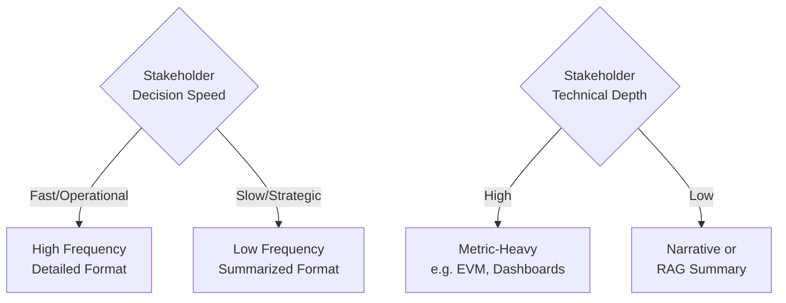

## Status Reporting Formats and Cadences

### Definition and Purpose

Status Reporting Formats and Cadences refers to the specific design choices made when implementing project reporting: what format status information takes (dashboard, narrative report, RAG status, burndown chart) and how frequently it is produced and distributed (daily, weekly, bi-weekly, monthly, milestone-based). This is a practical application area within Manage Communications, translating the general reporting requirements defined in the Communications Management Plan into concrete, repeatable reporting artifacts and schedules.

**Key Points**

- Format and cadence decisions should be driven by stakeholder information needs and decision-making timelines, not by convenience or habit
- Different stakeholder groups typically require different formats and cadences for the same underlying project data
- Over-reporting and under-reporting are both failure modes; the goal is matching frequency and detail to actual decision-making needs
- Status reporting formats commonly draw on Work Performance Data and Work Performance Information generated across all knowledge areas, not communications alone

### Position in the Process Flow

### Common Status Reporting Formats

**Narrative Status Report**

A written summary describing accomplishments, upcoming work, issues, and risks in prose form. Typically includes sections such as: overall status summary, accomplishments since last report, planned work for next period, issues/risks, and decisions needed.

**RAG (Red-Amber-Green) Status Report**

A visual indicator system condensing complex status information into a simple color-coded signal, typically applied across dimensions such as schedule, cost, scope, and risk.

| Indicator | Typical Meaning |
| --- | --- |
| Green | On track; no significant issues |
| Amber/Yellow | At risk; issues present but manageable with attention |
| Red | Off track; significant issues requiring escalation or intervention |

**Dashboard Reporting**

A visual, often digital, consolidated view combining multiple metrics (schedule variance, cost variance, risk exposure, milestone tracking) into a single-screen or single-page format, frequently supporting drill-down into underlying detail. Often implemented via PMIS tools with pull-based access, allowing stakeholders to check status at their own convenience.

**Earned Value-Based Reports**

Reports built around earned value metrics (Planned Value, Earned Value, Actual Cost, Schedule Variance, Cost Variance, SPI, CPI), providing a quantitative, standardized view of schedule and cost performance.

$$SPI = \frac{EV}{PV} \quad \quad CPI = \frac{EV}{AC}$$

**Burndown/Burnup Charts**

Common in agile or hybrid environments, visually tracking remaining work (burndown) or completed work (burnup) against time, typically at the sprint or iteration level.

**Milestone/Exception Reports**

Focused reporting that highlights only significant milestone completions or deviations from plan (an "exception-based" approach), reducing report volume for stakeholders who only need to be alerted when something material changes.

### Common Cadences

| Cadence | Typical Audience | Typical Content Level |
| --- | --- | --- |
| Daily | Core execution team (e.g., daily stand-up) | Highly tactical, task-level |
| Weekly | Project team, immediate management | Task/activity-level progress, near-term issues |
| Bi-Weekly | Steering committee, mid-level stakeholders | Summarized progress, key risks/issues, decisions needed |
| Monthly | Senior sponsors, portfolio management | High-level status, financial summary, major risks |
| Milestone-Based | Executive stakeholders, external stakeholders | Triggered by specific deliverable/phase completion |
| Ad Hoc / Exception | Any stakeholder needing escalation-level awareness | Triggered only by significant deviation or issue |

### Matching Format and Cadence to Stakeholder Needs

The Stakeholder Register and Communications Management Plan should drive these choices, generally following this reasoning pattern:

### Worked Example

**Example**

A mid-sized IT implementation project has three distinct stakeholder groups requiring different reporting treatments:

1. **Development Team** (daily cadence, task-level format): A daily stand-up plus an automated burndown chart pulled from the sprint tracking tool, since the team needs high-frequency, granular visibility into remaining work.
2. **Steering Committee** (bi-weekly cadence, RAG + narrative format): A one-page RAG status summary across schedule/cost/scope/risk, accompanied by a half-page narrative on key decisions needed, since this group needs periodic, digestible status without operational detail.
3. **Executive Sponsor** (monthly cadence, milestone/exception format): A brief milestone-completion notice and financial summary, escalated immediately (ad hoc) only if a RAG indicator turns Red, since this stakeholder's information need is primarily exception-based awareness rather than continuous tracking.

This layered design avoids sending granular daily data to the executive sponsor (information overload with low relevance) while also avoiding sending only a monthly high-level summary to the development team (insufficient frequency for daily coordination needs).

### Format/Cadence Mismatch Risks

| Mismatch | Risk |
| --- | --- |
| High-frequency reporting to strategic/executive stakeholders | Information overload; important signals lost in noise; disengagement |
| Low-frequency reporting to operational/tactical stakeholders | Delayed awareness of issues; coordination breakdowns |
| Overly technical format (e.g., raw EVM tables) for non-technical stakeholders | Misinterpretation or disengagement due to lack of context |
| Overly simplified format (e.g., RAG-only) for stakeholders needing root-cause detail | Insufficient information to make informed decisions; follow-up requests increase overhead |

### Considerations for Format/Cadence Design

- **Actionability**: Each report should ideally support a specific decision or action by its recipient; content that serves no decision-making purpose should be reconsidered or removed
- **Consistency**: Once established, format and cadence should remain stable enough that stakeholders know what to expect and when, reducing cognitive load
- **Escalation Paths**: Exception-based reporting should have clearly defined thresholds for what triggers an ad hoc report outside the normal cadence
- **Tool Alignment**: Reporting format should align with what the organization's PMIS or reporting tools can realistically automate versus what requires manual compilation, which affects the sustainability of a given cadence over the project's duration [Inference: sustainability depends heavily on the specific tooling and team capacity available, which varies by organization]

### Common Pitfalls

- Applying a single report format and cadence uniformly across all stakeholder groups regardless of differing needs
- Designing overly frequent cadences that are not sustainable to produce manually, leading to reporting quality degrading over time or reports being skipped
- Failing to define clear thresholds for exception-based/ad hoc reporting, resulting in either escalation fatigue (too many "urgent" reports) or delayed awareness of real issues
- Neglecting to revisit format and cadence choices as the project moves between phases (e.g., planning-heavy vs. execution-heavy periods may warrant different reporting rhythms)

**Related Topics**

- Manage Communications
- Monitor Communications
- Plan Communications Management
- Earned Value Management
- Stakeholder Engagement Assessment Matrix
- Agile Reporting Practices (Burndown/Burnup, Velocity)