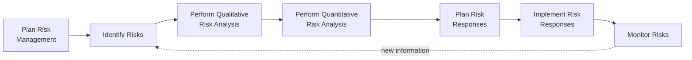
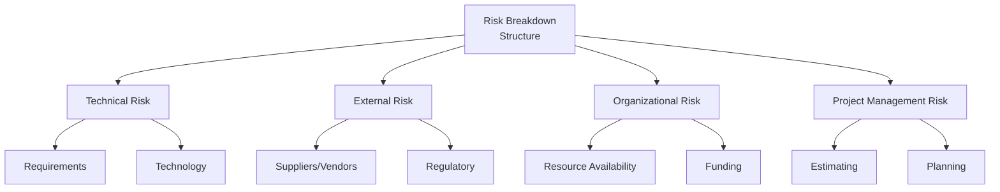
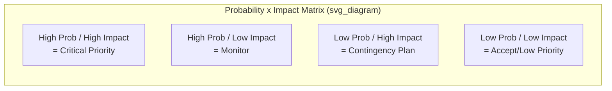

## Planning Risk Management

### Definition and Purpose

Plan Risk Management is the process of defining how to conduct risk management activities for a project. This is a planning process within Project Risk Management, and it is the foundational process that establishes the overall approach, methodology, roles, and criteria that all subsequent risk management processes (Identify Risks, Perform Qualitative Risk Analysis, Perform Quantitative Risk Analysis, Plan Risk Responses, Implement Risk Responses, and Monitor Risks) will follow.

**Key Points**

- Ensures the degree, type, and visibility of risk management applied are proportionate to both the risks and the importance of the project to the organization
- Produces the Risk Management Plan, which is distinct from the Risk Register (the Risk Management Plan describes the approach; the Risk Register lists actual identified risks)
- Should be conducted early in project planning, since it establishes definitions and criteria used throughout the rest of the risk management processes
- Involves key stakeholders, since risk appetite, thresholds, and tolerance vary across the organization and must be reconciled

### Position in the Process Flow

### Inputs

- **Project Charter**
  - High-level project description, objectives, and pre-approved financial resources that inform overall risk appetite considerations
- **Project Management Plan**
  - All subsidiary plans and baselines provide context for what areas require risk consideration (scope, schedule, cost, quality, resources)
- **Project Documents**
  - Stakeholder Register: identifies stakeholders' roles in the risk management process and their individual risk appetites
- **Enterprise Environmental Factors (EEFs)**
  - Organizational or industry-wide risk appetite, thresholds, and tolerances
  - Established risk categories, common definitions of concepts and terms, standard templates
  - Roles and responsibilities, authority levels for decision-making
- **Organizational Process Assets (OPAs)**
  - Organizational risk policy
  - Risk categories, possibly organized into a Risk Breakdown Structure (RBS)
  - Common definitions of risk concepts and terms
  - Risk statement formats
  - Standard templates
  - Roles and responsibilities
  - Authority levels for decision-making
  - Lessons learned repository from previous similar projects

### Tools and Techniques

**Expert Judgment**

Input from individuals or groups with specialized knowledge in risk management approaches for similar projects, tailoring the process to the organization and industry.

**Data Analysis**

- **Stakeholder Analysis**: Understanding stakeholders' risk appetite and thresholds to inform how the risk management process should be tailored

**Meetings**

Project teams hold planning meetings to develop the Risk Management Plan; attendees may include the project manager, selected team members and stakeholders, anyone in the organization with responsibility for managing risk planning and execution activities, and others as needed.

### Outputs: The Risk Management Plan

The Risk Management Plan is the sole output of this process and typically includes the following components:

**Risk Strategy**

The general approach to managing risk on this project.

**Methodology**

Defines the specific approaches, tools, and data sources to be used to perform risk management on the project.

**Roles and Responsibilities**

Defines the lead, support, and risk management team members for each type of activity described in the plan, and clarifies their responsibilities.

**Funding**

Identifies the funds needed to perform activities related to risk management, and establishes protocols for the application of contingency and management reserves.

**Timing**

Defines when and how often the risk management processes will be performed throughout the project life cycle, and establishes risk management activities for inclusion into the project schedule.

**Risk Categories**

Provides a means for grouping individual project risks, often structured as a **Risk Breakdown Structure (RBS)**.

**Stakeholder Risk Appetite**

The stakeholders' risk appetite is expressed as a measurable risk threshold around each project objective; the threshold reflects the degree of acceptable variation.

**Definitions of Risk Probability and Impact**

Definitions of risk probability and impact levels are specific to the project context and reflect the risk appetite and thresholds of the organization and key stakeholders; they may be applied generically across all objectives or tailored per objective.

| Impact Level | Scope Impact Example | Schedule Impact Example | Cost Impact Example |
| --- | --- | --- | --- |
| Very Low | Barely noticeable scope change | <1 week delay | <1% budget impact |
| Low | Minor scope areas affected | 1–2 week delay | 1–5% budget impact |
| Moderate | Major scope areas affected | 2–4 week delay | 5–10% budget impact |
| High | Scope reduction unacceptable to sponsor | 4–8 week delay | 10–20% budget impact |
| Very High | Project end item effectively useless | >8 week delay | >20% budget impact |

**Probability and Impact Matrix**

Opportunities and threats are represented in a common probability and impact matrix using positive definitions of impact for opportunities and negative definitions for threats.

**Revised Stakeholders' Tolerances**

As applicable to the specific project, revised or refined during the planning process.

**Reporting Formats**

Defines how the outcomes of the risk management process will be documented, analyzed, and communicated, describing the content and format of the risk register and risk report.

**Tracking**

Documents how risk activities will be recorded for the benefit of the current project and how risk management processes will be audited.

### Probability and Impact Matrix (Illustrative)

### Worked Example

**Example**

An organization undertaking a mid-sized software modernization project holds a risk planning meeting. Key stakeholders express differing thresholds: the sponsor's schedule tolerance is a maximum 2-week slip before escalation is required, while the technical lead's primary concern is technical integration risk.

Resulting Risk Management Plan components:

- **Methodology**: Combination of qualitative analysis (probability/impact matrix) for all risks, with quantitative Monte Carlo simulation reserved for risks affecting the critical path
- **Timing**: Risk identification workshops scheduled at the start of each project phase, with risk register reviews embedded into existing bi-weekly status meetings
- **Risk Categories (RBS)**: Technical, External (vendor/API dependency), Organizational (resource contention with other active projects), Project Management (estimation accuracy)
- **Probability/Impact Definitions**: Schedule impact scale calibrated specifically to the sponsor's stated 2-week threshold as the boundary between "Moderate" and "High" impact
- **Funding**: A contingency reserve set as a percentage of the approved budget, released according to protocols defined in this plan, separate from management reserve controlled at a higher organizational level

### Common Pitfalls

- Treating Plan Risk Management as a formality and reusing a generic template without tailoring probability/impact definitions to actual stakeholder thresholds
- Confusing the Risk Management Plan (the approach) with the Risk Register (the list of actual risks), which is a distinct output of the subsequent Identify Risks process
- Failing to secure genuine stakeholder input on risk appetite and tolerance, resulting in definitions that don't reflect real organizational priorities
- Neglecting to define funding and timing protocols clearly, causing confusion later about how contingency reserves may be accessed

**Next Steps**

- Identify Risks
- Perform Qualitative Risk Analysis
- Perform Quantitative Risk Analysis
- Plan Risk Responses
- Risk Breakdown Structure construction in depth
- Contingency Reserve vs. Management Reserve