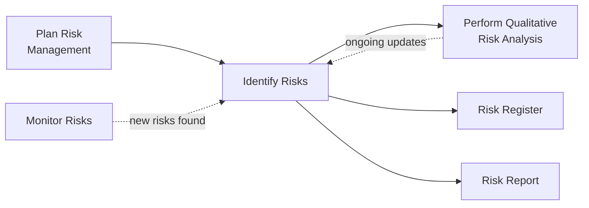
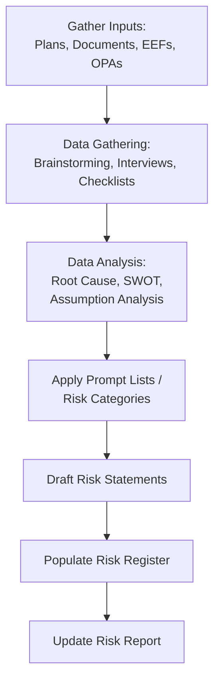

## Identifying Risks

### Definition and Purpose

Identify Risks is the process of identifying individual project risks as well as sources of overall project risk, and documenting their characteristics. This is a planning process within Project Risk Management, distinct from Plan Risk Management (which sets the approach) in that this process actually populates the Risk Register with real, specific risks relevant to the current project.

**Key Points**

- Produces the initial version of the Risk Register and the Risk Report, both of which are updated iteratively throughout the project
- Addresses both individual project risks (specific uncertain events or conditions) and overall project risk (the effect of uncertainty on the project as a whole)
- Is not a one-time activity; new risks may emerge and existing risks may change or become irrelevant as the project progresses
- Benefits from participation by a broad group: project team members, risk management team, subject matter experts, customers, sponsors, end users, and other stakeholders

### Position in the Process Flow

### Inputs

- **Project Management Plan**
  - Requirements Management Plan, Schedule Management Plan, Cost Management Plan, Quality Management Plan, Resource Management Plan: each may indicate areas particularly exposed to uncertainty
  - Risk Management Plan: defines roles, budgeting, and timing for risk identification activities
  - Scope Baseline, Schedule Baseline, Cost Baseline: deviations from these become sources of risk
- **Project Documents**
  - Assumption Log: assumptions and constraints are potential sources of individual project risks
  - Cost Estimates and Duration Estimates: aggressive or uncertain estimates are themselves risk indicators
  - Issue Log: current issues may point to related or emerging risks
  - Requirements Documentation: ambiguous or conflicting requirements are risk sources
  - Resource Requirements, Stakeholder Register: identify areas of resource or stakeholder-driven uncertainty
- **Agreements**
  - Procurement-related details (e.g., milestone dates, penalty clauses) can be sources of risk
- **Procurement Documentation**
  - When the project involves external procurement, related documentation may reveal supplier-side risks
- **Enterprise Environmental Factors (EEFs)**
  - Published material, including commercial risk databases or checklists
  - Academic studies, benchmarking, industry studies of similar projects
- **Organizational Process Assets (OPAs)**
  - Project files, including actual data from previous projects
  - Organizational and project process controls
  - Risk statement formats or templates
  - Lessons learned repository

### Tools and Techniques

**Expert Judgment**

Individuals with relevant experience on similar projects or business areas provide insight into likely risks.

**Data Gathering**

- **Brainstorming**: A general technique used to gather data and generate creative ideas about project risks, often facilitated by an experienced moderator
- **Checklists**: Developed based on historical information and knowledge accumulated from similar past projects and other sources of information; a Risk Breakdown Structure (RBS) can serve as a checklist framework
- **Interviews**: Used to identify individual project risks or sources of overall project risk by interviewing experienced project participants, stakeholders, and subject matter experts

**Data Analysis**

- **Root Cause Analysis**: Used to discover the underlying causes leading to a problem, and to develop preventive action
- **Assumption and Constraint Analysis**: Explores the validity of assumptions and constraints to determine which pose a risk to the project
- **SWOT Analysis**: Examines the project from Strengths, Weaknesses, Opportunities, and Threats perspectives, increasing the breadth of identified risks by including internally generated risks
- **Document Analysis**: A structured review of project documentation, including plans, assumptions, contracts, and prior project files

**Interpersonal and Team Skills**

- **Facilitation**: Improves the effectiveness of data gathering and creative risk identification activities such as brainstorming sessions

**Prompt Lists**

A predetermined list of risk categories used to stimulate thinking during individual and group risk identification, often structured around a general strategic framework (e.g., PESTLE: Political, Economic, Social, Technological, Legal, Environmental) or the Risk Breakdown Structure.

**Meetings**

Specialized risk identification workshops that focus specifically on identifying project risk.

### Outputs

**Risk Register**

Where the outputs of the risk management processes are recorded; captures the results of Identify Risks, Perform Qualitative Risk Analysis, Perform Quantitative Risk Analysis, and Plan Risk Responses. Typically includes for each risk:

- List of identified risks, each with a unique identifier and a risk statement
- Potential risk owners
- List of potential risk responses
- Root causes of risks
- Updated risk categories

**Risk Report**

Presents information on overall project risk, along with summary information on identified individual project risks; developed progressively throughout the project. Typically includes:

- Sources of overall project risk, indicating which drivers have the most effect on overall project risk exposure
- Summary information on identified individual project risks (e.g., number of threats and opportunities, distribution across risk categories, metrics and trends)

**Project Document Updates**

- Assumption Log: updated with new assumptions, or refinements to existing ones, uncovered during risk identification
- Issue Log: new issues identified during risk identification
- Lessons Learned Register: updated with information on techniques that were effective in identifying risks

### Risk Statement Format

A well-formed risk statement typically separates cause, risk, and effect to avoid vague or unusable entries in the Risk Register:

$$\text{"Because of [cause], [risk event] may occur, which would lead to [effect]"}$$

| Component | Example |
| --- | --- |
| Cause | Because the third-party payment API has not been finalized by the vendor |
| Risk Event | there is a risk that integration testing cannot begin on schedule |
| Effect | which could delay the overall system testing phase by 2–3 weeks |

### Illustrative Risk Identification Workflow

### Worked Example

**Example**

During a risk identification workshop for a data migration project, the team uses a combination of brainstorming and a Risk Breakdown Structure-based checklist (Technical, External, Organizational, Project Management categories) to surface risks.

Sample resulting risk register entries:

| ID | Risk Statement | Category | Potential Owner |
| --- | --- | --- | --- |
| R-014 | Because legacy source data has never been fully validated, there is a risk that data quality issues surface during migration, which could delay go-live | Technical | Data Migration Lead |
| R-015 | Because the client's IT security review process has historically taken longer than scheduled, there is a risk that security sign-off is delayed, which could push the go-live date | External | Project Manager |
| R-022 | Because two key database specialists are also allocated to another active project, there is a risk of resource contention during the critical migration window, which could reduce migration throughput | Organizational | Resource Manager |

Root cause analysis on R-014 traces the underlying cause to the absence of a formal data quality audit early in the project, prompting an additional recommended action (feeding into the later Plan Risk Responses process) to schedule a data profiling activity before the migration cutover.

### Common Pitfalls

- Writing vague risk statements (e.g., "data quality" or "resourcing") without a clear cause-risk-effect structure, making the risk difficult to analyze or assign ownership
- Treating Identify Risks as a single early-project workshop rather than an ongoing activity throughout the project life cycle
- Focusing exclusively on threats and neglecting to identify legitimate opportunities (positive risks)
- Failing to distinguish between issues (already occurring) and risks (uncertain future events), leading to a Risk Register cluttered with items that belong in the Issue Log instead

**Related Topics**

- Plan Risk Management
- Perform Qualitative Risk Analysis
- Perform Quantitative Risk Analysis
- Plan Risk Responses
- Risk Breakdown Structure
- Root Cause Analysis techniques
- SWOT Analysis