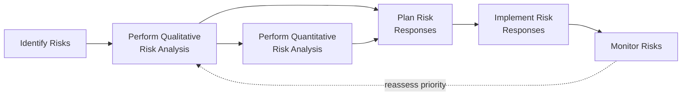
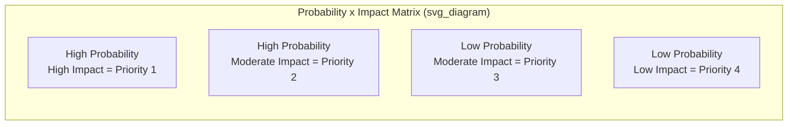

## Qualitative Risk Analysis

### Definition and Purpose

Perform Qualitative Risk Analysis is the process of prioritizing individual project risks for further analysis or action by assessing their probability of occurrence and impact, as well as other characteristics. This is a planning process within Project Risk Management that occurs after Identify Risks, and its central purpose is to reduce project uncertainty and focus attention on the highest-priority risks rather than treating the raw, unranked list from the Risk Register as uniformly important.

**Key Points**

- Establishes relative priorities among identified individual project risks for further analysis, response planning, or immediate action
- Assesses the priority of risks using their probability of occurrence, corresponding impact, timing of impact, and other factors (e.g., risk urgency, proximity, manageability)
- Is typically faster and less resource-intensive than Perform Quantitative Risk Analysis, and can be performed on all identified risks
- Should be revisited throughout the project life cycle, since risk exposure and priority can shift over time

### Position in the Process Flow

### Inputs

- **Project Management Plan**
  - Risk Management Plan: provides the probability and impact definitions, probability and impact matrix, and revised stakeholder tolerances established during Plan Risk Management
- **Project Documents**
  - Assumption Log: assumptions underpinning identified risks, relevant to assessing likelihood
  - Risk Register: the raw list of identified risks that will be analyzed and prioritized
  - Stakeholder Register: identifies key stakeholders' risk tolerances relevant to prioritization
- **Enterprise Environmental Factors (EEFs)**
  - Industry studies of similar projects that may inform probability/impact assessments
  - Published material, including commercial risk databases
- **Organizational Process Assets (OPAs)**
  - Information from prior, similar completed projects

### Tools and Techniques

**Expert Judgment**

Individuals with experience with similar recent projects assess the probability and impact of individual project risks.

**Data Gathering — Interviews**

Structured interviews may be used to assess the probability and impact of individual project risks, or other prioritization factors, especially for risks that are difficult to assess from documentation alone.

**Data Analysis**

- **Risk Data Quality Assessment**: Evaluates the degree to which the data about individual project risks is accurate and reliable as a basis for qualitative risk analysis; poor data quality can make the analysis of limited use
- **Risk Probability and Impact Assessment**: Considers the likelihood of occurrence for a specific risk and the corresponding effect on project objectives if the risk occurs
- **Assessment of Other Risk Parameters**: The project team may consider additional factors beyond probability and impact, including:
  - **Urgency**: The period within which a response to the risk needs to be implemented to be effective
  - **Proximity**: The period before the risk might have an impact on the project objectives
  - **Dormancy**: The period that may elapse after a risk occurs before its impact is discovered
  - **Manageability**: The ease with which the risk owner (or organization) can manage the occurrence or impact of a risk
  - **Controllability**: The degree to which the risk owner is able to control the risk's outcome
  - **Detectability**: The ease with which the results of the risk occurring, or about to occur, can be detected or recognized
  - **Connectivity**: The extent to which the risk is related to other individual project risks
  - **Strategic Impact**: The potential for the risk to have a positive or negative effect on organizational strategic goals
  - **Propinquity**: The degree to which a risk is perceived to matter by stakeholders

**Data Representation**

- **Probability and Impact Matrix**: A grid for mapping the probability of each risk's occurrence against its impact should it occur, used to sort risks for further quantitative analysis and response planning
- **Hierarchical Charts**: Where more than two parameters are considered (e.g., probability, impact, and urgency), a bubble chart can display three dimensions of data simultaneously (typically x-axis and y-axis for two parameters, and bubble size for a third)

**Interpersonal and Team Skills**

- **Facilitation**: Improves effectiveness by helping ensure participants stay focused on the task, accurately understand the process being used to analyze risks, and reach consensus without being unduly influenced by a small number of participants

**Risk Categorization**

Risks can be categorized by sources of risk (using the RBS), the area of the project affected (using the WBS), or other useful categories (e.g., project phase) to determine areas of the project most exposed to the effects of uncertainty.

**Iteration**

Perform Qualitative Risk Analysis is repeated for individual project risks as needed, based on the outcome from Monitor Risks or when a change of any magnitude to individual project risks occurs.

### Probability and Impact Matrix Structure

A common approach assigns a numeric probability-impact score:

$$\text{Risk Score} = P \times I$$

Where $P$ is the assessed probability (e.g., 0.1 to 0.9 scale) and $I$ is the assessed impact (e.g., on a 1–5 or monetary scale). Risks are then ranked in descending order of score to establish relative priority, though this simple multiplicative approach does not capture secondary factors like urgency or proximity unless those are separately incorporated. [Inference: whether a simple P×I score or a more nuanced multi-factor approach is preferable depends on the organization's risk management maturity and the specific project context.]

### Outputs

**Project Document Updates**

- **Assumption Log**: updated with new assumptions or refinements identified during analysis
- **Issue Log**: updated with any new issues uncovered during the qualitative analysis
- **Risk Register**: updated with assessed probability and impact for each risk, risk ranking or score, risk urgency information or risk categorization, and a watch list for low-priority risks or risks requiring further analysis
- **Risk Report**: updated to reflect the most important individual project risks and common risk sources, along with summary conclusions about the overall risk exposure of the project

### Worked Example

**Example**

A project's Risk Register contains a risk (R-014, data quality issues during migration). During qualitative analysis:

- **Probability Assessment**: Rated "High" (0.7) based on the fact that legacy data has never been formally validated
- **Impact Assessment**: Rated "Moderate" (impact score 3 on a 1–5 scale) since data quality issues would require rework but would not halt the project entirely
- **Risk Score**: $0.7 \times 3 = 2.1$
- **Urgency**: Assessed as "High," since the migration cutover window is only 6 weeks away and any remediation requires lead time
- **Manageability**: Assessed as "Moderate," since a data profiling exercise could reduce uncertainty but cannot be completed instantly

Based on the combination of a relatively high risk score and high urgency, R-014 is placed in the top tier of the Risk Register's prioritized list, flagged for progression to Perform Quantitative Risk Analysis (given its potential effect on the cost baseline) and immediate consideration in Plan Risk Responses, rather than being placed on the lower-priority watch list.

### Common Pitfalls

- Relying solely on a simple probability × impact score without considering urgency, proximity, or manageability, which can misprioritize risks that are lower-impact but require an immediate response
- Allowing a small number of vocal participants to dominate probability/impact assessments during group sessions, introducing bias; strong facilitation mitigates this
- Skipping the Risk Data Quality Assessment step, leading to overconfidence in probability/impact ratings derived from poor or incomplete information
- Treating qualitative analysis as a one-time exercise rather than repeating it as new information emerges through Monitor Risks

**Related Topics**

- Identify Risks
- Perform Quantitative Risk Analysis
- Plan Risk Responses
- Monitor Risks
- Risk Breakdown Structure
- Probability and Impact Matrix design