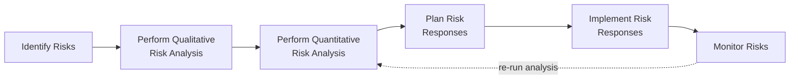
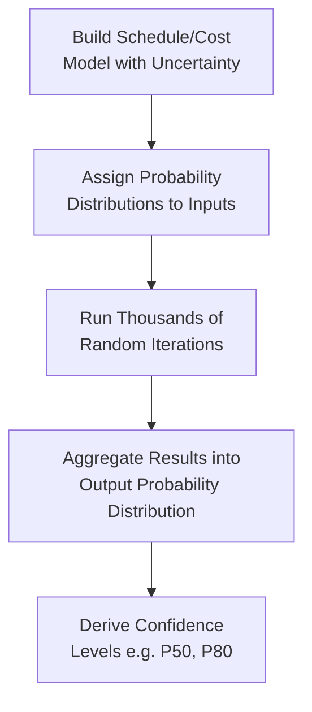
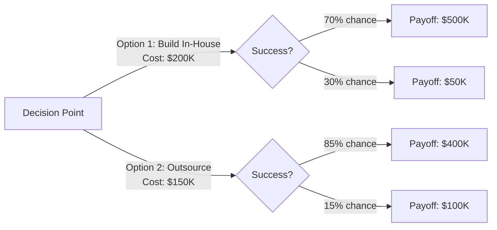

## Quantitative Risk Analysis

### Definition and Purpose

Perform Quantitative Risk Analysis is the process of numerically analyzing the combined effect of identified individual project risks and other sources of uncertainty on overall project objectives. This is a planning process within Project Risk Management, and unlike Perform Qualitative Risk Analysis (which ranks risks relatively), this process produces a quantitative, probabilistic estimate of overall project outcomes such as total cost or completion date.

**Key Points**

- Not required for every project; it is used mainly for large or complex projects, projects that are strategically important, projects for which it is a contractual requirement, or where a key stakeholder requires it
- Analyzes the combined effect of risks, providing a more realistic picture than examining risks individually
- Produces a probabilistic analysis of the project, expressed as the likelihood of achieving specific cost or schedule targets
- Requires quality data, an unbiased understanding of risks, and appropriate quantitative risk models; without these prerequisites, the effort may not be worthwhile [Inference: the threshold for when the cost/effort of this analysis is justified varies by project size, complexity, and organizational risk maturity]

### Position in the Process Flow

### Inputs

- **Project Management Plan**
  - Risk Management Plan: specifies whether quantitative analysis is required and, if so, the resources and methods to be used
  - Scope, Schedule, and Cost Baselines: serve as the basis against which probabilistic outcomes are compared
- **Project Documents**
  - Assumption Log, Basis of Estimates: identify uncertainty embedded in current estimates
  - Cost Forecasts, Milestone List: used as the structural inputs for schedule/cost modeling
  - Risk Register and Risk Report: provide the prioritized individual project risks feeding into the model
- **Enterprise Environmental Factors (EEFs)**
  - Industry studies, published data on risk attitudes and thresholds
- **Organizational Process Assets (OPAs)**
  - Information from prior similar completed projects

### Tools and Techniques

**Expert Judgment**

Individuals with prior, relevant experience assess risks and their interactions to feed model assumptions, as well as validate the tools and results of the quantitative analysis.

**Data Gathering — Interviews**

Used to generate quantitative or numeric estimates of the probability and impact of risks on project objectives (e.g., optimistic, most likely, and pessimistic values used in modeling).

**Interpersonal and Team Skills — Facilitation**

Helps improve understanding of the quantitative risk process, keeps efforts focused on relevant tasks, and helps generate meaningful results, particularly when engaging stakeholders unfamiliar with probabilistic reasoning.

**Representations of Uncertainty**

Quantitative risk analysis requires inputs that model uncertainty explicitly, such as three-point (triangular or PERT) duration or cost estimates, or full probability distributions (e.g., normal, lognormal, beta, triangular, uniform, or discrete distributions) for individual risk factors.

$$E_{PERT} = \frac{O + 4M + P}{6}$$

Where $O$ = optimistic estimate, $M$ = most likely estimate, $P$ = pessimistic estimate.

**Data Analysis**

- **Simulations**: Typically performed using the Monte Carlo method, in which the project model is computed many times (iterated), with input values randomly selected from probability distributions for each iteration, to calculate a probability distribution for the total project cost or completion date
- **Sensitivity Analysis**: Helps determine which individual project risks or other sources of uncertainty have the most potential impact on project outcomes, by correlating variations in project outcomes with variations in elements of the quantitative risk analysis model; commonly displayed as a **tornado diagram**
- **Decision Tree Analysis**: Used to support selection of the best course of action among several alternative courses of action, incorporating the cost of each available choice, the probabilities of each possible scenario, and the rewards or losses associated with each logical path
- **Influence Diagrams**: Graphical aids representing a project or situation as a set of entities, outcomes, and influences, along with the relationships and effects between them, useful for situations with significant complexity or important interrelated uncertainties

### Monte Carlo Simulation Process

### Decision Tree Structure (Illustrative)

Expected Monetary Value (EMV) for each branch:

$$EMV = \sum (\text{Probability} \times \text{Payoff}) - \text{Cost}$$

$$EMV_{\text{In-House}} = (0.7 \times 500{,}000 + 0.3 \times 50{,}000) - 200{,}000 = 165{,}000$$

$$EMV_{\text{Outsource}} = (0.85 \times 400{,}000 + 0.15 \times 100{,}000) - 150{,}000 = 205{,}000$$

Based on EMV alone, the outsourcing option shows a higher expected value in this illustrative example; a real decision would also weigh factors such as risk tolerance and non-financial considerations that are not captured purely by EMV. [Inference: EMV is a decision-support input, not an automatic decision rule, since it does not account for risk aversion or qualitative factors.]

### Outputs

**Project Document Updates**

- **Risk Report**: updated to include the quantitative risk analysis results, presented as:
  - Assessment of overall project risk exposure, such as the probability of achieving project objectives (e.g., "80% probability of completing within budget of $X")
  - Detailed probabilistic analysis of the project, including cost and schedule forecasts with associated confidence levels (e.g., S-curves showing cumulative probability of completion by date)
  - Prioritized list of quantified risks, including those risks with the greatest effect on schedule contingency, cost contingency, or opportunity (typically presented via tornado diagrams)
  - Trends in quantitative risk analysis results as the analysis is repeated over time
  - Recommended risk responses, informing the subsequent Plan Risk Responses process

### Interpreting Probabilistic Outputs

| Term | Meaning |
| --- | --- |
| P50 | 50% probability the project will complete at or below this cost/date; the median outcome |
| P80 | 80% probability the project will complete at or below this cost/date; a more conservative confidence level often used for contingency-setting |
| S-Curve | Cumulative probability distribution plotted against cost or schedule outcomes, showing the shape of overall project risk exposure |
| Tornado Diagram | Bar chart ranking risk factors by their degree of influence on the outcome variable, widest bars at top |

### Worked Example

**Example**

A Monte Carlo simulation is run on a project's schedule model, incorporating three-point estimates for 12 uncertain activities. After 10,000 iterations, results show:

- P50 completion date: October 15
- P80 completion date: November 2
- The tornado diagram identifies "Vendor API Integration Risk" as the single largest driver of schedule variance, contributing substantially more variance than the next-highest factor

Based on this output, the project team recommends to the sponsor that the schedule baseline target the P80 date (November 2) rather than the P50 date, to reflect an 80% confidence level consistent with the sponsor's stated risk tolerance, and flags the vendor API integration risk for priority treatment in Plan Risk Responses given its outsized influence on the overall schedule outcome.

### Common Pitfalls

- Running quantitative analysis without first ensuring reasonably reliable data quality (garbage-in, garbage-out risk applies strongly to probabilistic modeling)
- Presenting only a single-point probabilistic output (e.g., only the P50) without communicating the associated confidence level, leading stakeholders to misinterpret it as a guaranteed outcome
- Applying quantitative analysis uniformly to all projects regardless of size or complexity, incurring unnecessary time and cost for projects where qualitative analysis alone would suffice
- Treating EMV or simulation output as an automatic decision without incorporating stakeholder risk tolerance and qualitative judgment

**Related Topics**

- Perform Qualitative Risk Analysis
- Plan Risk Responses
- Monitor Risks
- Reserve Analysis (Contingency and Management Reserves)
- Three-Point Estimating
- Sensitivity Analysis and Tornado Diagrams