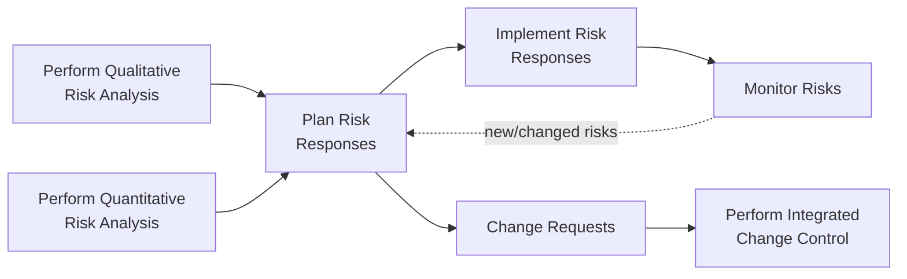
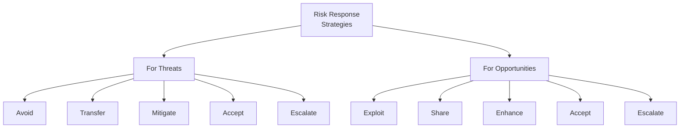

## Planning Risk Responses

### Definition and Purpose

Plan Risk Responses is the process of developing options, selecting strategies, and agreeing on actions to address overall project risk exposure, as well as to treat individual project risks. This is a planning process within Project Risk Management, and it is where analysis (from Perform Qualitative and Quantitative Risk Analysis) is converted into concrete, actionable strategies and agreed-upon activities.

**Key Points**

- Develops appropriate strategies to address both overall project risk and prioritized individual project risks, matched to their importance
- Response strategies must be timely, cost-effective, realistic within the project context, agreed upon by relevant parties, and owned by a responsible person
- Distinguishes between strategies for threats (negative risks) and strategies for opportunities (positive risks), plus contingent response strategies for either
- Feeds directly into the project management plan and project documents (schedule, cost, resource updates), since agreed responses often require baseline changes

### Position in the Process Flow

### Inputs

- **Project Management Plan**
  - Resource Management Plan: informs how resources for response actions will be allocated
  - Risk Management Plan: defines roles, thresholds, and general approach guiding response selection
  - Cost Baseline: informs contingency reserve amounts
- **Project Documents**
  - Lessons Learned Register, Project Schedule, Project Team Assignments, Resource Calendars: inform feasibility and scheduling of response actions
  - Risk Register and Risk Report: provide the prioritized list of risks and analysis results that responses will address
  - Stakeholder Register: identifies stakeholders' roles relevant to response ownership and risk appetite
- **Enterprise Environmental Factors (EEFs)**
  - Stakeholder risk appetite and thresholds
- **Organizational Process Assets (OPAs)**
  - Templates for the Risk Management Plan, Risk Register, and Risk Report
  - Historical databases and lessons learned from previous similar projects

### Tools and Techniques

**Expert Judgment**

Input from individuals with expertise in the assessment of responses for both threats and opportunities, as well as in the specific type of technical response being considered.

**Data Gathering — Interviews**

Used to help develop response options for both individual project risks and overall project risk.

**Interpersonal and Team Skills — Facilitation**

Improves the effectiveness of developing risk response options by helping team members and stakeholders reach consensus on response strategies.

**Strategies for Threats**

- **Escalate**: Appropriate when the project team or sponsor agrees the threat is outside the scope of the project or the proposed response exceeds the project manager's authority; escalated risks are managed at the program, portfolio, or other relevant organizational level
- **Avoid**: The project team acts to eliminate the threat or protect the project from its impact, usually by changing some aspect of the overall project management plan
- **Transfer**: Shifting ownership of a threat to a third party to manage the risk and to bear the impact if the threat occurs (e.g., insurance, warranties, performance bonds)
- **Mitigate**: Action is taken to reduce the probability of occurrence and/or impact of a threat, ideally to below an acceptable threshold
- **Accept**: Acknowledging the existence of the threat, but not taking any proactive action unless the risk occurs (can be active, e.g., establishing a contingency reserve, or passive, requiring no action other than periodic review)

**Strategies for Opportunities**

- **Escalate**: Appropriate when the project team or sponsor agrees the opportunity is outside the scope of the project
- **Exploit**: Selected to ensure that an opportunity is realized, by eliminating the uncertainty associated with a particular upside risk
- **Share**: Transferring ownership of an opportunity to a third party better able to capture the benefit (e.g., forming risk-sharing partnerships, teams, or joint ventures)
- **Enhance**: Modifying the size of an opportunity by increasing probability and/or impact, and by identifying and maximizing key drivers of the positive impact
- **Accept**: Acknowledging the existence of the opportunity but not actively pursuing it

**Contingent Response Strategies**

Some responses are designed for use only if specific events occur; a response plan will only be executed under certain predefined conditions, using **triggering events** to activate the plan (e.g., missing intermediate milestones), often called a **contingency plan**, with associated **fallback plans** developed if the initial response proves inadequate.

**Data Analysis**

- **Alternatives Analysis**: Comparison of different response strategy options
- **Cost-Benefit Analysis**: Determining the most cost-effective risk response, comparing the cost of the response with the expected benefit

**Decision Making — Multicriteria Decision Analysis**

Techniques such as a decision matrix used to prioritize among a number of possible risk response options.

### Threat vs. Opportunity Strategy Comparison

### Outputs

**Change Requests**

Plan Risk Responses can result in change requests to the cost baseline or schedule baseline, or other components of the project management plan, submitted through Perform Integrated Change Control.

**Project Management Plan Updates**

- Schedule Management Plan, Cost Management Plan, Quality Management Plan, Resource Management Plan, Procurement Management Plan: updated to reflect any process changes resulting from responses
- Scope, Schedule, Cost Baselines: updated to reflect approved changes arising from agreed responses

**Project Document Updates**

- Assumption Log: updated with new assumptions or changes to existing assumptions arising from response planning
- Cost Forecasts, Lessons Learned Register, Project Schedule, Project Team Assignments: updated to reflect resourcing, timing, and cost implications of chosen responses
- Risk Register: updated with agreed-upon response strategies, specific actions to implement the chosen strategy, triggering conditions, budget and schedule activities required, contingency plans and triggers, fallback plans for use when the primary response is not effective, residual risks expected after planned response, and secondary risks that arise as a direct result of implementing a risk response
- Risk Report: updated to reflect agreed responses for the most significant individual project risks and sources of overall project risk

### Worked Example

**Example**

Building on risk R-014 (data quality issues during migration, high priority from qualitative analysis) and the vendor API integration risk flagged as the largest schedule variance driver from quantitative analysis:

**R-014 (Threat: Data Quality)**

- **Strategy Selected**: Mitigate
- **Response Action**: Schedule a formal data profiling and cleansing activity 4 weeks before the migration cutover
- **Residual Risk**: Some undiscovered data quality issues may still surface during migration, but at reduced probability and impact
- **Secondary Risk**: The data profiling activity itself consumes specialist resource time that was not originally budgeted, creating a new minor resource-contention risk requiring its own entry in the Risk Register

**Vendor API Integration Risk (Threat: Schedule)**

- **Strategy Selected**: Transfer (partial) combined with Mitigate
- **Response Action**: Negotiate a contractual penalty clause with the vendor for late API delivery (transfer of financial impact), while also building a 2-week schedule buffer specifically around the integration testing phase (mitigate)
- **Contingent Response**: If the vendor misses an intermediate milestone (triggering event), a fallback plan is activated to begin integration testing against a vendor-provided mock/sandbox environment rather than waiting for the live API

**Opportunity Example**

A separately identified opportunity — the possibility of reusing a component from a prior project, reducing development effort — is assigned an **Exploit** strategy: the team commits engineering time immediately to confirm and adapt the reusable component, rather than leaving the opportunity to chance.

### Common Pitfalls

- Selecting "Accept" as a default response for risks that actually warrant proactive mitigation, due to insufficient time or facilitation during the planning session
- Failing to identify secondary risks introduced by the chosen response itself, leaving the Risk Register incomplete
- Neglecting to define clear triggering events for contingent responses, resulting in contingency plans that are never actually activated when needed
- Treating opportunity strategies as an afterthought, focusing almost exclusively on threat responses and leaving legitimate upside potential unmanaged

**Related Topics**

- Perform Qualitative Risk Analysis
- Perform Quantitative Risk Analysis
- Implement Risk Responses
- Monitor Risks
- Contingency Reserve vs. Management Reserve
- Perform Integrated Change Control