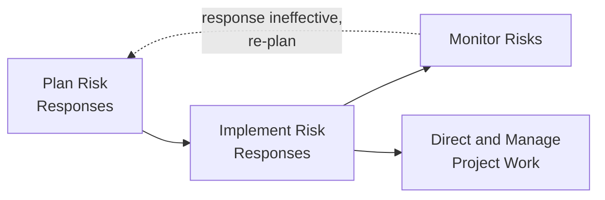
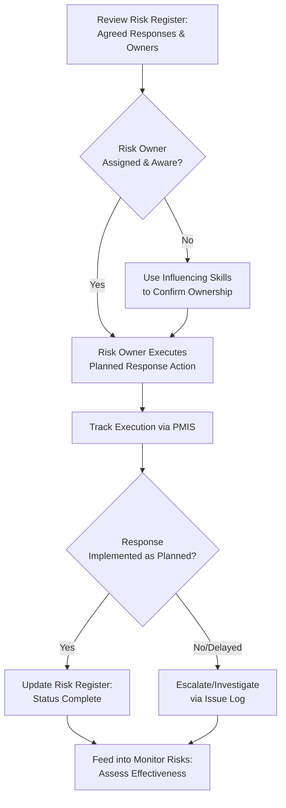

## Implementing Risk Responses

### Definition and Purpose

Implement Risk Responses is the process of implementing agreed-upon risk response plans. This is an executing process within Project Risk Management, and its core purpose is ensuring that agreed-upon risk responses are actually executed as planned, rather than being defined in the Risk Register but never acted upon — a common failure mode this process is specifically designed to prevent.

**Key Points**

- The sole objective is to ensure that agreed-upon risk responses are actually executed as planned, closing a common gap where risk responses are documented but not enacted
- Ensures appropriate resources and attention are devoted to the planned risk response activities embedded in the Risk Register, without deviating and simply attending to risks as they occur
- Requires the involvement of the assigned risk owner, who is responsible for determining and confirming the effectiveness of the selected response
- Directly links back to Monitor Risks, since the effectiveness of implemented responses must be tracked and reassessed

### Position in the Process Flow

### Inputs

- **Project Management Plan**
  - Risk Management Plan: identifies roles, responsibilities, and resources allocated to risk management, including implementation of responses
- **Project Documents**
  - Lessons Learned Register: earlier insights on effective/ineffective implementation approaches
  - Risk Register: contains the agreed-upon response strategies, specific actions, responsible risk owners, and triggering conditions to be implemented
  - Risk Report: describes the sources of overall project risk, along with agreed responses, that must be actioned
- **Organizational Process Assets (OPAs)**
  - Lessons learned repository and historical information from previous similar projects regarding risk response implementation

### Tools and Techniques

**Expert Judgment**

The expertise of individuals or groups with specialized knowledge of the specific agreed-upon risk responses being implemented should be considered, particularly for technically complex responses (e.g., specific mitigation techniques).

**Interpersonal and Team Skills — Influencing**

Because some risk owners may be reluctant to take on additional actions related to risk responses that lie outside their strict role or day-to-day responsibilities, project managers or risk management team members may need to use influencing skills to encourage assigned risk owners to take the necessary action.

**Project Management Information System (PMIS)**

Scheduling, resource, and cost software may be used to ensure that risk response action plans and their associated activities are integrated with other project activities, tracked for completion, and reported through the appropriate PMIS.

### Outputs

**Change Requests**

Implementing risk responses may require a change request affecting the cost baseline, schedule baseline, or other components of the project management plan, submitted through Perform Integrated Change Control (e.g., if implementing a mitigation action requires additional budget or time not previously included).

**Project Document Updates**

- **Issue Log**: updated with issues encountered as a result of implementing risk responses
- **Lessons Learned Register**: updated with information on techniques that were effective (or ineffective) at implementing risk responses
- **Project Team Assignments**: updated to reflect specific roles assigned to implement agreed responses
- **Risk Register**: updated to reflect the status of implementation for each response

**Organizational Process Assets Updates**

- Contingency reserve utilization records updated as responses that draw on contingency reserves are implemented

### Implementation Workflow

### Worked Example

**Example**

Continuing the earlier scenario for risk R-014 (data quality issues during migration), Plan Risk Responses had established a mitigation action: schedule a formal data profiling and cleansing activity 4 weeks before the migration cutover, with the Data Migration Lead as the designated risk owner.

During Implement Risk Responses:

1. The project manager confirms with the Data Migration Lead that the data profiling activity is scheduled and resourced according to the plan
2. The Data Migration Lead reports that the specialist assigned to the profiling task is also committed to another urgent internal request; the project manager uses influencing skills, engaging the specialist's functional manager to confirm the priority of the risk response activity given its documented importance to the migration schedule
3. The data profiling activity proceeds; results are tracked in the PMIS alongside other project schedule activities to ensure visibility and integration
4. Upon completion, several data quality issues are indeed found and remediated ahead of the cutover window, rather than being discovered during the live migration
5. The Risk Register is updated to reflect that the mitigation response for R-014 was implemented as planned, and this becomes an input for Monitor Risks to assess whether the residual risk level has, in fact, been reduced as expected

For the vendor API integration risk, the contingent fallback plan (using a vendor sandbox environment) required a triggering event (a missed intermediate vendor milestone) that has not yet occurred; accordingly, this contingent response remains in a "ready but not yet triggered" status, tracked in the Risk Register but not actively implemented until the trigger condition is met.

### Implement Risk Responses vs. Plan Risk Responses vs. Monitor Risks

| Aspect | Plan Risk Responses | Implement Risk Responses | Monitor Risks |
| --- | --- | --- | --- |
| Process Type | Planning | Executing | Monitoring and Controlling |
| Primary Focus | Deciding what to do | Actually doing it | Checking whether it worked |
| Key Question | "What should we do about this risk?" | "Is the agreed action being carried out?" | "Is the response effective, and are there new risks?" |
| Typical Output | Risk Register response strategies | Updated implementation status, change requests | Work performance information, risk register updates |

### Common Pitfalls

- Assuming that documenting a response strategy in the Risk Register during planning is sufficient, without a deliberate process to confirm actual execution
- Failing to use influencing skills when a risk owner deprioritizes the response action in favor of other competing responsibilities, allowing planned mitigations to lapse
- Not integrating risk response activities into the PMIS/project schedule, causing them to be overlooked amid other execution priorities
- Neglecting to update the Risk Register promptly upon implementation, causing Monitor Risks to work from stale or inaccurate status information

**Related Topics**

- Plan Risk Responses
- Monitor Risks
- Perform Integrated Change Control
- Direct and Manage Project Work
- Contingency Reserve vs. Management Reserve
- Influencing and Negotiation skills for project managers