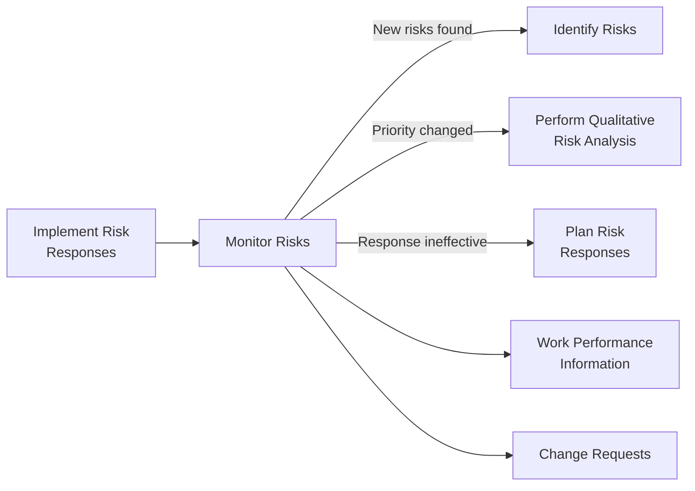
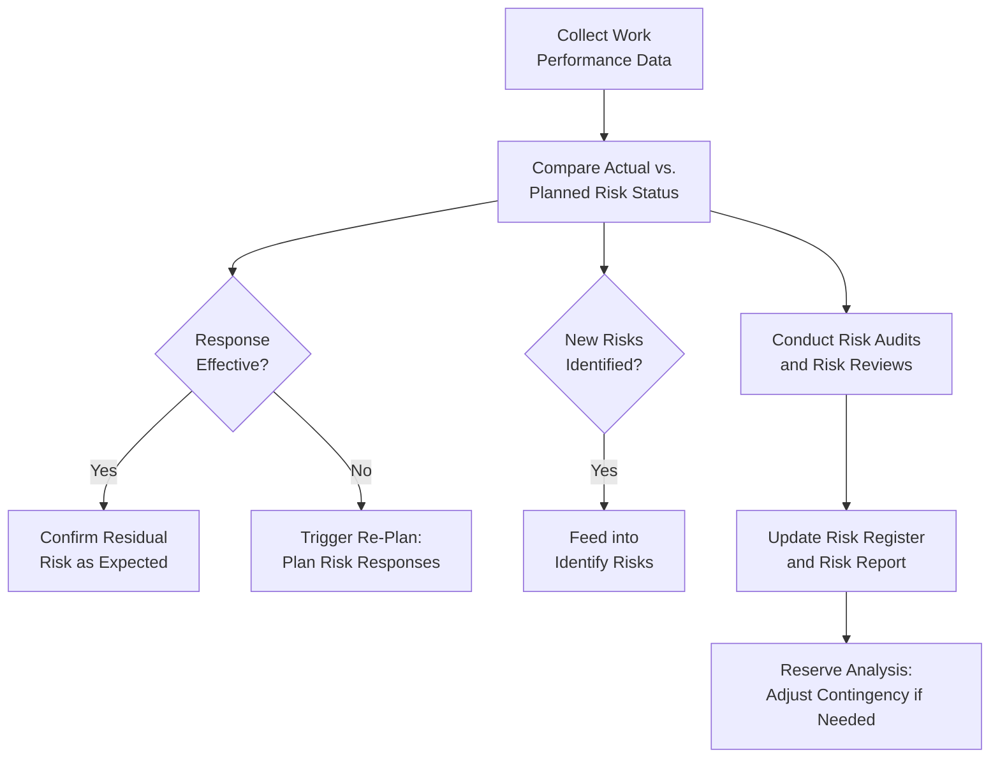

## Monitoring Risks

### Definition and Purpose

Monitor Risks is the process of monitoring the implementation of agreed-upon risk response plans, tracking identified risks, identifying and analyzing new risks, and evaluating risk process effectiveness throughout the project. This is a monitoring and controlling process within Project Risk Management, and it is the final process in the risk management cycle, closing the loop back to earlier processes as new information emerges.

**Key Points**

- Uses information gained from project performance to determine if the overall project risk exposure has changed, individual risk statuses have evolved, or new risks have emerged
- Determines whether project assumptions are still valid, whether analysis reflects prior assessments appropriately, and whether risk management policies and procedures are being followed
- Determines whether contingency reserves for cost or schedule should be modified in line with the current risk assessment
- Is continuous throughout the project life cycle; it does not occur only at the end or only once during execution

### Position in the Process Flow

### Inputs

- **Project Management Plan**
  - Risk Management Plan: defines timing, roles, and criteria for ongoing risk monitoring activities
- **Project Documents**
  - Issue Log: tracks current issues that may relate to, or arise from, project risks
  - Lessons Learned Register: informs more effective monitoring approaches based on earlier experience within the same project
  - Risk Register: the central document being continuously updated with status changes, new risks, and reassessed priorities
  - Risk Report: overall project risk exposure information that is refreshed as monitoring proceeds
- **Work Performance Data**
  - Raw observations on project status, including data related to various types of project performance possibly affected by risks (e.g., schedule progress, cost expenditure, deliverable status)
- **Work Performance Reports**
  - Information from performance measurements, which is analyzed to provide project work performance information, including variance analysis, earned value data, and forecasting data

### Tools and Techniques

**Data Analysis**

- **Technical Performance Analysis**: Compares technical accomplishments during project execution to the schedule of technical achievement, using measures of technical performance to help forecast the degree of success in achieving the project's scope
- **Reserve Analysis**: Compares the amount of contingency reserves remaining to the amount of risk remaining at any time in the project, to determine if the remaining reserve is adequate

**Audits**

Risk audits examine and document the effectiveness of risk responses in dealing with identified individual project risks and their root causes, as well as the effectiveness of the overall risk management process; the project manager is responsible for ensuring risk audits are performed at an appropriate frequency, as defined in the Risk Management Plan.

**Meetings**

- **Risk Reviews**: Examine and document the effectiveness of risk responses in dealing with overall project risk and with identified individual project risks; may involve reviewing and documenting the effectiveness of responses in the Risk Register and Risk Report

### Outputs

**Work Performance Information**

Includes information on how project risk management is performing when compared to expectations, such as which individual project risks have occurred, or the status of ongoing top risks and their responses compared to expectations of how they would perform.

**Change Requests**

May be generated as a result of performing Monitor Risks, including recommended corrective and preventive actions, which are then processed for review and disposition through Perform Integrated Change Control.

**Project Management Plan Updates**

Any component of the project management plan may be updated as a result of Monitor Risks.

**Project Document Updates**

- Assumption Log, Issue Log, Lessons Learned Register: updated with new information from monitoring activities
- Risk Register and Risk Report: updated to reflect current status of individual project risks, new risks, closed risks, and overall project risk exposure

**Organizational Process Assets Updates**

Includes information developed from project risk activities, incorporated into the historical database of both project and organizational risk management processes, including risk register templates, RBS templates, lessons learned repository, and risk management plan templates, potentially updated as a result of the current project's monitoring activities.

### Risk Monitoring Workflow

### Reserve Analysis Example

$$\text{Remaining Reserve Ratio} = \frac{\text{Remaining Contingency Reserve}}{\text{Remaining Risk Exposure}}$$

A ratio significantly below 1.0 may indicate that contingency reserves are being depleted faster than risk exposure is declining, signaling a need to escalate for additional reserve or accelerate mitigation efforts. [Inference: what constitutes a "significant" shortfall depends on organizational policy and the specific risk profile of the project, and is not a fixed universal threshold.]

### Worked Example

**Example**

At the project's midpoint, a scheduled risk review meeting is held per the cadence defined in the Risk Management Plan.

Findings from Monitor Risks activities:

1. **Risk R-014 (data quality)**: The implemented mitigation (data profiling activity) is confirmed via technical performance analysis to have reduced the number of outstanding data quality defects by a substantial margin compared to the pre-mitigation baseline; the risk is downgraded and moved toward closure in the Risk Register
2. **Vendor API Integration Risk**: A risk audit reveals the vendor has, in fact, missed an intermediate milestone — the previously defined triggering event for the contingent fallback plan. This is documented in the Issue Log, and Implement Risk Responses is re-engaged to activate the sandbox-based fallback plan
3. **New Risk Identified**: During the review, a team member raises a previously unconsidered risk related to a recent regulatory change affecting data handling requirements; this is fed back into Identify Risks for formal assessment and Risk Register entry
4. **Reserve Analysis**: Contingency reserve consumption is reviewed against the current aggregate risk exposure; the ratio remains within an acceptable range defined by organizational policy, so no request for additional reserve is made at this time

These findings collectively update the Risk Register and Risk Report, and the cycle of Identify Risks, Perform Qualitative Risk Analysis, and Plan Risk Responses is re-engaged specifically for the newly surfaced regulatory risk and the triggered vendor fallback plan, while R-014 progresses toward closure.

### Risk Audits vs. Risk Reviews

| Aspect | Risk Audit | Risk Review |
| --- | --- | --- |
| Primary Focus | Effectiveness of the risk management process itself | Effectiveness of specific responses to specific risks |
| Typical Conductor | May involve an independent party or dedicated audit function | Often conducted by the project team and risk owners |
| Frequency | As defined in the Risk Management Plan, often periodic | Often integrated into regular status/review meetings |
| Primary Output | Process improvement recommendations | Updated Risk Register/Risk Report status |

### Common Pitfalls

- Treating Monitor Risks as a passive, end-of-project retrospective activity rather than a continuous process throughout execution
- Failing to formally re-engage Identify Risks, Perform Qualitative Risk Analysis, or Plan Risk Responses when monitoring reveals new or changed risks, leaving the Risk Register stale
- Neglecting reserve analysis, resulting in contingency reserves being depleted without warning before residual risk exposure has meaningfully declined
- Conflating risk audits (process effectiveness) with risk reviews (specific response effectiveness), leading to incomplete oversight of either dimension

**Related Topics**

- Identify Risks
- Perform Qualitative Risk Analysis
- Plan Risk Responses
- Implement Risk Responses
- Reserve Analysis (Contingency and Management Reserves)
- Perform Integrated Change Control