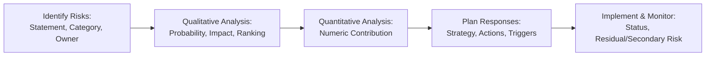
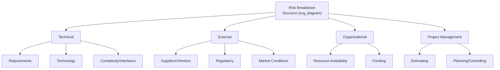

## Risk Registers and Risk Breakdown Structures

### Definition and Purpose

The Risk Register and the Risk Breakdown Structure (RBS) are two distinct but complementary artifacts used across Project Risk Management. The Risk Register is the central repository documenting individual project risks and the outcomes of each risk management process as it progresses. The Risk Breakdown Structure is a hierarchical categorization scheme used to organize and group potential sources of risk, functioning as a structural taxonomy rather than a live tracking document.

**Key Points**

- The Risk Register is a living document, continuously updated across Identify Risks, Perform Qualitative Risk Analysis, Perform Quantitative Risk Analysis, Plan Risk Responses, Implement Risk Responses, and Monitor Risks
- The Risk Breakdown Structure is established early (typically during Plan Risk Management) and used as a categorization framework and identification aid throughout the project, rather than being updated with individual risk entries itself
- Both artifacts support consistent risk categorization, which allows risk data to be aggregated, compared, and analyzed for patterns across the project or across the organization's project portfolio
- Confusing the two is a common error: the RBS categorizes types/sources of risk, while the Risk Register lists the actual, specific identified risks

### Risk Register: Structure and Contents

The Risk Register is developed initially in Identify Risks and evolves as it passes through subsequent processes. A mature Risk Register typically contains:

**From Identify Risks**

- Unique identifier for each risk
- Risk statement (cause-risk-effect structured)
- Risk category (often referencing the RBS)
- Potential risk owner
- List of potential risk responses (preliminary)
- Root cause of the risk

**From Perform Qualitative Risk Analysis**

- Assessed probability and impact ratings
- Risk score or priority ranking
- Urgency assessment and other secondary parameters (proximity, manageability, etc.)
- Risks grouped by category, and a watch list of lower-priority risks

**From Perform Quantitative Risk Analysis**

- Numerical/probabilistic contribution to overall project cost or schedule risk (where applicable)
- Ranking based on quantitative influence (e.g., tornado diagram results)

**From Plan Risk Responses**

- Agreed-upon response strategy (avoid, transfer, mitigate, accept, escalate; or exploit, share, enhance, accept, escalate)
- Specific actions to implement the response
- Triggering conditions for contingent responses
- Budget and schedule activities required for the response
- Contingency plans and associated triggers
- Fallback plans
- Residual risk expected to remain after the response
- Secondary risks arising from the response itself
- Confirmed risk owner responsible for implementation

**From Implement Risk Responses and Monitor Risks**

- Implementation status of the response
- Current risk status (open, closed, occurred, escalated)
- Updated ratings if reassessed

### Risk Breakdown Structure: Structure and Purpose

The RBS provides a hierarchical representation of potential sources of risk, typically structured from a general top-level category down to more specific subcategories, analogous in form to a Work Breakdown Structure but organized around risk sources rather than deliverables.

**Common Top-Level RBS Categories**

| Category | Typical Subcategories |
| --- | --- |
| Technical | Requirements, Technology, Complexity/Interfaces, Performance, Reliability/Quality |
| External | Suppliers/Vendors, Regulatory, Market, Customer, Weather/Force Majeure |
| Organizational | Resource Availability, Funding, Prioritization/Dependencies, Organizational Stability |
| Project Management | Estimating, Planning, Controlling, Communication |

### Uses of the Risk Breakdown Structure

- **Serves as a checklist** during Identify Risks to prompt brainstorming across each category and subcategory, reducing the chance that an entire risk source area is overlooked
- **Enables risk categorization** in the Risk Register, allowing risks to be grouped, filtered, and analyzed by source
- **Supports pattern analysis** by revealing whether a disproportionate share of risk exposure originates in one category (e.g., predominantly Technical risk), which can inform where additional risk management attention or resources should be concentrated
- **Facilitates organizational learning**, since a standardized RBS taxonomy reused across projects allows the organization to compare risk profiles and build historical risk databases (an Organizational Process Asset)

### Risk Register vs. Risk Breakdown Structure: Direct Comparison

| Aspect | Risk Register | Risk Breakdown Structure |
| --- | --- | --- |
| Nature | Living document, continuously updated | Relatively static categorization framework |
| Established During | Identify Risks (created), updated in every subsequent risk process | Plan Risk Management (created), rarely modified afterward |
| Content | Specific, individual identified risks with full detail | Generic categories and subcategories of risk sources |
| Primary Use | Tracking, analysis, and response management for actual risks | Organizing risk identification efforts and enabling categorized reporting |
| Analogy | Like a detailed task list | Like a Work Breakdown Structure, but for risk sources |

### Worked Example

**Example**

An organization defines a standard RBS with four top-level categories (Technical, External, Organizational, Project Management) as an Organizational Process Asset, reused across all its projects for consistency.

During Identify Risks for a specific software project, the team uses this RBS as a structured checklist during a brainstorming workshop, systematically working through each category:

- **Technical**: Surfaces a risk about an unproven third-party library dependency
- **External**: Surfaces a risk about a vendor's historically slow security review process
- **Organizational**: Surfaces a risk about key specialist resource contention with another active project
- **Project Management**: Surfaces a risk about aggressive estimating assumptions made during initial planning

Each of these becomes a distinct, fully detailed entry in the Risk Register, complete with a cause-risk-effect statement, assigned category (linked back to the RBS), and a designated potential owner. As the project progresses through qualitative analysis, quantitative analysis, and response planning, each Risk Register entry accumulates additional fields (probability, impact, strategy, status), while the RBS itself remains unchanged, continuing to serve purely as the categorization reference.

At project closure, the Lessons Learned Register notes that the RBS's "Organizational" category consistently surfaced the highest-impact risks across the project's lifecycle, information that is then fed back into organizational process assets to refine risk management guidance for future projects of a similar type.

### Common Pitfalls

- Treating the RBS as a place to record actual project risks, rather than using the Risk Register for that purpose
- Using an RBS that is too generic or too rigid, failing to reflect the specific risk landscape of the organization's industry or project types
- Allowing the Risk Register to become a static document updated only during initial risk identification, rather than continuously maintained through Monitor Risks
- Failing to leverage the RBS's categorization for portfolio-level or organizational-level risk pattern analysis, missing an opportunity for broader organizational learning

**Related Topics**

- Identify Risks
- Plan Risk Management
- Perform Qualitative Risk Analysis
- Plan Risk Responses
- Monitor Risks
- Organizational Process Assets and Lessons Learned Repositories