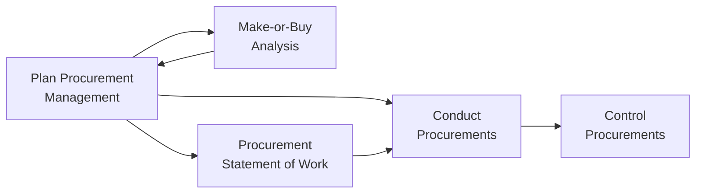
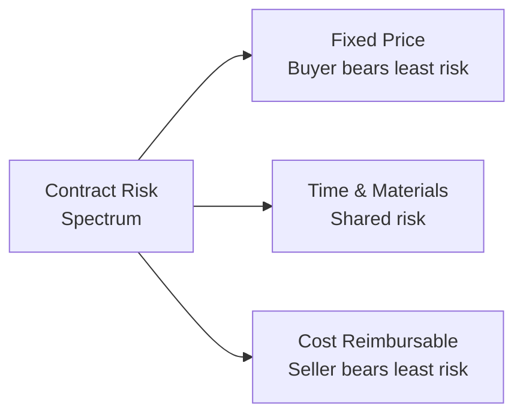

## Planning Procurement Management

### Definition and Purpose

Plan Procurement Management is the process of documenting project procurement decisions, specifying the approach, and identifying potential sellers. This is a planning process within Project Procurement Management, and it is the foundational process that determines whether to acquire goods or services from outside the project team, and if so, what to acquire, how, and when.

**Key Points**

- Includes consideration of the risks involved with each make-or-buy decision, and reviewing the type of contract planned to be used with respect to mitigating risks and transferring risks to the seller
- Governs all subsequent procurement processes (Conduct Procurements, Control Procurements) by establishing the overall approach and required documentation
- Should identify sellers, particularly if the buyer wishes to exercise some degree of influence or control over contracting decisions
- Is typically conducted early enough to allow adequate time for solicitation, seller selection, and contract negotiation before the procured item or service is actually needed

### Position in the Process Flow

### Inputs

- **Project Charter**
  - High-level objectives, description, and pre-approved financial resources relevant to procurement scope
- **Business Documents**
  - Business Case: identifies the reasons for undertaking the project, which may inform whether external procurement supports the business objective more effectively than internal execution
- **Project Management Plan**
  - Scope Management Plan, Quality Management Plan, Resource Management Plan: inform what needs to be procured and to what standard
  - Scope Baseline: defines the deliverables and boundaries relevant to identifying what may need external procurement
- **Project Documents**
  - Milestone List, Project Team Assignments, Requirements Documentation, Requirements Traceability Matrix, Resource Requirements, Risk Register, Stakeholder Register: each informs procurement scope, timing, requirements, and risk considerations
- **Enterprise Environmental Factors (EEFs)**
  - Marketplace conditions
  - Products, services, and results available in the marketplace, from whom and under what terms and conditions
  - Typical terms and conditions for the product, service, or result, or for the specific industry
  - Local requirements regarding doing business with foreign sellers
  - Legal advice regarding procurement
  - Contract management systems
  - Multi-tier supply chain information
- **Organizational Process Assets (OPAs)**
  - Approved seller lists or prequalified seller lists
  - Formal procurement policies, procedures, and guidelines
  - Types of contracts used by the performing organization

### Tools and Techniques

**Expert Judgment**

Expertise should be considered from individuals or groups with specialized knowledge in procurement and purchasing, contract types and contract documents, regulations, compliance requirements, legal and regulatory requirements, and other technical disciplines relevant to what is being procured.

**Data Gathering — Market Research**

Examines industry and specific seller capabilities, including exploring industry and vendor conferences, reviewing information from a variety of sources, and identifying market capabilities in relation to what is needed.

**Data Analysis — Make-or-Buy Analysis**

Used to determine whether work or deliverables can best be accomplished by the project team or should be purchased from outside sources.

$$\text{Cost}_{Make} \text{ vs. } \text{Cost}_{Buy}$$

Considerations extend beyond simple unit cost comparisons to include factors such as the organization's core capabilities, control over quality, indirect costs (e.g., equipment maintenance, training), and strategic importance of retaining the capability in-house. [Inference: the relative weight given to strategic versus purely cost factors depends on organizational priorities and cannot be reduced to a single universal formula.]

**Source Selection Analysis**

Reviewing factors such as the least cost, qualifications only, quality-based/highest technical proposal score, quality- and cost-based, sole source, fixed budget, when selecting the approach for choosing sellers.

**Meetings**

Research alone may not provide specific information necessary to formulate a procurement strategy without additional information gained through meetings with potential bidders, including prospective sellers with prior experience.

### Contract Types

| Contract Type | Risk to Buyer | Risk to Seller | Typical Use Case |
| --- | --- | --- | --- |
| Fixed-Price (FP) | Low | High | Well-defined scope, low uncertainty |
| Fixed Price Incentive Fee (FPIF) | Low–Moderate | Moderate | Well-defined scope with performance incentives |
| Fixed Price with Economic Price Adjustment (FP-EPA) | Low–Moderate | Moderate | Multi-year contracts subject to cost fluctuation (inflation) |
| Cost-Reimbursable (CR) | High | Low | Uncertain or evolving scope |
| Cost Plus Fixed Fee (CPFF) | High | Low | Uncertain scope, seller reimbursed cost plus a fixed fee |
| Cost Plus Incentive Fee (CPIF) | High–Moderate | Low–Moderate | Uncertain scope with performance incentives |
| Cost Plus Award Fee (CPAF) | High | Low | Uncertain scope, fee based on subjective performance criteria |
| Time and Materials (T&M) | Moderate–High | Low–Moderate | Staff augmentation, small or undefined scope |

### Outputs

**Procurement Management Plan**

Describes how the project team will acquire goods and services from outside the project, including: types of contracts to be used; risk management issues; whether independent estimates will be used; procurement-related actions the organization can take unilaterally; standardized procurement documents; managing multiple providers; coordinating procurement with other project aspects; constraints affecting procurement; handling long lead-time procurement items; handling make-or-buy decisions and linking them to schedule activities; establishing procurement contract deliverable due dates; metrics for managing contracts and evaluating sellers.

**Procurement Strategy**

Determines the project delivery method, the type(s) of legally binding agreement(s), and how procurement will advance through its phases.

**Bid Documents**

Used to solicit proposals from prospective sellers:

- **Request for Information (RFI)**: Used when more information is needed on goods/services to be acquired
- **Request for Quotation (RFQ)**: Used when more information is needed on how vendors would satisfy the requirements and/or how much it will cost, typically for standard/commercial items priced primarily on cost
- **Request for Proposal (RFP)**: Used when there is a problem in project execution and the solution is not straightforward, requiring detailed technical proposals along with pricing

**Procurement Statement of Work (SOW)**

Developed from the project scope baseline, defines only that portion of the project scope to be included within the related contract; describes the procurement item in sufficient detail to allow prospective sellers to determine if they are capable of providing it.

**Source Selection Criteria**

Often included as part of procurement documents; can include criteria such as capability and capacity, product cost and life-cycle cost, delivery dates, technical expertise and approach, specific relevant experience, adequacy of proposed approach, warranty, financial capacity, references, intellectual property rights.

**Make-or-Buy Decisions**

Documents the conclusions reached regarding what will be produced or performed by the project team and what will be purchased or acquired from outside sources.

**Independent Cost Estimates**

For large procurements, the procuring organization may prepare its own independent cost estimate as a benchmark on proposed responses, or may use an outside professional estimator.

**Change Requests**

Decisions made during Plan Procurement Management may require a change request to the project management plan, its subsidiary plans, and other components.

**Project Document Updates**

- Lessons Learned Register, Milestone List, Requirements Documentation, Requirements Traceability Matrix, Risk Register, Stakeholder Register: updated to reflect procurement-related decisions and information

**Organizational Process Assets Updates**

Information on qualified sellers.

### Worked Example

**Example**

A construction project needs specialized structural steel fabrication, a capability the organization does not maintain in-house.

**Make-or-Buy Analysis**: Given the specialized equipment and expertise required, along with the one-time nature of this need, the analysis favors "Buy" over building internal capability, despite an internal build having a theoretically lower unit cost if the capability were reused across many future projects — a strategic consideration the analysis explicitly weighs against near-term cost.

**Contract Type Selection**: Given the well-defined engineering specifications for the steel components, a Fixed-Price contract is selected, since scope is stable and well-understood, placing appropriate risk on the seller to deliver at the agreed price.

**Bid Document**: Since the requirement is a well-defined, largely commodity-priced fabrication service, an RFQ is issued rather than an RFP, since the primary differentiator among sellers is price and delivery timeline rather than a complex technical approach.

**Source Selection Criteria**: Delivery date reliability, prior experience with similar structural specifications, and financial capacity to bond the project are weighted heavily, given the criticality of on-time steel delivery to the broader construction schedule.

### Common Pitfalls

- Selecting a contract type without adequately considering the risk allocation implications (e.g., using a cost-reimbursable contract for well-defined, low-risk scope, needlessly retaining risk that could have been transferred)
- Treating make-or-buy analysis as a pure cost comparison, ignoring strategic factors such as core competency retention or long-term capability building
- Failing to develop a sufficiently detailed Procurement Statement of Work, leading to ambiguous seller responses that are difficult to compare or evaluate fairly
- Choosing the wrong bid document type (e.g., issuing an RFP for a simple commodity purchase, or an RFQ for a complex, solution-dependent problem)

**Next Steps**

- Conduct Procurements
- Control Procurements
- Contract Types in depth
- Source Selection Criteria design
- Make-or-Buy Analysis techniques