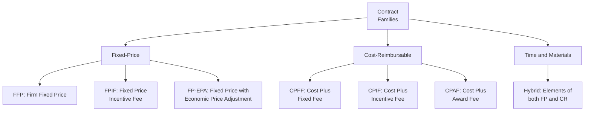
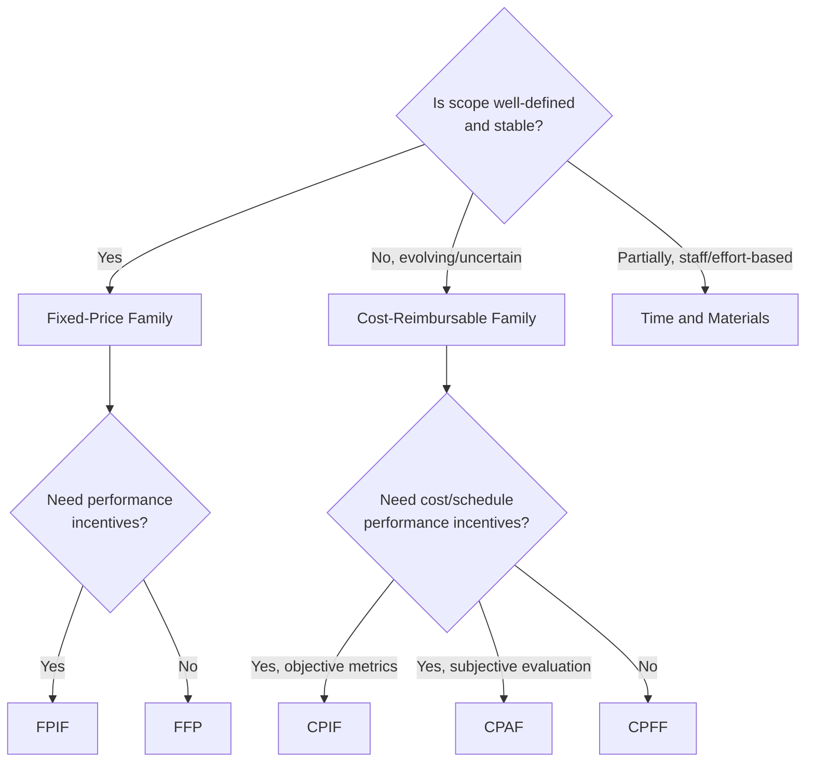

## Contract Types and Structures

### Definition and Purpose

Contract Types and Structures refers to the legal and commercial frameworks used to formalize agreements between a buyer (the project's performing organization) and a seller (a contractor, vendor, or supplier) for the provision of goods, services, or results. Contract type selection is a critical decision made during Plan Procurement Management, since it directly determines how risk, cost responsibility, and performance incentives are allocated between the two parties.

**Key Points**

- Contract type selection should be driven primarily by the degree of scope definition and risk allocation appropriate to the specific procurement, not by habit or organizational default
- All contracts generally fall into three broad families: Fixed-Price, Cost-Reimbursable, and Time and Materials, each with variations that adjust risk-sharing and incentive structures
- Every contract represents a mutually binding legal agreement that obligates the seller to provide specified products, services, or results, and obligates the buyer to compensate the seller
- Contract type is closely tied to how well the scope of work can be defined in advance; poorly defined scope generally favors contract types that shift more cost risk to the buyer

### Broad Contract Family Overview

### Fixed-Price (FP) Contracts

**Firm Fixed Price (FFP)**

Sets a fixed total price for a defined product or service to be provided; the price is not subject to change unless the scope of work changes. Places the greatest risk on the seller, since any cost overrun is absorbed by the seller rather than the buyer. Most commonly used contract type due to its predictability for the buyer.

**Fixed Price Incentive Fee (FPIF)**

Gives the buyer and seller some flexibility, in that it allows for deviation from performance, with financial incentives tied to achieving agreed-upon metrics; typically includes a price ceiling, above which the seller bears full responsibility for cost overrun.

$$\text{Final Price} = \text{Target Cost} + \text{Target Fee} + (\text{Sharing Ratio} \times (\text{Target Cost} - \text{Actual Cost}))$$

**Fixed Price with Economic Price Adjustment (FP-EPA)**

Used whenever the seller's performance period spans a considerable period of years, as is desired with many long-term relationships; includes a special provision allowing for predefined final adjustments to the contract price due to changed conditions, such as inflation changes or cost increases (decreases) for specific commodities.

### Cost-Reimbursable (CR) Contracts

**Cost Plus Fixed Fee (CPFF)**

The seller is reimbursed for all allowable costs for performing the contract work, and receives a fixed fee payment calculated as a percentage of the initial estimated project costs; the fee amount does not change unless the project scope changes.

**Cost Plus Incentive Fee (CPIF)**

The seller is reimbursed for all allowable costs for performing the contract work, and receives a predetermined incentive fee based upon achieving certain performance objectives as set out in the contract; a cost-sharing formula distributes cost overruns or underruns between buyer and seller according to a pre-negotiated ratio.

**Cost Plus Award Fee (CPAF)**

The seller is reimbursed for all legitimate costs, but the majority of the fee is only earned based on the satisfaction of certain broad subjective performance criteria defined and incorporated into the contract; the determination of fee is based solely on the subjective determination of seller performance by the buyer, and is generally not subject to appeals.

### Time and Materials (T&M) Contracts

Hybrid-type contractual arrangements containing aspects of both cost-reimbursable and fixed-price contracts, often used for staff augmentation, acquisition of experts, and outside support when a precise statement of work cannot be quickly prescribed. The full value of the agreement and the exact quantity of items to be delivered may not be defined by the buyer at the time of contract award, so T&M contracts can increase in contract value as if they were cost-reimbursable-type arrangements, though unit rates are typically preset by buyer and seller (a fixed-price characteristic).

### Contract Type Selection Logic

### Comprehensive Comparison Table

| Contract Type | Buyer Risk | Seller Risk | Scope Definition Needed | Administrative Burden |
| --- | --- | --- | --- | --- |
| FFP | Low | High | High | Low |
| FPIF | Low–Moderate | Moderate | High | Moderate |
| FP-EPA | Low–Moderate | Moderate | High (long duration) | Moderate |
| CPFF | High | Low | Low–Moderate | Moderate–High |
| CPIF | High–Moderate | Low–Moderate | Low–Moderate | High |
| CPAF | High | Low | Low–Moderate | High |
| T&M | Moderate–High | Low–Moderate | Low | Moderate |

### Key Contract Structure Elements

Beyond the payment structure, well-formed contracts typically address:

- **Statement of Work (SOW)**: Defines the specific scope, deliverables, and acceptance criteria for the procurement
- **Terms and Conditions**: Legal provisions governing the relationship, including warranties, indemnification, and liability
- **Payment Terms and Schedule**: Milestone-based, periodic, or completion-based payment structures
- **Performance Metrics**: Specific, measurable criteria used to evaluate seller performance, particularly relevant for incentive- and award-fee-based contracts
- **Termination Clauses**: Conditions under which either party may terminate the agreement, including termination for convenience or termination for cause
- **Change Control Provisions**: Procedures for handling scope, schedule, or cost changes after contract execution
- **Point of Total Assumption (PTA)**: Specific to FPIF contracts, the cost point above which the seller assumes total responsibility for each additional dollar of cost

$$PTA = \frac{(\text{Ceiling Price} - \text{Target Price})}{\text{Buyer's Share Ratio}} + \text{Target Cost}$$

### Worked Example

**Example**

A project requires two distinct procurements:

**Procurement A — Standard Office Furniture (Well-Defined Scope)**

- Scope is fully specified (exact items, quantities, delivery date)
- Contract Type Selected: **Firm Fixed Price (FFP)**
- Rationale: Low uncertainty, straightforward comparison across sellers, buyer wants price certainty

**Procurement B — Custom Software Integration Consulting (Evolving Scope)**

- The exact technical approach cannot be fully specified in advance, as it depends on discoveries made during initial system analysis
- Contract Type Selected: **Time and Materials (T&M)**, transitioning to a **Cost Plus Incentive Fee (CPIF)** structure once initial analysis defines a clearer scope and cost-sharing incentives can be meaningfully negotiated
- Rationale: T&M allows engagement to begin before scope is fully known; the later shift to CPIF, once feasible, reintroduces a shared incentive for cost control as scope definition improves

For Procurement B, if a CPIF contract were eventually negotiated with a Target Cost of $500,000, a Target Fee of $50,000, and a Sharing Ratio of 80/20 (buyer/seller), and actual costs came in at $450,000 (an underrun of $50,000):

$$\text{Seller's Fee} = 50{,}000 + (0.20 \times 50{,}000) = 60{,}000$$

$$\text{Final Price} = 450{,}000 + 60{,}000 = 510{,}000$$

This illustrates how the incentive structure rewards the seller for cost underperformance relative to target, sharing the savings according to the agreed ratio.

### Common Pitfalls

- Defaulting to a Firm Fixed Price contract for poorly defined or highly uncertain scope, which typically results in disputes, change orders, or seller underperformance as they attempt to protect margin
- Using Cost-Reimbursable contracts for well-defined, low-risk scope, unnecessarily exposing the buyer to cost risk that could have been transferred to the seller
- Neglecting to define a Point of Total Assumption in FPIF contracts, leaving ambiguity about where seller risk exposure fully shifts
- Failing to define objective, measurable performance metrics in incentive-fee contracts, rendering the incentive structure difficult to administer fairly

**Related Topics**

- Plan Procurement Management
- Conduct Procurements
- Control Procurements
- Make-or-Buy Analysis
- Source Selection Criteria
- Procurement Statement of Work development