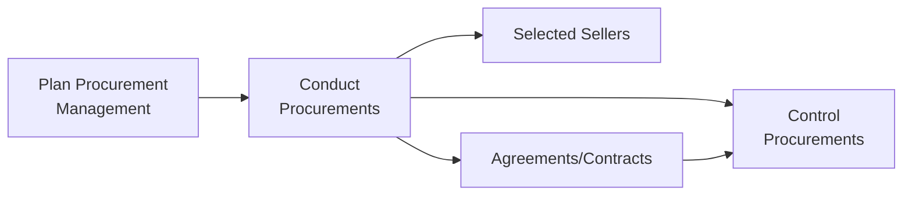
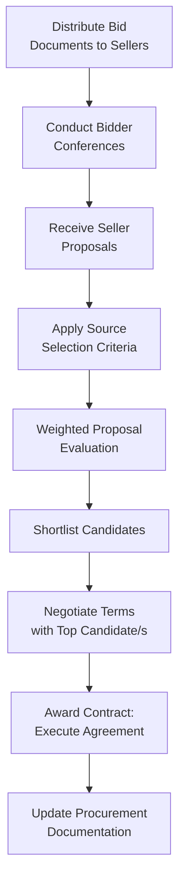

## Conducting Procurements

### Definition and Purpose

Conduct Procurements is the process of obtaining seller responses, selecting a seller, and awarding a contract. This is an executing process within Project Procurement Management, and it is where the strategy and documentation developed during Plan Procurement Management are actually put into action: qualified sellers are solicited, their proposals are evaluated, and a contract is negotiated and awarded.

**Key Points**

- Obtains and reviews all bids and proposals from prospective sellers, applying previously established source selection criteria to select one or more qualified sellers capable of performing the work
- Results in an executed legal agreement (contract) between the buyer and one or more selected sellers
- Involves the project team throughout the seller selection process, providing insight into technical requirements and evaluation of seller proposals
- May involve advertising and outreach efforts to broaden the pool of prospective sellers, particularly for public sector or highly regulated procurements

### Position in the Process Flow

### Inputs

- **Project Management Plan**
  - Scope, Requirements, Communications, Risk Management Plans: provide context and requirements against which seller proposals are evaluated
  - Procurement Management Plan: defines the overall approach, contract type, and criteria to be applied
  - Configuration Management Plan: relevant if procured items must integrate with existing configuration-managed components
  - Cost Baseline: provides the budgetary context for evaluating seller pricing proposals
- **Project Documents**
  - Lessons Learned Register, Project Schedule, Requirements Documentation, Risk Register, Stakeholder Register: inform evaluation and negotiation
- **Procurement Documentation**
  - Bid documents (RFI, RFQ, RFP), Procurement Statement of Work, Independent Cost Estimates, Source Selection Criteria: the outputs from Plan Procurement Management that structure this process
- **Seller Proposals**
  - Formal responses from prospective sellers, forming the basic information to be used by an evaluation body to select one or more successful bidders
- **Enterprise Environmental Factors (EEFs)**
  - Local laws and regulations regarding procurement
  - Marketplace conditions
- **Organizational Process Assets (OPAs)**
  - List of preferred sellers, previously vetted or prequalified

### Tools and Techniques

**Expert Judgment**

Expertise should be considered from individuals or groups with specialized knowledge in evaluation of seller proposals, including proposal evaluation techniques, contract negotiation, and technical subject matter expertise related to what is being procured.

**Advertising**

Existing lists of potential sellers can often be expanded by placing advertisements in general circulation publications, specialized trade publications, or online resources, particularly relevant for government contracting where advertising in public news media is often required.

**Bidder Conferences**

Meetings with prospective sellers and bidders prior to submittal of a bid or proposal; used to ensure that all prospective sellers have a clear and common understanding of the procurement, and that no bidders receive preferential treatment, by ensuring all potential sellers hear every question from any individual prospective seller and every answer from the buyer.

**Data Analysis — Proposal Evaluation**

Reviewing proposals in accordance with the procurement documents' evaluation criteria and the terms and conditions of the intended contract, including using a weighting system to establish a quantitative measure of value or preference for one seller relative to another.

$$\text{Weighted Score}_{Seller} = \sum_{i=1}^{n} (w_i \times r_i)$$

Where $w_i$ is the weight of criterion $i$ and $r_i$ is the seller's rating on that criterion.

**Interpersonal and Team Skills**

- **Negotiation**: Clarifying the structure, requirements, and other terms of the purchases so that mutual agreement can be reached prior to signing the contract; final contract language reflects all agreements reached
- **Note**: In many, but not all, cases, the negotiation is led by a member of the procurement team who is not the project manager

### Bid Documents and Their Purpose (Recap)

| Document | Purpose |
| --- | --- |
| Request for Information (RFI) | Gathering general information on seller capabilities before a formal solicitation |
| Request for Quotation (RFQ) | Obtaining pricing/quotes for well-defined, typically commodity-type items |
| Request for Proposal (RFP) | Soliciting detailed technical and pricing approaches for complex or ambiguous requirements |

### Conduct Procurements Workflow

### Outputs

**Selected Sellers**

Those sellers who have been judged to be in a competitive range based on the outcome of the proposal or bid evaluation, and who have negotiated a draft contract that will become the actual contract when the award is made.

**Agreements**

A contract is awarded to each selected seller; may be in the form of a simple purchase order or a complex, detailed document, and can include (among other components): procurement statement of work or deliverables, schedule, baselines, performance reporting, pricing, payment terms, place of delivery, inspection and acceptance criteria, warranty, product support, limitation of liability, incentives and penalties, insurance and performance bonds, subordinate subcontractor approvals, change request handling, and termination clauses.

**Change Requests**

Changes to the project management plan, its subsidiary plans, and other components may result from Conduct Procurements (e.g., cost, schedule, and resource management plan changes), submitted through Perform Integrated Change Control.

**Project Management Plan Updates**

- Requirements Management Plan, Quality Management Plan, Communications Management Plan, Risk Management Plan, Procurement Management Plan, Scope/Schedule/Cost Baselines: updated to reflect finalized agreements

**Project Document Updates**

- Lessons Learned Register, Requirements Documentation, Requirements Traceability Matrix, Resource Calendars, Risk Register, Stakeholder Register: updated based on outcomes of the seller selection process

**Organizational Process Assets Updates**

- Information on qualified sellers for future use

### Proposal Evaluation Techniques

| Technique | Application |
| --- | --- |
| Screening System | Establishing minimum requirements a proposal must meet to remain under consideration |
| Weighting System | Assigning relative weights to criteria and calculating a quantitative score for each seller |
| Independent Cost Estimates Comparison | Comparing proposed pricing against the buyer's own independent cost estimate to identify outliers |
| Past Performance History | Reviewing sellers' record of prior contract performance as a predictive factor |

### Worked Example

**Example**

Continuing the earlier structural steel fabrication procurement (Firm Fixed Price, RFQ-based), three sellers respond to the RFQ.

**Screening**: All three sellers meet the minimum bonding capacity requirement, so all proceed to full evaluation.

**Weighted Evaluation** (weights based on previously defined Source Selection Criteria):

| Criterion | Weight | Seller X | Seller Y | Seller Z |
| --- | --- | --- | --- | --- |
| Price Competitiveness | 0.35 | 4 | 5 | 3 |
| Delivery Reliability (past performance) | 0.30 | 5 | 3 | 4 |
| Technical Compliance | 0.25 | 4 | 4 | 5 |
| Financial Capacity | 0.10 | 5 | 4 | 4 |

$$\text{Score}_X = (0.35 \times 4) + (0.30 \times 5) + (0.25 \times 4) + (0.10 \times 5) = 4.4$$

$$\text{Score}_Y = (0.35 \times 5) + (0.30 \times 3) + (0.25 \times 4) + (0.10 \times 4) = 4.05$$

Seller X scores highest overall (4.4), driven primarily by strong delivery reliability, despite Seller Y having the most competitive price. Negotiation proceeds with Seller X to finalize delivery milestones and payment terms, resulting in an executed Firm Fixed Price agreement.

### Common Pitfalls

- Allowing informal or side communications with individual bidders outside of a properly conducted bidder conference, creating fairness and compliance risks
- Over-weighting price in the evaluation criteria for procurements where quality, reliability, or technical compliance are more material to project success
- Failing to involve appropriate technical and legal expertise during negotiation, resulting in a contract with ambiguous or unfavorable terms
- Not updating the Risk Register and other project documents to reflect risks or dependencies introduced by the newly selected seller and executed agreement

**Related Topics**

- Plan Procurement Management
- Control Procurements
- Contract Types and Structures
- Source Selection Criteria
- Negotiation skills for project managers
- Perform Integrated Change Control