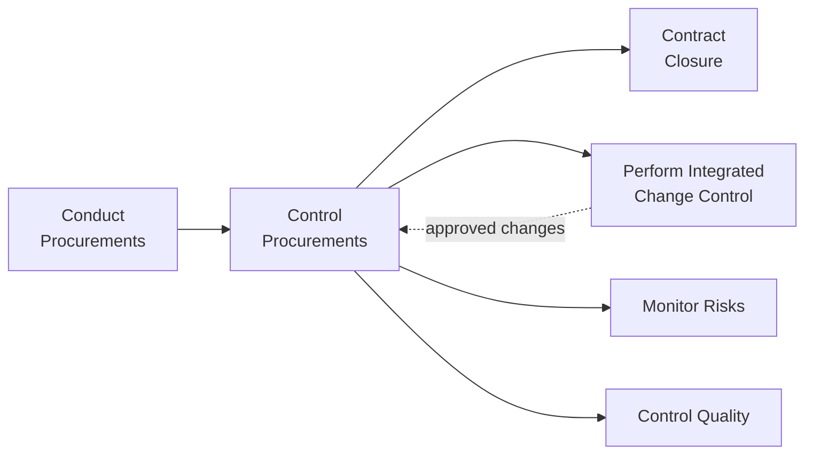
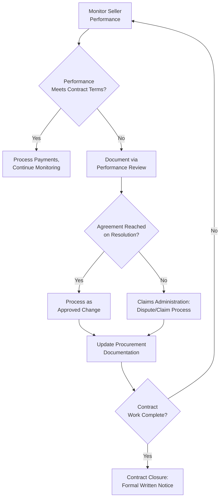

## Controlling Procurements

### Definition and Purpose

Control Procurements is the process of managing procurement relationships, monitoring contract performance and making changes and corrections as appropriate, and closing out contracts. This is a monitoring and controlling process within Project Procurement Management, and it governs the entire ongoing relationship between buyer and seller from contract award through to contract closure, ensuring both parties meet their contractual obligations and that legal rights are protected.

**Key Points**

- Ensures that both the seller's and the buyer's performance meets procurement requirements according to the terms of the legal agreement
- Applies appropriate project management processes (Direct and Manage Project Work, Control Quality, Perform Integrated Change Control, Monitor Risks) to the contractual relationship, integrating outputs from these into the overall management of the project
- Includes managing early termination of the contract work for cause, convenience, or default, in accordance with the termination clause of the agreement
- Precedes and feeds into formal contract closure, which is administrative in nature and confirms all work and deliverables were acceptable

### Position in the Process Flow

### Inputs

- **Project Management Plan**
  - Requirements Management Plan, Risk Management Plan, Procurement Management Plan, Change Management Plan, Schedule Baseline: govern how procurement-related changes and performance issues are managed
- **Project Documents**
  - Assumption Log, Lessons Learned Register, Milestone List, Quality Reports, Requirements Documentation, Requirements Traceability Matrix, Risk Register, Stakeholder Register: provide the broader project context against which seller performance is assessed
- **Agreements**
  - The actual executed contract(s), including their terms, conditions, and any incorporated procurement statements of work, which serve as the primary reference for evaluating compliance
- **Procurement Documentation**
  - Contains complete supporting records, including the statement of work, payment information, contractor work performance information, plans, drawings, and other correspondence
- **Approved Change Requests**
  - Can include modifications to the terms and conditions of the contract, including the procurement statement of work, pricing, and description of the products, services, or results to be provided
- **Work Performance Data**
  - Extent to which quality standards are being satisfied, costs incurred or committed, and seller invoices that have been paid
- **Enterprise Environmental Factors (EEFs)**
  - Contract change control system
  - Marketplace conditions
- **Organizational Process Assets (OPAs)**
  - Procurement policies

### Tools and Techniques

**Expert Judgment**

Expertise in contract administration, claims administration, legal, regulatory compliance, and other relevant technical disciplines related to the specific procurement.

**Claims Administration**

Contested changes and potential constructive changes are those requested where the buyer and seller cannot reach an agreement on compensation for the change, or cannot agree that a change has occurred at all; these contested changes are called claims, disputes, or appeals, and are documented, processed, monitored, and managed throughout the contract life cycle, usually in accordance with the terms of the contract, with settlement of all claims and disputes preferably resolved through negotiation.

**Data Analysis**

- **Performance Reviews**: Measurement, comparison, and analysis of quality, resource, schedule, and cost performance against the agreement, including assessment of seller performance
- **Earned Value Analysis (EVA)**: Schedule Performance Index and Cost Performance Index are calculated to determine the degree of variance from the target agreed to in the contract
- **Trend Analysis**: Determines if performance is improving or deteriorating over time, using earned value analysis or separate cost/schedule trend analysis

**Inspection**

A structured review of the work being performed by the seller, which may involve a simple review of deliverables or an actual physical review of the work itself.

**Audits**

Procurement audits are a structured review of the procurement process arising from Plan Procurement Management through Control Procurements; the objective of a procurement audit is to identify successes and failures that warrant recognition in the preparation or administration of other procurement contracts on the project, or on other projects within the performing organization.

### Outputs

**Closed Procurements**

The buyer, usually through its authorized procurement administrator, provides the seller with formal written notice that the contract has been completed, typically as specified in the terms and conditions of the contract.

**Work Performance Information**

Provides a basis for identifying current or potential problems to support later claims or new procurements, and includes documentation of how well a seller is performing by comparing the deliverables provided, technical performance achieved, and costs incurred and accepted versus budgeted.

**Procurement Documentation Updates**

The contract with all supporting schedules, requested unapproved contract changes, and approved change requests, and any seller-developed technical documentation and other work performance information (such as deliverables, seller performance reports and warranties, financial documents including invoices and payment records, and the results of contract-related inspections).

**Change Requests**

Change requests to the project management plan, its subsidiary plans, and other components (e.g., cost baseline, schedule baseline, procurement management plan), submitted for review through Perform Integrated Change Control.

**Project Management Plan Updates**

- Risk Management Plan, Procurement Management Plan, Schedule Baseline, Cost Baseline: updated as required based on procurement performance and any approved changes

**Project Document Updates**

- Lessons Learned Register, Resource Requirements, Requirements Traceability Matrix, Risk Register, Stakeholder Register: updated based on the outcome of controlling procurement activities

**Organizational Process Assets Updates**

- Payment schedules and requests, seller performance evaluation documentation

### Control Procurements Workflow

### Worked Example

**Example**

Continuing the structural steel fabrication contract (Firm Fixed Price, awarded to Seller X), Control Procurements activities during execution include:

**Performance Review**: A monthly inspection of fabrication progress compares actual completion percentage to the contractually agreed milestone schedule. Trend analysis over three consecutive months shows Seller X consistently completing milestones 3–5 days ahead of schedule, indicating strong performance.

**Unforeseen Issue**: Midway through fabrication, a design change originating from the buyer's engineering team requires a modification to the steel specifications. This constitutes an approved change request, processed through Perform Integrated Change Control, which then updates the contract's procurement statement of work and adjusts the fixed price accordingly through a formal contract modification.

**Claims Scenario**: Later, a dispute arises when Seller X claims the specification change caused additional costs beyond what was captured in the formal change order, due to a rework requirement not initially anticipated. Since the buyer and seller do not immediately agree on this additional compensation, this becomes a formal claim, documented and processed according to the contract's dispute resolution clause, and negotiation proceeds to attempt resolution before escalating to any formal arbitration process specified in the contract.

**Contract Closure**: Upon final delivery and buyer inspection confirming all deliverables meet acceptance criteria, the buyer's procurement administrator issues formal written notice of contract completion, and procurement documentation (including all approved changes, inspection records, and payment history) is finalized and archived as an organizational process asset for future reference.

### Control Procurements vs. Conduct Procurements vs. Contract Closure

| Aspect | Conduct Procurements | Control Procurements | Contract Closure |
| --- | --- | --- | --- |
| Process Type | Executing | Monitoring and Controlling | Closing (embedded within Control Procurements outputs) |
| Primary Focus | Selecting seller, awarding contract | Managing ongoing performance and changes | Formal administrative completion |
| Key Activities | Bidder conferences, proposal evaluation, negotiation | Performance reviews, claims administration, audits | Final inspection, formal written notice, documentation archival |

### Common Pitfalls

- Failing to document performance issues formally and promptly, weakening the buyer's position if a dispute or claim later arises
- Conflating a legitimate contract change with an informal, undocumented agreement, creating ambiguity about what was actually authorized
- Neglecting regular performance reviews and trend analysis, allowing a deteriorating seller performance trend to go unnoticed until it becomes a significant issue
- Treating contract closure as a mere formality without ensuring all deliverables, documentation, and financial reconciliation are genuinely complete

**Related Topics**

- Conduct Procurements
- Plan Procurement Management
- Perform Integrated Change Control
- Close Project or Phase
- Contract Types and Structures
- Claims and Dispute Resolution