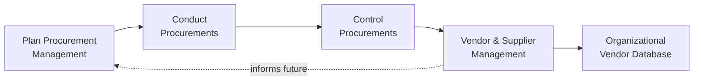
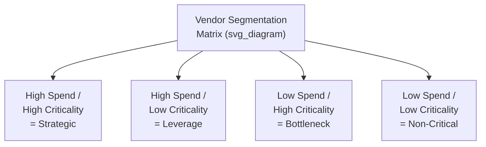
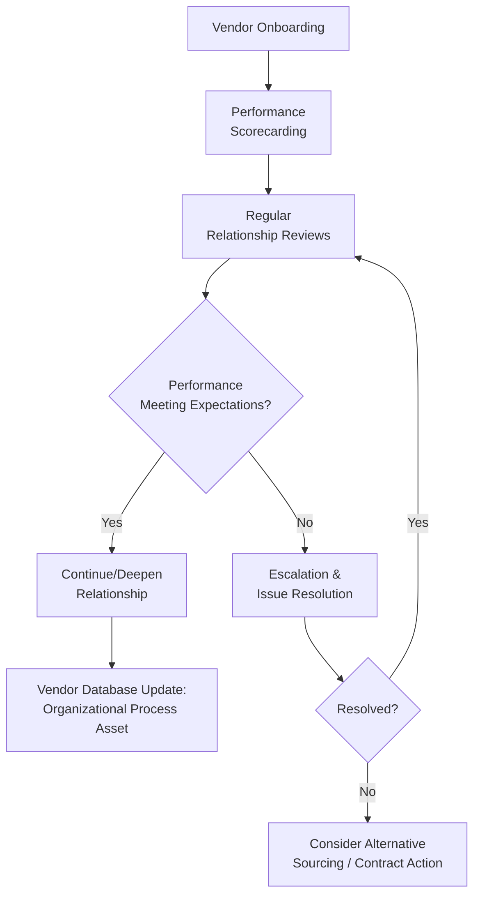

## Vendor and Supplier Management

### Definition and Purpose

Vendor and Supplier Management refers to the ongoing discipline of overseeing relationships with external organizations that provide goods, services, or results to a project, extending beyond the formal PMBOK procurement processes into the broader practice of relationship governance, performance tracking, and strategic vendor engagement. While closely related to Control Procurements, this topic emphasizes the relational and strategic dimensions of working with vendors and suppliers across the full engagement lifecycle, not solely contract compliance.

**Key Points**

- Extends beyond contractual compliance to encompass relationship quality, communication cadence, and long-term supplier performance trends across multiple engagements
- Distinguishes between transactional vendors (one-time or low-criticality purchases) and strategic suppliers (ongoing, high-criticality relationships warranting deeper investment)
- Draws on tools and techniques from Control Procurements (performance reviews, audits, claims administration) but applies them within a broader relationship management framework
- Effective vendor management reduces procurement-related risk exposure and can improve outcomes on price, quality, and delivery reliability over time through relationship maturity [Inference: the degree of improvement is highly dependent on the specific vendor relationship, market conditions, and organizational procurement maturity]

### Position Within Procurement Processes

### Vendor Segmentation

A common practice in vendor management is segmenting vendors by criticality and relationship complexity to determine the appropriate level of management attention.

| Segment | Characteristics | Management Approach |
| --- | --- | --- |
| Strategic | High spend, high criticality, difficult to replace | Dedicated relationship management, joint planning, executive engagement |
| Leverage | High spend, low criticality, multiple alternatives available | Competitive tension maintained, periodic re-bidding |
| Bottleneck | Low spend, high criticality (e.g., sole-source specialty item) | Risk mitigation focus, contingency sourcing where possible |
| Non-Critical | Low spend, low criticality | Transactional management, minimal overhead |

### Core Vendor Management Activities

**Relationship Governance**

Establishing regular touchpoints (business reviews, steering committees) separate from day-to-day contract administration, particularly for strategic vendors, to discuss broader partnership health, upcoming needs, and joint problem-solving.

**Performance Scorecarding**

A structured, often recurring evaluation of vendor performance across multiple dimensions, extending the performance review concept from Control Procurements into a longitudinal tracking tool.

| Dimension | Example Metrics |
| --- | --- |
| Quality | Defect rate, rework frequency, compliance with specifications |
| Delivery | On-time delivery percentage, lead time reliability |
| Cost | Price competitiveness, cost variance vs. contract, invoice accuracy |
| Responsiveness | Issue resolution time, communication responsiveness |
| Compliance | Adherence to regulatory, safety, or contractual requirements |

$$\text{Composite Vendor Score} = \sum_{i=1}^{n} (w_i \times s_i)$$

Where $w_i$ is the weight assigned to dimension $i$ and $s_i$ is the vendor's score on that dimension.

**Risk Monitoring**

Ongoing assessment of vendor-related risks, including financial stability of the vendor, single-source dependency risk, geographic or geopolitical exposure, and supply chain continuity, feeding into the project's Risk Register where vendor-related risks are material to project objectives.

**Vendor Development**

For strategic or bottleneck vendors, proactive engagement to help the vendor improve capabilities, quality, or capacity, particularly when alternatives are limited or switching costs are high.

**Escalation and Issue Management**

A defined pathway for surfacing and resolving vendor performance issues before they rise to the level of formal claims or disputes under Control Procurements, often involving tiered escalation (project level, then account management level, then executive level).

### Vendor Management Lifecycle

### Relationship to Formal PMBOK Processes

| PMBOK Process | Vendor/Supplier Management Extension |
| --- | --- |
| Plan Procurement Management | Vendor segmentation informs sourcing strategy and contract type selection |
| Conduct Procurements | Vendor management history and scorecards inform source selection criteria weighting |
| Control Procurements | Performance reviews and audits feed into the broader scorecarding and relationship governance framework |
| Organizational Process Assets | Vendor performance databases become a durable asset, informing future procurement decisions across projects |

### Worked Example

**Example**

An organization runs multiple projects that rely on a single specialty electronics component supplier, classified as a **Bottleneck** vendor (low spend relative to total project cost, but high criticality since no alternative supplier can meet the required technical specification within the project timeline).

**Vendor Management Approach Applied:**

1. **Segmentation**: Classified as Bottleneck, triggering a risk-mitigation-focused management approach rather than the more transactional approach applied to Non-Critical vendors
2. **Scorecarding**: A composite score is tracked quarterly across Quality (defect rate), Delivery (on-time percentage), and Compliance (certification renewal status), weighted 0.4, 0.4, and 0.2 respectively
3. **Risk Monitoring**: The vendor's financial stability is periodically reviewed (via credit reporting services) given the single-source dependency; this risk is explicitly tracked in the project's Risk Register under the "External" RBS category
4. **Vendor Development**: Given the criticality and lack of alternatives, the organization invests in a closer technical collaboration relationship, including sharing forward-looking demand forecasts to help the vendor better plan capacity, rather than treating the relationship purely transactionally
5. **Escalation Path**: When a delivery delay occurs, the issue is first raised at the project level with the vendor's account manager; when unresolved within an agreed timeframe, it escalates to a joint executive-level review between the two organizations, rather than immediately proceeding to formal claims administration under Control Procurements

This approach, applied consistently across the composite score of 4.4 (on the low end of "meeting expectations" against an organizational threshold of 4.0), triggers continued close monitoring but not yet a formal escalation to alternative sourcing consideration.

### Common Pitfalls

- Applying the same level of relationship management overhead uniformly across all vendors, regardless of criticality or spend, wasting effort on Non-Critical vendors while under-investing in Bottleneck or Strategic relationships
- Relying solely on formal contract-based performance reviews (Control Procurements) without a broader scorecarding or relationship governance mechanism, missing early warning signs of relationship deterioration
- Failing to track vendor-related risks (financial instability, single-source dependency) as explicit entries in the project Risk Register
- Not maintaining a durable organizational vendor performance history, causing each new project to re-evaluate vendors from scratch rather than benefiting from accumulated organizational knowledge

**Related Topics**

- Control Procurements
- Conduct Procurements
- Plan Procurement Management
- Risk Breakdown Structure (External risk category)
- Claims Administration and Dispute Resolution
- Organizational Process Assets and vendor databases