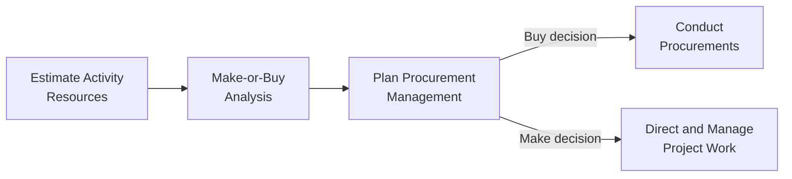
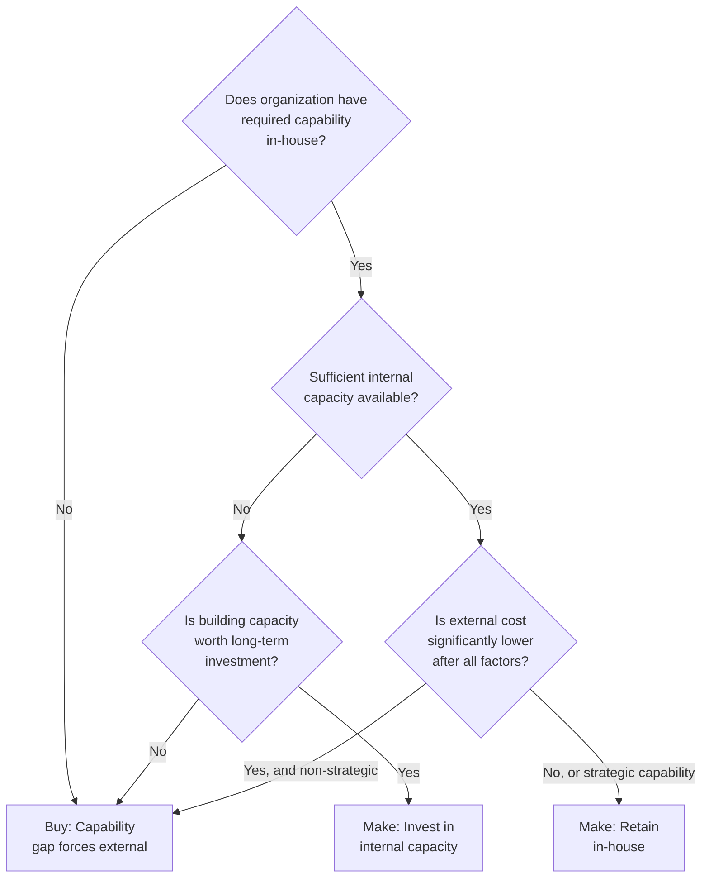

## Make or Buy Analysis

### Definition and Purpose

Make-or-Buy Analysis is a data analysis technique used to determine whether particular work or deliverables can best be accomplished by the project team, or should be purchased from outside sources. This technique is applied primarily during Plan Procurement Management, and its output — the make-or-buy decision — directly shapes the scope of what enters the procurement process at all, distinguishing which portions of project work remain internal versus which become candidates for external contracting.

**Key Points**

- Considers both direct and indirect costs when comparing making a product in-house versus buying it from an external source
- Reflects both external business considerations (whether the seller has a different cost structure than the buyer, and whether there is sufficient competition) and internal considerations (whether the organization wishes to expend its own resources, or would prefer to purchase items in a completed state)
- Applies not only to whether an entire deliverable is made or bought, but also to decisions about the quantity to make versus buy, and whether to lease versus purchase equipment or resources
- Should be revisited as project conditions change, since a make-or-buy decision made during initial planning may no longer be optimal later in the project

### Position in the Process Flow

### Key Factors Considered

**Cost Factors**

- Direct cost of making versus buying (materials, labor, equipment)
- Indirect/overhead costs associated with in-house production (facility usage, equipment maintenance, training)
- Opportunity cost of allocating internal resources to this work rather than other project or organizational priorities

**Capability Factors**

- Whether the organization possesses the necessary skills, equipment, or capacity in-house
- Whether building the capability in-house has strategic value beyond this single project (reusability across future projects)
- Quality and control considerations: in-house production typically allows for greater direct oversight

**Capacity and Timing Factors**

- Whether internal resources have sufficient capacity to take on the work within the required timeframe
- Lead time required to acquire external capability versus developing it internally

**Risk Factors**

- Risk transfer potential: buying can transfer certain risks (e.g., quality defects, schedule delays) to a seller through contract terms
- Dependency risk: buying introduces reliance on an external party's performance and reliability
- Intellectual property and confidentiality considerations, which may favor keeping sensitive work in-house

**Market Factors**

- Marketplace conditions, including the degree of competition among potential sellers
- Whether the seller's cost structure allows them to produce the item more cheaply than the buyer could internally, due to specialization or economies of scale

### Make-or-Buy Decision Framework

### Cost Comparison Formula

A simplified breakeven-style comparison is often used as a starting point, though a complete analysis extends well beyond this basic calculation:

$$\text{Cost}_{Make} = \text{Fixed Costs}_{internal} + (\text{Variable Cost per Unit}_{internal} \times \text{Quantity})$$

$$\text{Cost}_{Buy} = \text{Purchase Price per Unit} \times \text{Quantity} + \text{Procurement Overhead}$$

$$\text{Breakeven Quantity} = \frac{\text{Fixed Costs}_{internal}}{\text{Purchase Price per Unit} - \text{Variable Cost per Unit}_{internal}}$$

Below the breakeven quantity, buying is typically more cost-effective; above it, making in-house may become more cost-effective, assuming variable cost per unit for internal production is lower than the external purchase price. This calculation captures only direct cost dynamics; capability, risk, capacity, and strategic factors must still be layered on top of this quantitative baseline. [Inference: the relative importance of quantitative versus qualitative factors in the final decision depends heavily on organizational context and cannot be reduced to the cost formula alone.]

### Leasing vs. Purchasing Consideration

Make-or-buy analysis also extends to equipment decisions: whether to lease or purchase equipment needed for the project.

| Factor | Favors Leasing | Favors Purchasing |
| --- | --- | --- |
| Duration of Need | Short-term or one-time use | Long-term or recurring use across projects |
| Capital Availability | Limited upfront capital | Capital available and long-term ownership desired |
| Maintenance Responsibility | Lessor typically handles maintenance | Organization retains full control over maintenance |
| Technology Obsolescence Risk | High (equipment may be quickly outdated) | Low (stable, long-lived technology) |

### Worked Example

**Example**

A project requires a specialized testing rig used to validate 500 units of a manufactured component.

**Cost Data**

- In-house fixed setup cost for building the testing rig internally: $40,000
- In-house variable cost per unit tested: $15
- External vendor price per unit tested (using their existing rig): $35
- No significant procurement overhead is assumed for simplicity in this illustrative calculation

$$\text{Breakeven Quantity} = \frac{40{,}000}{35 - 15} = 2{,}000 \text{ units}$$

Since the project only requires testing 500 units, well below the breakeven quantity of 2,000 units, the quantitative cost comparison favors **Buy** (using the external vendor) rather than **Make** (building the internal rig), since the fixed cost of building in-house cannot be amortized over enough units to become cost-competitive at this volume.

**Qualitative Overlay**: Before finalizing the decision, the team also considers whether this testing capability might be reused across future projects (in which case building internal capability could still be justified despite the near-term cost disadvantage) and whether the external vendor's reliability and quality track record are sufficient to trust a critical validation step to an outside party. In this scenario, since the testing requirement is a one-time need specific to this project and the vendor has a strong quality track record, the team confirms the **Buy** decision, formalized as an input feeding into Plan Procurement Management.

### Common Pitfalls

- Relying solely on the direct cost comparison formula without properly weighing indirect costs, strategic capability value, and risk factors
- Treating the make-or-buy decision as permanent and revisited only once, rather than reassessing it if project conditions (quantity needed, internal capacity, market pricing) materially change
- Overlooking capacity constraints, assuming internal resources are available for a "Make" decision without confirming actual availability against the project schedule
- Failing to consider the strategic value of building reusable internal capability when evaluating what appears to be a short-term cost disadvantage

**Related Topics**

- Plan Procurement Management
- Contract Types and Structures
- Estimate Activity Resources
- Conduct Procurements
- Reserve Analysis and Cost-Benefit Analysis
- Vendor and Supplier Management