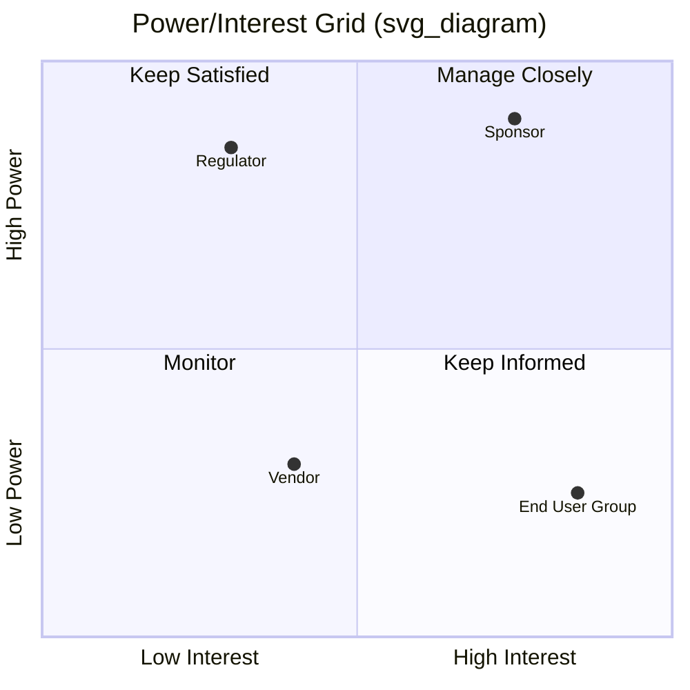

## Identifying Stakeholders

### Definition and Purpose

Identifying Stakeholders is the process of systematically finding and documenting individuals, groups, and organizations that may affect, be affected by, or perceive themselves to be affected by a project, decision, or outcome. In the PMBOK framework, it is the first process within the Project Stakeholder Management knowledge area, and it is iterative rather than a single event: stakeholders enter and exit a project's sphere of influence throughout its lifecycle, so the process is repeated at key intervals (phase transitions, major changes, or when new stakeholders emerge).

The core purpose is to build and maintain a **Stakeholder Register**, a living document that captures identification data, assessment data, and stakeholder classification. This register underpins nearly every subsequent stakeholder-management activity, including engagement planning, communication design, and risk analysis.

### Why It Matters

Unidentified stakeholders are a leading source of project risk. A stakeholder omitted from analysis can:

- Block approvals late in the project because they were never consulted
- Introduce scope changes discovered only after design or build has started
- Withhold resources or information critical to execution
- Undermine adoption of the final deliverable

[Inference] Empirical project-failure studies commonly cite inadequate stakeholder engagement as a top contributor to schedule and budget overruns, though the precise ranking varies by study and industry.

### Who Counts as a Stakeholder

A stakeholder is any entity with a vested interest in the project's process or outcome, whether that interest is positive, negative, or neutral. Categories typically considered:

- **Internal stakeholders**: sponsors, project team members, functional managers, internal departments (finance, legal, HR), executives, and the PMO
- **External stakeholders**: customers, end users, suppliers, vendors, contractors, regulators, government agencies, competitors, and the surrounding community
- **Positive vs. negative stakeholders**: those who benefit from project success versus those who perceive a loss (e.g., a department being restructured, a competitor threatened by a new product)
- **Direct vs. indirect stakeholders**: those actively involved in the work versus those affected by its downstream effects

### Inputs to the Process

- **Project Charter** — names the sponsor, initial stakeholders, and objectives
- **Business documents** — business case and benefits management plan
- **Agreements/contracts** — identify vendors, partners, and contractual parties
- **Enterprise Environmental Factors (EEFs)** — organizational culture, government/industry standards, geographic distribution
- **Organizational Process Assets (OPAs)** — templates, lessons learned, and historical stakeholder registers from similar projects

### Tools and Techniques

**1. Stakeholder Analysis**

The primary analytical technique. It involves gathering and analyzing information to determine whose interests should be considered, typically executed through classification models (detailed below).

**2. Data Gathering**

- Questionnaires and surveys
- Brainstorming and brainwriting sessions with the project team
- Document review of prior project files, contracts, and organizational charts

**3. Data Analysis**

- Document analysis of existing artifacts to infer stakeholders not explicitly named
- Comparison against similar past projects

**4. Data Representation**

Stakeholder classification models render analysis visually or in matrix form. The four most common are:

- **Power/Interest Grid** — plots stakeholders by their level of authority (power) against their level of concern for project outcomes (interest)
- **Power/Influence Grid** — plots authority against active involvement capability
- **Influence/Impact Grid** — plots active involvement against ability to effect changes to project planning or execution
- **Stakeholder Cube** — a three-dimensional model combining power, interest, and influence (or another third axis) for more nuanced segmentation

**5. Meetings**

Facilitated sessions (often called stakeholder identification workshops) where the project team and knowledgeable subject matter experts profile likely stakeholders together.

### The Power/Interest Grid in Detail

This is the most widely applied classification tool. Stakeholders fall into one of four quadrants, each implying a distinct engagement strategy:

| Quadrant | Power | Interest | Strategy |
| --- | --- | --- | --- |
| Manage Closely | High | High | Engage frequently, involve in decisions |
| Keep Satisfied | High | Low | Meet their needs, avoid unnecessary detail |
| Keep Informed | Low | High | Provide regular updates, invite feedback |
| Monitor | Low | Low | Minimal effort, periodic check-ins |

**Example**

A hospital IT modernization project identifies the following:

- **Chief Medical Officer** — high power (can halt the project), high interest (directly affects clinical workflow) → *Manage Closely*
- **Regional Health Regulator** — high power (compliance authority), low current interest (not yet engaged) → *Keep Satisfied*
- **Nursing Staff Union** — low formal power, high interest (workflow disruption concerns) → *Keep Informed*
- **Adjacent Facilities IT Team** — low power, low interest (minor downstream integration only) → *Monitor*

### The Stakeholder Register

The primary output of this process. A typical register includes:

- **Identification information**: name, position, role, location, contact details
- **Assessment information**: major requirements, expectations, influence level, phase of greatest interest
- **Stakeholder classification**: internal/external, supporter/neutral/resistor, and grid quadrant placement

[Inference] Many organizations restrict circulation of the full stakeholder register — particularly influence ratings and resistor classifications — to the core project team, since candid power/interest assessments can be politically sensitive if disclosed broadly.

### Salience Model (Supplementary Technique)

An alternative classification framework using three attributes:

- **Power** — ability to impose will
- **Legitimacy** — appropriateness of involvement
- **Urgency** — need for immediate attention

Stakeholders possessing all three attributes are classified as "definitive" and warrant the highest engagement priority; those with one or two attributes fall into intermediate categories (dominant, dependent, dangerous, dormant, discretionary, demanding).

### Common Pitfalls

- **Assuming the org chart is the stakeholder list** — formal hierarchy misses informal influencers, end users, and external parties
- **Treating identification as a one-time activity** — new stakeholders emerge as the project evolves; the register requires periodic revalidation
- **Underestimating negative stakeholders** — those who benefit from project failure are often omitted because they are uncomfortable to name
- **Conflating stakeholders with the RACI chart** — RACI defines task accountability; stakeholder identification is broader and precedes it

### Practical Workflow

1. Review charter, business case, and contracts for named parties
2. Interview the sponsor and core team to surface additional names
3. Conduct a brainstorming/brainwriting session to catch overlooked groups
4. Cross-check against org charts, vendor lists, and regulatory bodies
5. Populate the initial stakeholder register
6. Apply a classification model (Power/Interest Grid or Salience Model)
7. Validate the list with the sponsor before finalizing engagement strategy
8. Schedule periodic reassessment at phase gates

**Related Topics**

- Plan Stakeholder Engagement
- Manage Stakeholder Engagement
- Monitor Stakeholder Engagement
- Stakeholder Register (as a standalone artifact deep-dive)
- RACI Matrix and Responsibility Assignment
- Communications Management Plan
- Salience Model vs. Power/Interest Grid comparison
- Conflict Management in Stakeholder Relations