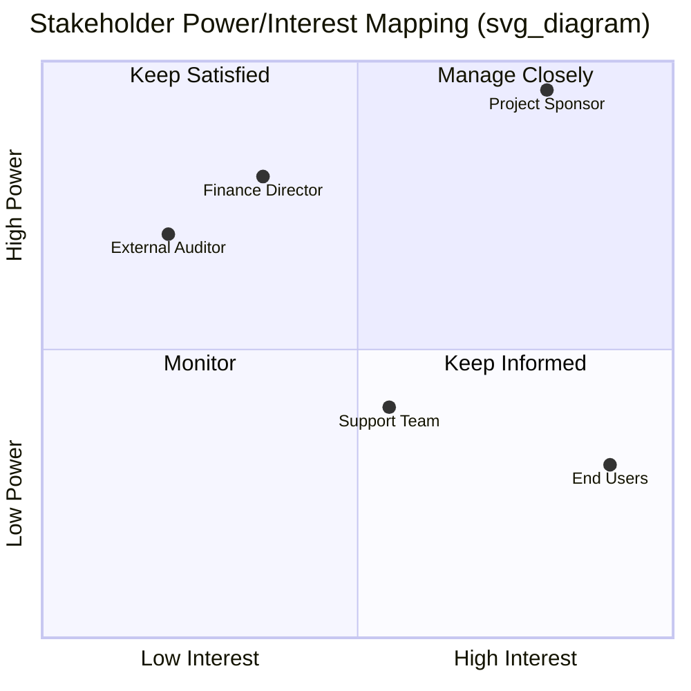

## Stakeholder Analysis and Mapping

### Definition and Purpose

Stakeholder Analysis and Mapping is the analytical technique used to systematically evaluate stakeholders' interests, expectations, influence, and potential impact on a project, then represent those findings visually to guide engagement strategy. Where stakeholder identification answers "who is involved," analysis and mapping answers "how much does each stakeholder matter, in what way, and what should we do about it."

This process typically follows identification and precedes engagement planning, though in practice the three activities iterate together as new information surfaces.

### Objectives

- Determine relative priority among stakeholders competing for limited project attention
- Anticipate support, neutrality, or resistance before it manifests
- Tailor communication frequency, depth, and channel to each stakeholder's needs
- Surface hidden or indirect stakeholders whose interests are not obvious from a role title
- Provide a defensible, documented basis for engagement decisions

### Core Analytical Dimensions

Most mapping models reduce stakeholder complexity to two or three measurable dimensions:

- **Power/Authority** — capacity to influence project decisions, budget, or continuation
- **Interest** — degree to which the stakeholder cares about or is affected by project outcomes
- **Influence** — active capacity to affect project execution (distinct from formal power)
- **Impact** — ability to effect changes to project planning or execution
- **Legitimacy** — appropriateness or validity of the stakeholder's claim on the project
- **Urgency** — time-sensitivity of the stakeholder's expectations

[Inference] Organizations often favor two-dimensional models (Power/Interest) for their simplicity in workshops, while three-attribute models (Salience) tend to appear in academic or highly political stakeholder environments where a binary grid oversimplifies competing claims.

### Mapping Models

**1. Power/Interest Grid**

The most common model, plotting stakeholders on two axes to produce four engagement quadrants (Manage Closely, Keep Satisfied, Keep Informed, Monitor).

**2. Power/Influence Grid**

Substitutes "influence" (active involvement capability) for "interest," useful when a stakeholder's formal authority and practical sway diverge — for example, a senior executive (high power) who delegates all engagement to a proxy (the proxy holds the influence).

**3. Influence/Impact Grid**

Focuses on stakeholders' capability to participate in the work versus their capacity to change project scope or planning, often used in operational or delivery-heavy contexts.

**4. Stakeholder Cube**

Extends the grid into three dimensions (e.g., power, interest, and attitude) to avoid collapsing nuanced positions into a single quadrant. Useful when two stakeholders share a quadrant but require opposite engagement tactics.

**5. Salience Model**

Classifies stakeholders using presence or absence of power, legitimacy, and urgency, producing seven overlapping categories:

| Category | Attributes Present |
| --- | --- |
| Dormant | Power only |
| Discretionary | Legitimacy only |
| Demanding | Urgency only |
| Dominant | Power + Legitimacy |
| Dangerous | Power + Urgency |
| Dependent | Legitimacy + Urgency |
| Definitive | Power + Legitimacy + Urgency |

**6. Directions of Influence Model**

Classifies stakeholders by the direction their influence flows relative to the project team:

- **Upward** — senior management, sponsors
- **Downward** — team members, contributors
- **Outward** — external parties (suppliers, regulators, community)
- **Sideward** — peer project managers, other teams competing for the same resources

### Visualizing the Analysis

Below is a stakeholder-attitude map, a complementary visualization plotting current support level against influence, often used alongside the power/interest grid to track sentiment over time.

<svg xmlns="http://www.w3.org/2000/svg" viewBox="0 0 640 420">
<text x="320" y="24" text-anchor="middle" font-size="16" font-weight="bold" fill="#1f2937">Stakeholder Attitude Map (svg_diagram)</text>
<line x1="80" y1="360" x2="580" y2="360" stroke="#374151" stroke-width="2" />
<line x1="80" y1="360" x2="80" y2="60" stroke="#374151" stroke-width="2" />

<text x="330" y="395" text-anchor="middle" font-size="13" fill="`#374151`">Influence →</text>

<text x="30" y="210" text-anchor="middle" font-size="13" fill="`#374151`" transform="rotate(-90 30 210)">Support Level →</text>

<text x="80" y="378" font-size="11" fill="`#6b7280`">Low</text>

<text x="560" y="378" font-size="11" fill="`#6b7280`">High</text>

<text x="60" y="360" font-size="11" fill="`#6b7280`" text-anchor="end">Resistor</text>

<text x="60" y="70" font-size="11" fill="`#6b7280`" text-anchor="end">Champion</text>

<line x1="330" y1="60" x2="330" y2="360" stroke="#d1d5db" stroke-width="1" stroke-dasharray="4,4" />
<line x1="80" y1="210" x2="580" y2="210" stroke="#d1d5db" stroke-width="1" stroke-dasharray="4,4" />
<circle cx="480" cy="100" r="10" fill="#2563eb" />
<text x="495" y="104" font-size="12" fill="#1f2937">Sponsor</text>
<circle cx="440" cy="300" r="10" fill="#dc2626" />
<text x="455" y="304" font-size="12" fill="#1f2937">Competing Dept. Head</text>
<circle cx="200" cy="140" r="10" fill="#16a34a" />
<text x="215" y="144" font-size="12" fill="#1f2937">Team Lead</text>
<circle cx="150" cy="330" r="10" fill="#d97706" />
<text x="165" y="334" font-size="12" fill="#1f2937">Skeptical Vendor</text>
</svg>

### Tools and Techniques for Conducting Analysis

- **Interviews and one-on-one discussions** with key stakeholders to surface unstated expectations
- **Focus groups** for stakeholder segments with shared characteristics
- **Facilitated workshops** combining brainstorming with live mapping exercises
- **Document analysis** of contracts, org charts, and prior lessons-learned registers
- **Expert judgment** from consultants or team members with prior exposure to similar stakeholder environments
- **Assumption and constraint logs** to capture unverified beliefs about a stakeholder's position for later validation

### Example

**Scenario**: A municipal government is rolling out a new digital permitting platform.

| Stakeholder | Power | Interest | Attitude | Quadrant | Engagement Approach |
| --- | --- | --- | --- | --- | --- |
| City Council | High | High | Supportive | Manage Closely | Monthly steering updates, early demo access |
| Permit Applicants (public) | Low | High | Mixed | Keep Informed | Public FAQ, town halls, help-desk channel |
| IT Security Office | High | Low (until launch) | Neutral | Keep Satisfied | Pre-launch security review, sign-off checkpoint |
| Legacy System Vendor | Low | High (contract at risk) | Resistant | Monitor / escalate if resistance grows | Contractual notice, transition timeline shared early |

**Key Points**

- Power and interest are not static; a stakeholder's position shifts as the project progresses (e.g., IT Security's interest rises sharply near go-live)
- Attitude (supportive/neutral/resistant) is a separate dimension from power and interest and should be tracked independently
- Mapping is only useful if revisited; a single snapshot early in the project can misrepresent stakeholders whose priorities evolve

### Common Pitfalls

- **Static analysis** — treating the map as a one-time deliverable instead of updating it at phase gates or after major scope changes
- **Conflating power with authority** — informal power (subject-matter credibility, network influence) can outweigh formal titles
- **Ignoring negative or resistant stakeholders** — omitting them from the map does not reduce their capacity to obstruct the project
- **Over-reliance on a single model** — using only the Power/Interest Grid can obscure legitimacy or urgency factors that the Salience Model would catch
- **Sharing sensitive classifications too broadly** — publishing raw influence/attitude ratings can damage trust if stakeholders see how they were rated

### Practical Workflow

1. Pull the validated stakeholder register from the identification process
2. Select one or more mapping models appropriate to project complexity and political sensitivity
3. Gather assessment data via interviews, surveys, or workshops
4. Plot stakeholders and assign quadrant/category classifications
5. Cross-validate classifications with the sponsor or a small trusted subset of the team
6. Document rationale for each classification (avoids relitigating decisions later)
7. Feed the map directly into the Stakeholder Engagement Plan
8. Schedule reassessment at defined intervals or trigger events (scope changes, new phase, leadership turnover)

**Next Steps**

- Plan Stakeholder Engagement
- Stakeholder Engagement Assessment Matrix (current vs. desired engagement level)
- Communications Management Plan
- Conflict and Resistance Management Strategies
- Power/Interest Grid vs. Salience Model: selection criteria by project type
- Monitor Stakeholder Engagement