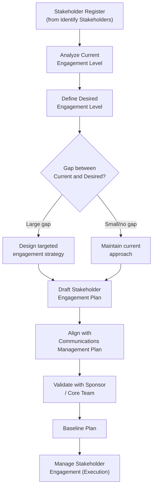

## Planning Stakeholder Engagement

### Definition and Purpose

Plan Stakeholder Engagement is the process of developing approaches to involve project stakeholders based on their needs, expectations, interests, and potential impact on the project. It translates the analysis produced during stakeholder identification and mapping into a documented, actionable strategy: the **Stakeholder Engagement Plan**.

Where analysis answers "who matters and how much," planning answers "what will we actually do about it, when, and through what channel." This process sits within Project Stakeholder Management and is typically performed early in planning, then revisited whenever the stakeholder register or project environment changes materially.

### Objectives

- Define an appropriate engagement strategy for each stakeholder or stakeholder group
- Establish the desired level of engagement versus the current level, and close that gap deliberately
- Align engagement approaches with communication methods, frequency, and cultural or organizational sensitivities
- Reduce the risk of resistance, scope disputes, or approval delays caused by inadequate involvement
- Provide a baseline against which engagement effectiveness can later be monitored

### Inputs

- **Project Charter** — high-level stakeholder list and project objectives
- **Project Management Plan** components — particularly the resource management plan and communications management plan
- **Project documents** — stakeholder register, assumption log, issue log, schedule
- **Agreements** — contracts specifying vendor or partner engagement obligations
- **Enterprise Environmental Factors (EEFs)** — organizational culture, geographic distribution of stakeholders, established communication channels
- **Organizational Process Assets (OPAs)** — lessons learned, historical engagement plans, organizational policies for stakeholder communication

### Tools and Techniques

**1. Expert Judgment**

Input from individuals with prior exposure to similar stakeholder environments, industry norms, or organizational politics.

**2. Data Gathering**

Benchmarking against comparable projects to determine typical engagement cadences and channels.

**3. Data Analysis**

- **Assumption and constraint analysis** — testing beliefs about how a stakeholder will respond
- **Root cause analysis** — understanding why a stakeholder's current engagement level differs from what is needed

**4. Decision Making**

Prioritization/ranking techniques to allocate limited engagement effort where it has the highest impact.

**5. Data Representation**

- **Mind mapping** — visually organizing stakeholder relationships and engagement needs
- **Stakeholder Engagement Assessment Matrix** — the primary representation tool (detailed below)

**6. Meetings**

Planning sessions with the project team, sponsor, and sometimes key stakeholders themselves to validate proposed strategies.

### The Stakeholder Engagement Assessment Matrix

This matrix compares each stakeholder's **current** engagement level against their **desired** engagement level, making the gap explicit and actionable. Five engagement levels are typically used:

- **Unaware** — unaware of the project and its potential impacts
- **Resistant** — aware of the project but resistant to change or outcomes
- **Neutral** — aware, but neither supportive nor resistant
- **Supportive** — aware and supportive of the project and its outcomes
- **Leading** — aware and actively engaged in ensuring project success

| Stakeholder | Unaware | Resistant | Neutral | Supportive | Leading |
| --- | --- | --- | --- | --- | --- |
| Sponsor |  |  |  | C | D |
| Finance Director |  |  | C | D |  |
| End-User Group |  | C |  | D |  |
| Legacy Vendor |  | D | C |  |  |

*C = Current engagement level, D = Desired engagement level.*

**Key Points**

- The gap between C and D directly informs the specific actions the engagement plan must contain
- A stakeholder positioned at D=Leading (e.g., the sponsor) requires ongoing effort to sustain that level, not just a one-time push
- A large C-to-D gap (e.g., the vendor moving from Resistant to Neutral) usually needs a dedicated mitigation or negotiation strategy, not just more frequent updates

### Structure of the Stakeholder Engagement Plan

A complete plan typically documents:

1. **Desired and current engagement levels** for key stakeholder groups (via the assessment matrix)
2. **Scope and impact of change** on stakeholders, described in terms relevant to each group
3. **Interrelationships and potential overlaps** between stakeholders (e.g., shared reporting lines, competing interests)
4. **Stakeholder communication requirements** for the current project phase
5. **Information to be distributed**, including language, format, content, and level of detail
6. **Reason for distribution**, and the anticipated impact of that information on engagement
7. **Timeframe and frequency** for distributing required information
8. **Method for updating the plan** as the project progresses and stakeholder relationships evolve

[Inference] Because the plan often contains candid assessments of resistance or political sensitivity, many organizations treat portions of it — particularly the engagement matrix — as restricted to the core project team rather than distributing it alongside general project documentation.

### Visualizing the Planning Workflow

### Example

**Scenario**: A retail company is implementing a new inventory management system across 40 stores.

- **Regional Store Managers** — Current: Neutral, Desired: Supportive. Strategy: host regional briefing sessions, provide early hands-on access to the system, designate a manager-champion per region to model adoption.
- **Warehouse Staff (end users)** — Current: Unaware, Desired: Supportive. Strategy: phased training rollout, simple FAQ sheet, dedicated help-desk channel during go-live week.
- **Finance Department** — Current: Neutral, Desired: Leading (needed to validate cost-reporting integration). Strategy: embed a finance representative directly in the project's working group rather than relying on periodic updates.
- **Union Representative** — Current: Resistant, Desired: Neutral (full support unrealistic short-term). Strategy: formal consultation meetings, written commitments on job-impact concerns, transparent timeline sharing.

### Common Pitfalls

- **Treating the plan as static** — engagement needs shift with project phase, scope changes, and external events; the plan should be revisited at each phase gate
- **Uniform engagement strategy** — applying the same communication cadence and depth to all stakeholders wastes effort on low-priority groups and under-serves high-priority ones
- **Ignoring cultural and organizational norms** — engagement approaches that work in one geography or department may fail in another
- **Conflating the engagement plan with the communications plan** — engagement plan defines *why* and *how much*; the communications plan defines *what, when, and through which channel* in operational detail
- **Failing to plan for resistant stakeholders explicitly** — hoping resistance dissolves on its own without a deliberate strategy

### Practical Workflow

1. Pull the finalized stakeholder register and analysis/mapping outputs
2. Assess each stakeholder's current engagement level
3. Define the desired engagement level required for project success
4. Build the Stakeholder Engagement Assessment Matrix to visualize gaps
5. Design specific strategies to close high-priority gaps
6. Draft the full Stakeholder Engagement Plan document
7. Cross-reference and align with the Communications Management Plan
8. Validate the plan with the sponsor and, where appropriate, selected stakeholders
9. Baseline the plan and establish a review cadence

**Next Steps**

- Manage Stakeholder Engagement
- Monitor Stakeholder Engagement
- Communications Management Plan
- Conflict Resolution and Negotiation Techniques
- Change Management and Stakeholder Resistance
- Stakeholder Engagement Assessment Matrix (deep-dive template design)