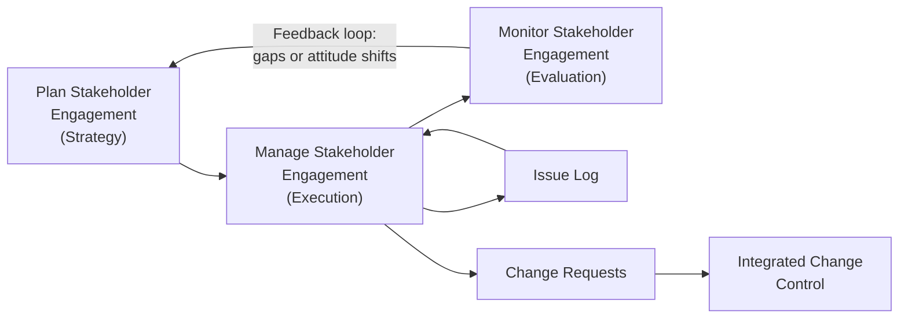

## Managing Stakeholder Engagement

### Definition and Purpose

Manage Stakeholder Engagement is the process of communicating and working with stakeholders to meet their needs and expectations, address issues as they arise, and foster appropriate involvement throughout the project lifecycle. It is the executing-process counterpart to the planning process: where Plan Stakeholder Engagement produces a strategy, Manage Stakeholder Engagement puts that strategy into daily practice.

This process is carried out continuously by the project manager, in contrast to the more periodic nature of identification, analysis, and planning. It focuses on real-time relationship management: building trust, resolving conflict, and adjusting tactics as stakeholders' attitudes shift.

### Objectives

- Guide and direct stakeholder engagement throughout the project according to the baseline plan
- Manage stakeholder expectations through negotiation and communication
- Address concerns and resolve issues that have not yet escalated to formal risk status
- Clarify and fulfill commitments made to stakeholders
- Foster appropriate stakeholder involvement in decisions and activities
- Anticipate reactions to project changes and proactively negotiate acceptance

### Inputs

- **Project Management Plan** components — communications management plan, stakeholder engagement plan, risk management plan, change management plan
- **Project documents** — change log, issue log, lessons learned register, stakeholder register
- **Enterprise Environmental Factors (EEFs)** — organizational culture and political climate, geographic distribution of facilities and resources, communication media in common use
- **Organizational Process Assets (OPAs)** — organizational communication requirements, procedures for issue control, historical data on stakeholder responses

### Tools and Techniques

**1. Expert Judgment**

Input on organizational politics, power structures, cultural norms, and negotiation approaches from those with relevant experience.

**2. Communication Skills**

- **Feedback** — soliciting and acting on stakeholder input
- **Active listening** — confirming understanding and reducing miscommunication

**3. Interpersonal and Team Skills**

- **Conflict management** — resolving disagreements before they escalate
- **Cultural awareness** — adapting engagement to cultural context and sensitivities
- **Negotiation** — reaching agreement on scope, expectations, or resource conflicts
- **Observation/conversation** — informal check-ins that surface concerns before they become formal issues
- **Political awareness** — understanding informal power structures and alliances

**4. Ground Rules**

Behavioral expectations defined in the team charter that extend to how stakeholders are engaged during meetings and collaboration.

### Outputs

- **Change requests** — arising from stakeholder feedback that requires formal scope, schedule, or cost adjustment
- **Updates to the project management plan** — particularly the stakeholder engagement plan and communications management plan
- **Updates to project documents** — issue log, lessons learned register, stakeholder register

### Relationship to Planning and Monitoring

**Key Points**

- Manage Stakeholder Engagement operates continuously across the project lifecycle, not at fixed checkpoints
- It generates real inputs (issues, change requests) that feed other knowledge areas — most notably Integrated Change Control and Risk Management
- Effective management here reduces the volume of issues that later require formal escalation

### Core Activities in Practice

**Building and maintaining trust**

Consistency between stated commitments and delivered outcomes is the primary trust-building mechanism. Missed commitments — even small ones — compound quickly with stakeholders who are already ambivalent.

**Resolving conflict**

Conflict is addressed as close to its origin as possible, using techniques ranging from collaborative problem-solving to, when necessary, formal escalation. [Inference] Most practitioner guidance favors a "confront and collaborate" approach as the default for most conflicts, reserving withdrawal or forcing tactics for situations where relationship preservation is secondary to a hard deadline or non-negotiable constraint.

**Clarifying and fulfilling commitments**

Every commitment made in a meeting or communication is logged (often within the issue log or a dedicated action log) with an owner and due date, then tracked to closure.

**Anticipating reactions to change**

Before formally introducing a scope or schedule change, the project manager assesses which stakeholders are likely to resist and pre-negotiates concerns, rather than surfacing the change cold in a steering committee meeting.

### Example

**Scenario**: A software vendor migration project encounters a compressed timeline that will require the finance team to complete user acceptance testing (UAT) two weeks earlier than originally planned.

1. The project manager reviews the stakeholder engagement plan and identifies the Finance Director as a "Manage Closely" stakeholder currently at a "Supportive" engagement level.
2. Rather than announcing the compressed UAT window in a general status report, the PM schedules a one-on-one conversation to explain the driver (a vendor-imposed licensing deadline) and negotiate feasible resourcing.
3. The Finance Director raises a concern about staff availability during month-end close. The PM logs this as an issue, proposes a partial UAT team augmented by two contractors, and confirms the revised plan in writing.
4. The agreed adjustment is captured as a formal change request and routed through Integrated Change Control, with the Finance Director's concerns and resolution documented in the issue log.
5. The stakeholder register is updated to note the successful negotiation, reinforcing the Finance Director's continued "Supportive" classification.

### Common Pitfalls

- **Treating engagement as one-way broadcast** — sending status updates without soliciting or acting on feedback erodes the "Supportive" or "Leading" engagement levels established during planning
- **Letting issues sit unaddressed** — small unresolved concerns tend to escalate into formal resistance or scope disputes
- **Ignoring informal power structures** — political awareness gaps can cause a nominally "low power" stakeholder with strong informal influence to derail a decision
- **Inconsistent commitment tracking** — failing to log and follow through on verbal commitments damages trust disproportionately to the size of the commitment
- **Reactive-only engagement** — waiting for stakeholders to raise concerns rather than proactively checking in, especially with stakeholders at "Resistant" or "Neutral" engagement levels

### Practical Workflow

1. Review the current Stakeholder Engagement Plan and Communications Management Plan before each engagement activity
2. Conduct scheduled and ad hoc communications per the plan's defined cadence and channel
3. Actively solicit feedback and concerns through active listening and observation
4. Log emerging concerns in the issue log with an owner and target resolution date
5. Apply negotiation and conflict management techniques to resolve issues before escalation
6. Route unavoidable scope/schedule/cost impacts through formal change request procedures
7. Update the stakeholder register and engagement plan to reflect shifts in attitude or engagement level
8. Capture lessons learned on what engagement tactics succeeded or failed for future reference

**Next Steps**

- Monitor Stakeholder Engagement
- Conflict Management Techniques and Models
- Negotiation Strategies in Project Management
- Integrated Change Control
- Issue Log Management
- Communications Management Plan