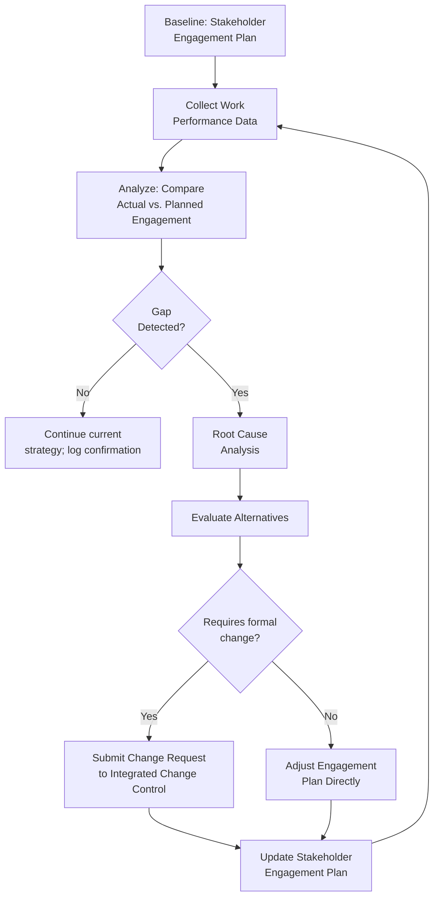

## Monitoring Stakeholder Engagement

### Definition and Purpose

Monitor Stakeholder Engagement is the process of overseeing project stakeholder relationships and adjusting strategies and plans for engaging stakeholders through modification of engagement strategies and plans. It is the monitoring-and-controlling counterpart to the executing process of Manage Stakeholder Engagement, and it closes the loop in the Project Stakeholder Management knowledge area.

This process maintains or increases the efficiency and effectiveness of stakeholder engagement activities as the project evolves and its environment changes. It is performed continuously, or at defined intervals, throughout the project lifecycle — not as a single closing activity.

### Objectives

- Verify that stakeholder engagement activities are achieving their intended effect
- Detect gaps between planned and actual engagement levels before they cause project harm
- Reassess stakeholder classifications (power, interest, attitude) as circumstances change
- Trigger updates to the Stakeholder Engagement Plan, Stakeholder Register, or related project documents
- Provide evidence-based input into performance reporting and risk management

### Inputs

- **Project Management Plan** components — resource management plan, communications management plan, stakeholder engagement plan
- **Project documents** — issue log, lessons learned register, project communications, risk register, stakeholder register
- **Work Performance Data** — raw observations and measurements collected during execution (e.g., meeting attendance, feedback volume, survey responses)
- **Enterprise Environmental Factors (EEFs)** and **Organizational Process Assets (OPAs)** — same categories relevant to planning and managing engagement, reassessed for currency

### Tools and Techniques

**1. Data Analysis**

- **Alternatives analysis** — evaluating different response options when engagement gaps are found
- **Root cause analysis** — determining why actual engagement diverges from planned engagement
- **Stakeholder satisfaction assessment** — surveys, interviews, or informal feedback mechanisms measuring how stakeholders perceive project performance

**2. Decision Making**

- **Multicriteria decision analysis** — prioritizing which engagement gaps to address first, using weighted criteria such as stakeholder power, urgency, and cost to remediate

**3. Data Representation**

- **Stakeholder Engagement Assessment Matrix** — the same tool used in planning, now updated to compare current-state engagement against the original baseline, revealing drift
- **Dashboards or scorecards** summarizing engagement health across the full stakeholder population

**4. Interpersonal and Team Skills**

- **Active listening**, **cultural awareness**, **leadership**, **networking**, and **political awareness** — the same relationship-management skills used in managing engagement, applied here diagnostically to detect emerging misalignment

**5. Meetings**

Status review meetings, retrospectives, and stakeholder check-ins used specifically to gather engagement-health signals rather than project-status signals.

### Outputs

- **Work Performance Information** — analyzed, contextualized engagement data (e.g., "engagement with the Finance Director has declined since the scope change") derived from raw work performance data
- **Change requests** — when monitoring reveals that engagement strategy adjustments require formal changes to scope, resourcing, or schedule
- **Updates to the Project Management Plan** — most commonly the stakeholder engagement plan and communications management plan
- **Updates to project documents** — issue log, lessons learned register, risk register, stakeholder register

### The Monitoring Feedback Loop

**Key Points**

- Monitoring is cyclical: it feeds directly back into planning and managing, rather than concluding the stakeholder management process
- A "no gap detected" outcome is still a valid and useful result — it confirms the current strategy remains appropriate and should be documented, not skipped
- Not every gap requires a formal change request; many can be resolved through direct engagement plan adjustments

### Signals That Indicate Monitoring Is Needed

- Declining meeting attendance or responsiveness from a previously engaged stakeholder
- Increased volume of complaints, escalations, or issue log entries tied to a specific stakeholder or group
- A stakeholder's organizational role changes (promotion, reassignment, departure)
- External events (regulatory change, market shift, leadership turnover) altering a stakeholder's power or interest
- Feedback from surveys or satisfaction assessments falling below an established threshold
- Discrepancy between reported sentiment in status meetings and observed behavior (e.g., verbal support but consistent non-participation)

### Example

**Scenario**: Six months into a multi-year ERP implementation, the project team conducts a scheduled quarterly stakeholder health review.

1. **Data collection**: The PM reviews meeting attendance logs, recent survey responses, and the issue log for stakeholder-linked entries.
2. **Analysis**: The Regional Operations Director, originally classified "Supportive" with a "Manage Closely" designation, has missed the last three steering committee meetings and delegated attendance to a junior analyst.
3. **Root cause analysis**: One-on-one conversation reveals the director's concern is not project confidence but a reorganization in their department competing for the same time slot.
4. **Alternatives evaluated**: Reschedule the steering committee, provide an async briefing option, or assign a senior team member for direct director-level updates outside the meeting cadence.
5. **Resolution**: The team reschedules the meeting slot and adds a monthly one-on-one briefing. No formal change request is needed; the stakeholder engagement plan is updated directly to reflect the revised communication cadence.
6. **Documentation**: The stakeholder register notes the temporary dip in engagement and the root cause, providing context if the pattern recurs.

### Common Pitfalls

- **Monitoring only at project milestones** — waiting for phase-gate reviews to assess engagement allows problems to compound between checkpoints
- **Relying solely on self-reported sentiment** — stakeholders may report support verbally while behavior (attendance, responsiveness, delegation) tells a different story
- **Failing to distinguish work performance data from work performance information** — raw attendance numbers are not useful until analyzed against the baseline and contextualized
- **Skipping documentation when no gap is found** — a lack of recorded confirmation makes it harder to demonstrate due diligence later or to notice a slow, cumulative decline
- **Treating every gap as requiring a formal change request** — over-escalating minor engagement adjustments burdens the change control process unnecessarily

### Practical Workflow

1. Establish a monitoring cadence (continuous, monthly, or tied to phase gates) appropriate to project risk and stakeholder volatility
2. Collect work performance data relevant to engagement (attendance, feedback, survey results, issue log entries)
3. Compare actual engagement levels against the baseline Stakeholder Engagement Assessment Matrix
4. Where gaps exist, conduct root cause analysis before proposing a remedy
5. Evaluate alternative responses using consistent prioritization criteria
6. Determine whether the response requires a formal change request or a direct plan update
7. Update the stakeholder engagement plan, stakeholder register, and related documents
8. Record findings — including "no gap" outcomes — in the lessons learned register for future projects

**Next Steps**

- Manage Stakeholder Engagement
- Plan Stakeholder Engagement
- Work Performance Data vs. Information vs. Reports
- Stakeholder Satisfaction Surveys: Design and Interpretation
- Integrated Change Control
- Lessons Learned Register Management