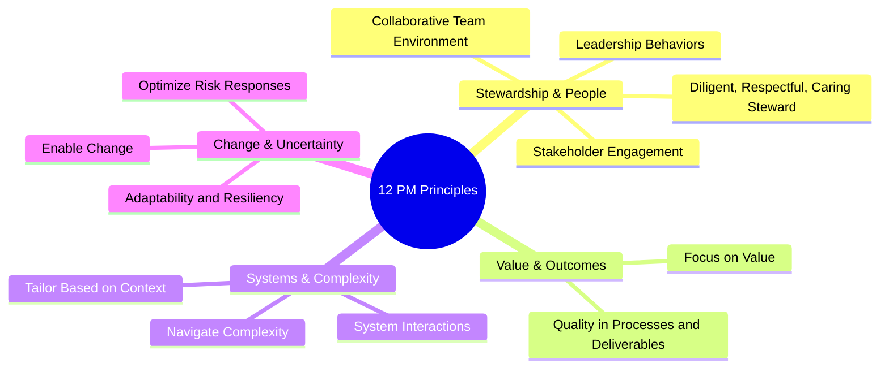

## The Twelve Project Management Principles

### Definition and Purpose

The Twelve Project Management Principles form the normative foundation of the PMBOK Guide, 7th Edition. Unlike prior editions organized around process groups and knowledge areas, PMBOK 7 shifts to a principles-based framework: broad, foundational statements of guidance that inform behavior and action across any delivery approach — predictive, agile, or hybrid. Principles describe *what* good project management values and *why*, leaving the *how* to the eight Performance Domains and to practitioner judgment.

[Inference] This shift reflects the broader industry move away from prescriptive, one-size-fits-all methodology toward adaptable, context-sensitive guidance suited to diverse project types, though the degree to which organizations have operationally adopted principles-based thinking over process checklists varies widely.

### Why a Principles-Based Framework

- Principles apply regardless of delivery approach, industry, or organizational structure
- They accommodate emerging practices (agile, hybrid, disciplined agile) without requiring a rewrite of the entire standard
- They shift the practitioner's mindset from "did I complete this process step" to "did I uphold this value in this decision"
- They complement, rather than replace, the detailed process guidance still found in the PMBOK's Process-based standard and practice guides

### The Twelve Principles

**1. Be a Diligent, Respectful, and Caring Steward**

Stewardship encompasses acting responsibly with financial, human, material, and environmental resources; upholding integrity, care, trustworthiness, and compliance across the project's internal and external environment.

**2. Create a Collaborative Project Team Environment**

Project teams operate best when composed of individuals with diverse skills and perspectives working together toward a shared objective, supported by team agreements, defined roles, and a transparent working culture.

**3. Effectively Engage with Stakeholders**

Proactively engaging stakeholders — with breadth and depth appropriate to their level of influence and interest — builds support, reduces resistance, and surfaces risk early. This principle directly underpins the entire Stakeholder Performance Domain.

**4. Focus on Value**

Value is the ultimate indicator of project success, continually evaluated and refined throughout the project rather than assumed to be fixed at the outset. Projects should be structured to enable early and frequent evaluation and reassessment of intended value.

**5. Recognize, Evaluate, and Respond to System Interactions**

Projects operate within larger systems (organizational, market, regulatory) with interdependent, dynamic components. Recognizing these interactions helps practitioners anticipate downstream effects of decisions rather than treating the project as an isolated unit.

**6. Demonstrate Leadership Behaviors**

Effective project leadership is exhibited through behavior, not authority or title — honesty, integrity, adaptability, and the ability to inspire and motivate a team toward shared goals.

**7. Tailor Based on Context**

Each project is unique; project approach, governance, and processes should be tailored to context (organizational culture, project size, complexity, industry, and delivery approach) rather than applied as a rigid template.

**8. Build Quality into Processes and Deliverables**

Quality must be considered throughout the entire project lifecycle, addressing both process quality (how the work is done) and deliverable quality (what is produced), aligned with stakeholder acceptance criteria.

**9. Navigate Complexity**

Complexity — arising from human behavior, system behavior, uncertainty, ambiguity, and technological innovation — should be continuously assessed and actively navigated using appropriate tools, processes, and organizational structures.

**10. Optimize Risk Responses**

Risk (both threats and opportunities) is a constant presence throughout the project lifecycle. Effective risk response should be proportionate, timely, and cost-effective — not simply exhaustive documentation of every possible exposure.

**11. Embrace Adaptability and Resiliency**

Project approaches should build in adaptability to respond to changing conditions, and resiliency to recover from setbacks, rather than assuming an unchanging environment.

**12. Enable Change to Achieve the Envisioned Future State**

Managing change — both the organizational change a project produces and the change required within the project itself — is essential to realizing the intended benefits and value of the project.

### Structural Overview

**Key Points**

- The 12 principles are not sequential or process steps; they operate simultaneously and continuously throughout a project
- They are deliberately delivery-approach agnostic — equally applicable to a waterfall construction project and an agile software sprint
- The principles inform, but do not replace, the more operational guidance in the eight Performance Domains

### Relationship to the Performance Domains

The principles are abstract and values-based; the eight Performance Domains (Stakeholders, Team, Development Approach and Life Cycle, Planning, Project Work, Delivery, Measurement, Uncertainty) provide the operational areas of focus where those principles are applied in practice. For example, Principle 3 (Effectively Engage with Stakeholders) is operationalized through the Stakeholder Performance Domain; Principle 10 (Optimize Risk Responses) is operationalized through the Uncertainty Performance Domain.

### Example

**Scenario**: A construction firm is delivering a hospital wing expansion.

- **Stewardship (Principle 1)**: The PM ensures subcontractor payments are handled ethically and that environmental waste-disposal regulations are followed even where enforcement is lax.
- **Tailoring (Principle 7)**: Given the highly regulated healthcare construction context, the team adopts a predictive (waterfall) approach with rigorous compliance checkpoints rather than an agile approach better suited to less-regulated domains.
- **Navigating Complexity (Principle 9)**: Unexpected asbestos discovery mid-project introduces technical and regulatory complexity; the team pauses, reassesses risk, and adjusts sequencing rather than forcing the original schedule.
- **Adaptability and Resiliency (Principle 11)**: A six-week weather-related delay is absorbed through a pre-built schedule buffer and a temporary shift in crew allocation to unaffected work packages.
- **Enabling Change (Principle 12)**: Hospital staff are trained and transitioned into the new wing gradually, with the project team supporting a change management plan for altered patient-flow procedures.

### Common Misunderstandings

- **Mistaking principles for a checklist** — principles are lenses for judgment, not boxes to tick off sequentially
- **Assuming PMBOK 7 discards process guidance** — the process-based content (44 processes, five process groups) still exists as a separate standard (*The Standard for Project Management*, formerly integrated into PMBOK 6) referenced alongside the principles-based guide
- **Treating principles as agile-exclusive** — the framework is explicitly designed to be delivery-approach agnostic, not an endorsement of agile over predictive approaches
- **Viewing principles as static compliance items** — several principles (Navigate Complexity, Embrace Adaptability) explicitly call for ongoing, dynamic response rather than one-time application

### Practical Application Workflow

1. At project initiation, review all 12 principles against the specific project context
2. Identify which principles carry the highest relevance or risk for this project type (e.g., heavily regulated projects emphasize Stewardship and Quality; highly uncertain projects emphasize Navigate Complexity and Optimize Risk Responses)
3. Map relevant principles to the corresponding Performance Domain(s) for operational planning
4. Embed principle-based checkpoints into governance reviews (e.g., "are we still focused on value" at each phase gate)
5. Use principles as a shared vocabulary for team and stakeholder discussions about trade-offs and decisions
6. Revisit principle alignment when major changes occur (scope, team, environment)

**Related Topics**

- The Eight PMBOK 7 Performance Domains
- Stakeholder Performance Domain (deep-dive)
- Tailoring Frameworks and Approaches
- The Standard for Project Management vs. PMBOK Guide
- Agile, Predictive, and Hybrid Delivery Approaches
- Value Delivery and Benefits Realization