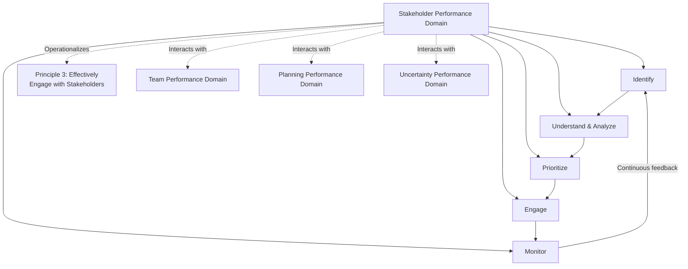

## Stakeholder Performance Domain

### Definition and Purpose

The Stakeholder Performance Domain is one of the eight Performance Domains defined in PMBOK 7. It addresses the activities and functions associated with stakeholders — anyone with an interest in, or influenced by, the project. This domain operationalizes Principle 3 (Effectively Engage with Stakeholders) and encompasses the practical work of identifying, understanding, analyzing, and engaging stakeholders in ways that support project success.

Performance Domains, unlike the process-based Knowledge Areas of earlier PMBOK editions, describe continuous, interdependent areas of focus rather than discrete, sequential processes. The Stakeholder Performance Domain operates concurrently with the other seven domains throughout the project lifecycle.

### Desired Outcomes

PMBOK 7 defines effective execution of the Stakeholder Performance Domain by the presence of specific outcomes rather than mandated activities:

- A productive working relationship with stakeholders throughout the project
- Stakeholder agreement with project objectives
- Stakeholders who are project beneficiaries and cooperate actively with the project
- Stakeholders who are not hindering project outcomes, having their concerns addressed

### Core Activities Within the Domain

**1. Identifying Stakeholders**

Ongoing recognition of individuals, groups, and organizations that may affect or be affected by the project. This is not a one-time activity — new stakeholders emerge as the project progresses through different phases and environments.

**2. Understanding and Analyzing Stakeholders**

Assessing stakeholder attributes such as:

- Power (level of authority)
- Interest (level of concern)
- Influence (active capacity to affect outcomes)
- Impact (ability to effect changes to planning or execution)
- Attitude (supportive, neutral, resistant)

**3. Prioritizing Stakeholders**

Because engagement resources are finite, stakeholders are ranked to focus the greatest effort where power, interest, or impact is highest — often visualized through grids such as Power/Interest or the Salience Model.

**4. Engaging Stakeholders**

Determining and applying the most effective engagement approach: collaboration, negotiation, active management of expectations, or direct communication tailored to stakeholder needs.

**5. Monitoring Stakeholder Relationships**

Continuously observing whether engagement strategies remain effective and adjusting them as stakeholder attitudes, power, or interest shift over time.

### Domain Structure

**Key Points**

- The five core activities form a continuous cycle rather than a linear sequence — monitoring feeds back into re-identification and re-analysis
- This domain does not operate in isolation; stakeholder dynamics directly influence planning assumptions, risk exposure, and team composition decisions
- Success is measured by outcomes (productive relationships, cooperation, addressed concerns), not by completion of a fixed checklist

### Interaction With Other Performance Domains

- **Team Performance Domain** — team members are themselves internal stakeholders whose engagement follows similar principles
- **Planning Performance Domain** — stakeholder requirements and constraints directly shape scope, schedule, and resource planning
- **Uncertainty Performance Domain** — stakeholder-driven risks (resistance, competing priorities, shifting sponsorship) are a distinct category of project uncertainty
- **Delivery Performance Domain** — stakeholder acceptance criteria determine what "done" and "delivered value" actually mean
- **Measurement Performance Domain** — stakeholder satisfaction is frequently tracked as a project health metric alongside cost, schedule, and quality

### Tailoring Considerations

PMBOK 7 explicitly calls for tailoring this domain's application to project context. Relevant tailoring factors include:

- **Stakeholder complexity** — number, diversity, and geographic distribution of stakeholders
- **Organizational culture** — hierarchical versus flat structures affect engagement channels
- **Delivery approach** — agile projects often favor frequent, informal, direct stakeholder collaboration (e.g., embedded product owners), while predictive projects may rely more on structured, scheduled engagement checkpoints
- **Regulatory environment** — regulated industries may require formal, documented stakeholder consultation processes

[Inference] Agile-oriented projects tend to blur the boundary between "team" and "stakeholder" more than predictive projects, since roles like product owner sit simultaneously inside the delivery team and as a direct stakeholder proxy — this is a common source of ambiguity when applying PMBOK 7 language to agile contexts.

### Example

**Scenario**: A nonprofit organization is deploying a new donor management platform.

- **Identify**: The project team recognizes stakeholders beyond the obvious (development staff, IT) — including major donors whose data privacy expectations matter, and volunteer coordinators who rely on legacy reporting exports.
- **Understand & Analyze**: The Executive Director holds high power and high interest; volunteer coordinators hold low power but high interest due to daily operational dependency on the system.
- **Prioritize**: The Executive Director and IT Director are placed in "Manage Closely," while volunteer coordinators are placed in "Keep Informed" but flagged for close monitoring given their operational dependency.
- **Engage**: Volunteer coordinators are invited to a working session to validate that legacy report formats will be preserved, addressing a concern before it becomes resistance.
- **Monitor**: Mid-project, a shift in donor privacy regulations elevates a previously "Monitor" stakeholder (the compliance officer) to "Manage Closely," triggering a re-prioritization.

### Common Pitfalls

- **Applying this domain only at project kickoff** — outcomes are meant to be sustained throughout the lifecycle, not established once and left unmonitored
- **Equating this domain with the stakeholder register alone** — the register is an artifact; the domain describes the ongoing behavioral and analytical work around it
- **Neglecting internal stakeholders** — team members, functional managers, and internal departments are stakeholders and fall within this domain's scope, not just external parties
- **Under-tailoring for agile contexts** — applying rigid, document-heavy engagement processes to a fast-moving agile team can create friction rather than value
- **Confusing prioritization with permanent classification** — stakeholder priority can and does change; the domain calls for continuous reassessment

### Practical Workflow

1. Establish a cadence for stakeholder identification appropriate to project pace and complexity
2. Continuously assess power, interest, influence, and attitude as new information emerges
3. Maintain a live prioritization view (grid, matrix, or dashboard) rather than a static snapshot
4. Select engagement techniques appropriate to the delivery approach and organizational culture
5. Monitor engagement effectiveness against desired outcomes, not just activity completion
6. Feed observed shifts back into planning, risk management, and team performance discussions
7. Document lessons learned about which engagement approaches were effective for future tailoring decisions

**Related Topics**

- Team Performance Domain
- Planning Performance Domain
- Uncertainty Performance Domain
- Delivery Performance Domain
- Stakeholder Identification and Analysis (process-based deep-dive)
- Tailoring the Development Approach and Life Cycle