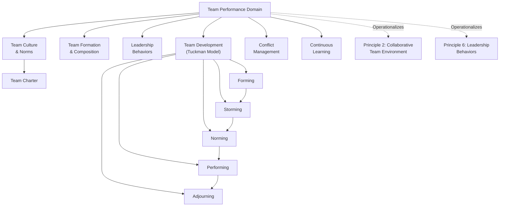

## Team Performance Domain

### Definition and Purpose

The Team Performance Domain is one of the eight Performance Domains in PMBOK 7. It addresses activities and functions associated with the people responsible for producing project deliverables and realizing project outcomes — the project team and, by extension, the project manager's leadership role within it. This domain operationalizes several of the twelve principles simultaneously, most directly Principle 2 (Create a Collaborative Project Team Environment) and Principle 6 (Demonstrate Leadership Behaviors).

Where the Stakeholder Performance Domain addresses relationships with all interested parties, the Team Performance Domain focuses specifically on the internal dynamics, culture, and leadership needed for the people doing the work to perform effectively.

### Desired Outcomes

PMBOK 7 defines success in this domain through outcomes rather than mandated steps:

- Shared ownership of the project among the team
- A high-performing team, characterized by trust and collaboration
- Team members who exhibit personal and social skills that contribute to shared success
- Continuous learning and improvement throughout the project lifecycle

### Core Focus Areas

**1. Managing Project Team Culture**

Establishing team norms, values, and expected behaviors — often formalized in a **team charter** — that promote transparency, integrity, respect, and accountability.

**2. Building Effective Teams**

Assembling teams with complementary skills, diverse perspectives, and appropriate composition (fixed, dedicated, part-time, or dynamic staffing models depending on delivery approach).

**3. Leadership and Management Behaviors**

Distinguishing leadership (inspiring, guiding, motivating) from management (planning, organizing, controlling) — both are needed, but PMBOK 7 places particular emphasis on servant leadership and leading by example over command-and-control authority.

**4. Team Performance and Development**

Applying models such as Tuckman's stages of team development (forming, storming, norming, performing, adjourning) to understand and support a team's evolving needs over time.

**5. Managing Team Conflict**

Addressing interpersonal or task-based conflict constructively, using techniques ranging from collaborative problem-solving to formal mediation, before conflict undermines collaboration.

**6. Continuous Learning**

Encouraging retrospectives, knowledge sharing, and skills development so the team improves its performance as the project progresses, rather than treating capability as fixed at team formation.

### Domain Structure

**Key Points**

- This domain applies equally to co-located, distributed, and virtual teams, though tailoring of specific techniques differs
- Leadership in this context is a behavior exercised at any level of the team, not a title reserved for the project manager
- Team performance is treated as dynamic and developmental, not a fixed attribute assigned at project start

### Tuckman's Stages Applied to Project Teams

| Stage | Characteristics | PM Role |
| --- | --- | --- |
| Forming | Polite, cautious, unclear roles | Clarify goals, roles, and expectations |
| Storming | Conflict emerges, competing ideas surface | Facilitate constructive conflict resolution |
| Norming | Cohesion builds, norms solidify | Reinforce team charter and positive patterns |
| Performing | High trust, autonomous collaboration | Delegate, remove obstacles, protect focus |
| Adjourning | Project or phase concludes, team disbands | Conduct retrospectives, recognize contributions |

[Inference] Real project teams rarely progress through these stages in a strictly linear fashion; membership changes, scope shifts, or external pressure can cause a team to cycle back to storming even after reaching performing, which is why this domain frames team development as continuous rather than a one-time milestone.

### Leadership vs. Management Behaviors

- **Leadership behaviors**: inspiring a shared vision, modeling integrity, coaching and mentoring, empowering decision-making at appropriate levels, adapting style to team needs (situational leadership)
- **Management behaviors**: assigning tasks, tracking progress against plans, allocating resources, enforcing process compliance, escalating risks

PMBOK 7 does not present these as opposing forces — effective project management requires both, applied in appropriate proportion depending on team maturity and project context.

### Example

**Scenario**: A cross-functional team is assembled to launch a new mobile banking feature, combining engineers, a compliance analyst, and a UX designer who have not previously worked together.

- **Team Culture**: The PM facilitates a kickoff session to co-create a team charter covering communication norms, decision-making authority, and working hours across two time zones.
- **Team Development**: Early "storming" emerges when the compliance analyst raises concerns late in a sprint that could have been addressed earlier. The PM adjusts the workflow to include the analyst in sprint planning rather than only in review.
- **Conflict Management**: A disagreement between the UX designer and an engineer over interface complexity is resolved through a facilitated trade-off discussion referencing the team's shared definition of value, rather than a unilateral PM decision.
- **Continuous Learning**: Sprint retrospectives surface a recurring bottleneck in the compliance review step, leading the team to adjust its process before the next release cycle.

### Common Pitfalls

- **Treating team building as a one-time kickoff event** — culture and cohesion require ongoing reinforcement, not a single charter-signing exercise
- **Applying pure command-and-control management** — undermines the shared ownership outcome this domain calls for, particularly in agile or knowledge-work contexts
- **Ignoring the storming stage as dysfunction** — conflict during team formation is often a necessary and productive stage, not a sign of failure
- **Neglecting distributed or virtual team dynamics** — team culture techniques designed for co-located teams may not translate without adaptation
- **Skipping retrospectives or lessons-learned capture** — undermines the continuous learning outcome and repeats avoidable mistakes across phases or projects

### Practical Workflow

1. Co-create a team charter early, defining norms, communication expectations, and decision-making authority
2. Assess team composition needs against required skills, diversity of perspective, and delivery approach
3. Recognize which Tuckman stage the team is in and adapt leadership style accordingly
4. Model leadership behaviors consistently — transparency, integrity, and adaptability — rather than relying solely on positional authority
5. Address conflict early and constructively, using collaborative techniques before escalation
6. Build in regular retrospectives or review cycles to capture and act on lessons learned
7. Reassess team dynamics when membership, scope, or external pressures change significantly

**Related Topics**

- Stakeholder Performance Domain
- Leadership Styles and Situational Leadership
- Conflict Management Techniques and Models
- Team Charters and Ground Rules
- Tuckman's Stages of Group Development
- Servant Leadership in Project Management