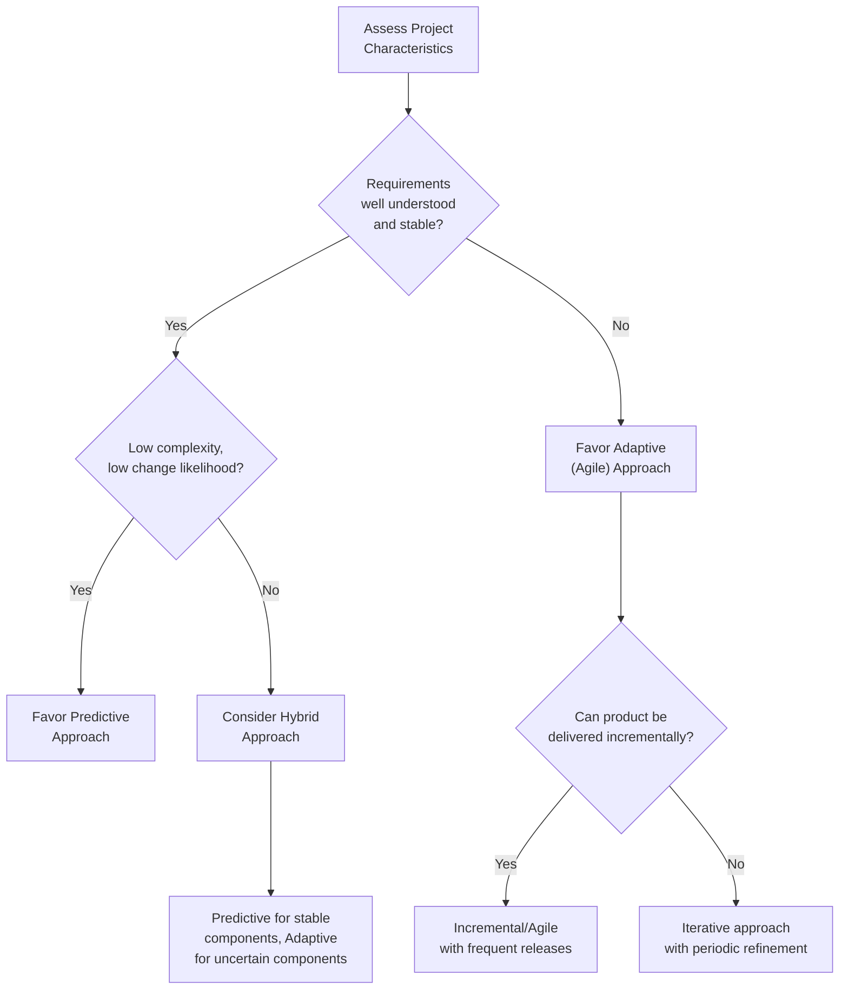

## Development Approach and Life Cycle Domain

### Definition and Purpose

The Development Approach and Life Cycle Performance Domain is one of the eight Performance Domains in PMBOK 7. It addresses activities and functions associated with determining the development approach, cadence, and life cycle phases of a project. This domain governs a foundational, upstream decision: *how* the project will be executed, which in turn shapes how every other Performance Domain is applied.

Because this decision precedes and influences planning, delivery, and measurement approaches, PMBOK 7 treats it as one of the earliest and most consequential tailoring decisions a project team makes.

### Desired Outcomes

- A development approach appropriate for the project deliverables
- A life cycle composed of phases that connect delivery from project start to finish, appropriate to the context and nature of the project
- A project life cycle that facilitates value delivery throughout the project

### Core Concepts

**1. Development Approach**

The method used to create and evolve the product, service, or result during the project life cycle. PMBOK 7 identifies three primary categories:

- **Predictive (waterfall/plan-driven)** — scope, schedule, and cost are largely determined early; work proceeds through sequential phases with limited iteration
- **Iterative** — the product is developed through repeated cycles, with each iteration refining the understanding of requirements or the product itself, though not necessarily delivering usable increments each cycle
- **Incremental** — the product is developed by producing successive, usable deliverable increments in a defined size and cadence
- **Agile (adaptive)** — combines iterative and incremental approaches, often through frameworks like Scrum or Kanban, emphasizing rapid feedback, adaptability, and frequent value delivery
- **Hybrid** — combines elements of predictive and adaptive approaches, tailored to the specific mix of certainty and uncertainty across different parts of the project

**2. Cadence**

The rhythm or frequency of project activities:

- **Single delivery** — the entire output is delivered once, at project completion
- **Multiple deliveries** — the project produces deliverables at varying intervals, either regular (fixed iteration length) or irregular (as-needed, milestone-based)
- **Periodic deliveries** — deliverables are produced at regular, fixed intervals (e.g., sprints)

**3. Life Cycle**

The series of phases a project passes through from initiation to closure. A life cycle may be:

- **Predictive life cycle** — phases are determined upfront and generally executed in sequence
- **Iterative/incremental life cycle** — phases may repeat as the product is refined or built up
- **Adaptive life cycle** — phases (often called iterations or sprints) are short, fixed in duration, and repeat throughout the project

### Decision Framework: Selecting a Development Approach

**Key Points**

- Development approach selection is not a permanent, binary choice — many organizations adopt hybrid models blending predictive and adaptive elements within a single project
- The chosen approach directly shapes the Planning, Delivery, and Measurement Performance Domains — for example, an adaptive approach relies on rolling wave planning rather than a fully detailed upfront schedule
- Cadence and life cycle are related but distinct: cadence describes delivery frequency, while life cycle describes the overall phase structure of the project

### Factors Influencing Selection

- **Product/deliverable variability** — how well-defined is the end state?
- **Level of uncertainty and risk** — high uncertainty favors iterative/adaptive approaches that allow course correction
- **Opportunity for incremental delivery** — can partial value be delivered before project completion (e.g., a modular software release) or does the deliverable require completion before any value is realized (e.g., a bridge)?
- **Stakeholder needs** — some stakeholders require frequent visibility and feedback loops; others require firm, fixed commitments upfront
- **Organizational culture and governance** — some organizations mandate stage-gate, predictive governance models regardless of project type
- **Regulatory and compliance requirements** — heavily regulated environments may require detailed upfront documentation more compatible with predictive approaches
- **Team experience and organizational maturity** — agile approaches require particular team skills, trust structures, and organizational support to succeed

[Inference] Organizations transitioning from a purely predictive delivery culture to agile or hybrid models often underestimate the governance, incentive, and stakeholder-expectation changes required to support the new cadence — the technical practices (sprints, backlogs) are typically easier to adopt than the surrounding organizational culture shift.

### Life Cycle Phase Structures Compared

| Life Cycle Type | Phase Structure | Delivery Pattern | Typical Fit |
| --- | --- | --- | --- |
| Predictive | Sequential (e.g., Initiate → Plan → Execute → Close) | Single delivery at project end | Construction, regulated manufacturing |
| Iterative | Repeated refinement cycles | Refined understanding; may not release increments | R&D, prototyping-heavy work |
| Incremental | Repeated build cycles | Successive usable increments | Phased software rollout |
| Adaptive | Fixed-length sprints/iterations | Frequent, periodic increments | Software development, product teams |
| Hybrid | Mixed phase structures | Combination of milestone and periodic delivery | Large programs with both fixed and uncertain components |

### Example

**Scenario**: A company is developing a new customer-facing mobile app while also integrating it with a legacy, heavily regulated core banking system.

- **Mobile app front end**: Requirements are expected to evolve based on user testing feedback. The team adopts an **adaptive (Scrum) approach** with two-week sprints, enabling frequent UX iteration.
- **Core banking integration**: Regulatory approval requires detailed upfront specification and formal sign-off before any code is written. The team adopts a **predictive approach** for this component, with fixed phases and milestone-based delivery.
- **Overall project life cycle**: The project is structured as a **hybrid life cycle** — predictive milestones govern the regulatory integration track, while the mobile app track proceeds on an adaptive sprint cadence, with periodic synchronization points between the two.

### Common Pitfalls

- **Selecting an approach based on organizational habit rather than project characteristics** — defaulting to "we always do waterfall" or "we always do agile" regardless of fit
- **Assuming hybrid means "a little bit of everything" without a deliberate design** — an effective hybrid approach deliberately assigns predictive or adaptive treatment to specific components based on their individual characteristics
- **Failing to revisit the approach when project conditions change** — a project that starts with stable, well-understood requirements may need to shift toward more adaptive elements if uncertainty increases mid-project
- **Ignoring organizational readiness** — adopting agile ceremonies without the supporting culture, stakeholder buy-in, or team autonomy tends to produce "agile in name only"
- **Conflating cadence with development approach** — a predictive project can still have multiple scheduled deliveries; frequent delivery alone does not make an approach "agile"

### Practical Workflow

1. Assess the deliverable's variability, complexity, and level of upfront requirement certainty
2. Evaluate organizational, regulatory, and stakeholder constraints that may mandate or favor a particular approach
3. Determine whether a single unified approach or a hybrid (component-by-component) approach best fits the project
4. Select an appropriate cadence (single, periodic, or multiple irregular deliveries) aligned with the chosen approach
5. Define the life cycle phase structure accordingly
6. Communicate the selected approach and its implications to stakeholders and the team
7. Reassess the development approach at major milestones or when project conditions materially change

**Related Topics**

- Tailoring the Project Approach
- Planning Performance Domain
- Delivery Performance Domain
- Agile Frameworks: Scrum, Kanban, and Scaled Agile
- Hybrid Project Management Models
- Rolling Wave Planning