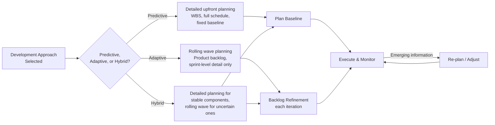
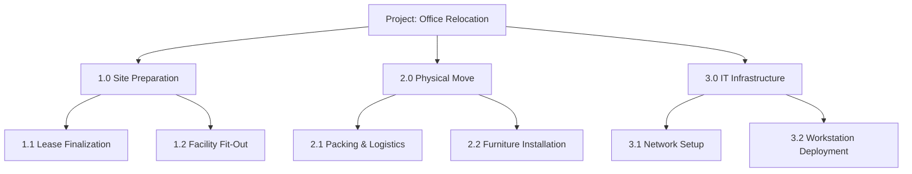

## Planning Performance Domain

### Definition and Purpose

The Planning Performance Domain is one of the eight Performance Domains in PMBOK 7. It addresses activities and functions associated with the initial, ongoing, and evolving organization and coordination necessary for delivering project deliverables and outcomes. Unlike the process-based "Planning Process Group" of earlier PMBOK editions, this domain frames planning as a continuous activity that adapts throughout the project life cycle rather than a discrete, front-loaded phase.

This domain directly builds on decisions made in the Development Approach and Life Cycle Performance Domain — the chosen approach (predictive, adaptive, or hybrid) fundamentally shapes how planning is conducted.

### Desired Outcomes

- The project progresses in an organized, coordinated, and deliberate manner
- There is a holistic approach to delivering the project outcomes
- Evolving information is elaborated to produce the deliverables and outcomes for which the project was undertaken
- Time spent planning is appropriate for the situation
- Planning information is sufficient to manage stakeholder expectations
- There is a process for the adaptation of plans throughout the project, based on emerging and changing needs or conditions

### Core Planning Considerations

**1. Variables That Influence Planning**

- **Development approach** — predictive projects plan in greater upfront detail; adaptive approaches favor rolling wave or just-in-time planning
- **Product/project deliverables** — variability and complexity of what is being produced
- **Organizational requirements** — governance mandates, approval gates, compliance obligations
- **Market conditions** — external factors affecting cost, resource availability, and constraints
- **Legal or regulatory restrictions** — compliance requirements shaping schedule and documentation needs

**2. Elements Commonly Addressed in Planning**

- **Scope** — defining what is and is not included in the project
- **Schedule** — sequencing and estimating time for work
- **Budget/resources** — estimating and allocating financial, human, and material resources
- **Quality** — defining acceptance criteria and quality standards
- **Procurement** — determining make-or-buy decisions and vendor engagement strategy
- **Changes** — establishing how changes to scope, schedule, or cost will be managed
- **Governance** — defining decision rights, escalation paths, and reporting structure
- **Communication** — establishing information needs, channels, and cadence

### Estimating Techniques

- **Analogous estimating** — using historical data from similar past projects
- **Parametric estimating** — using a statistical relationship between historical data and other variables (e.g., cost per square meter)
- **Three-point estimating** — using optimistic, pessimistic, and most likely estimates to calculate an expected value, commonly via the PERT formula:

$$E = \frac{O + 4M + P}{6}$$

where $O$ is the optimistic estimate, $M$ is the most likely estimate, and $P$ is the pessimistic estimate.

- **Bottom-up estimating** — aggregating detailed estimates of individual work components into a total
- **Affinity estimating / relative sizing** — common in agile contexts, using story points or T-shirt sizes rather than absolute time/cost units

### Planning Across Development Approaches

**Key Points**

- Planning is treated as continuous and adaptive in PMBOK 7, even for predictive projects — a baseline is expected to be revisited as approved changes occur
- The appropriate *amount* of planning detail is itself a judgment call; over-planning wastes effort on assumptions likely to change, while under-planning creates coordination and expectation-management risk
- Planning outputs must be sufficient to manage stakeholder expectations, linking this domain directly to the Stakeholder Performance Domain

### Rolling Wave Planning

A technique particularly relevant to adaptive and hybrid approaches: near-term work is planned in detail, while future work is planned at a higher level and elaborated progressively as it approaches execution and more information becomes available. This avoids the sunk effort of detailed planning for work that may change significantly before it begins.

### Work Breakdown Structure (WBS) — Predictive Context

For predictive approaches, planning commonly produces a **Work Breakdown Structure**: a hierarchical decomposition of the total scope of work into smaller, manageable components, down to the **work package** level — the lowest level at which cost and duration can be reliably estimated and assigned.

### Example

**Scenario**: A retail company plans the launch of a loyalty rewards program spanning a new mobile feature (adaptive) and a point-of-sale system integration (predictive).

- **POS integration**: A detailed WBS is developed down to the work package level, with bottom-up cost estimates for hardware, licensing, and vendor labor. A fixed schedule baseline is set given the hard go-live deadline tied to a marketing campaign.
- **Mobile loyalty feature**: A product backlog is created with high-level epics; only the next two sprints are planned in detail using relative story-point sizing, with subsequent sprints refined as user feedback comes in.
- **Governance planning**: A joint steering committee cadence is established to synchronize the predictive and adaptive tracks, with a shared high-level milestone plan spanning both.
- **Adaptation**: Midway through, vendor hardware delays force replanning of the POS schedule; the rolling-wave-planned mobile track absorbs the compressed testing window by reprioritizing lower-value backlog items.

### Common Pitfalls

- **Treating planning as a one-time, front-loaded activity** — particularly in predictive projects, failing to revisit and adapt the plan as approved changes and new information emerge
- **Over-detailing plans for highly uncertain work** — investing significant effort in fully detailed schedules for components likely to change undermines the "appropriate for the situation" outcome
- **Under-communicating planning assumptions to stakeholders** — planning outputs that remain internal to the project team fail to manage stakeholder expectations effectively
- **Ignoring the influence of the chosen development approach** — attempting to apply detailed predictive planning techniques wholesale to a highly adaptive project (or vice versa) creates friction and wasted effort
- **Estimating without accounting for uncertainty** — relying solely on a single-point estimate rather than incorporating techniques like three-point estimating in areas of higher risk

### Practical Workflow

1. Confirm the development approach and life cycle structure already established for the project
2. Identify planning elements relevant to the project (scope, schedule, cost, quality, procurement, governance, communication)
3. Select estimating techniques appropriate to the level of certainty in each planning element
4. For predictive components, develop a WBS down to the work package level and establish a schedule/cost baseline
5. For adaptive components, establish a backlog and apply rolling wave planning at the iteration level
6. Communicate planning outputs to stakeholders to align expectations
7. Establish a mechanism for reviewing and adapting plans as new information emerges or changes are approved
8. Monitor planning effectiveness and adjust the level of planning detail as the project matures

**Related Topics**

- Development Approach and Life Cycle Domain
- Project Work Performance Domain
- Work Breakdown Structure (WBS) Development
- Estimating Techniques: Analogous, Parametric, Three-Point
- Rolling Wave Planning
- Integrated Change Control