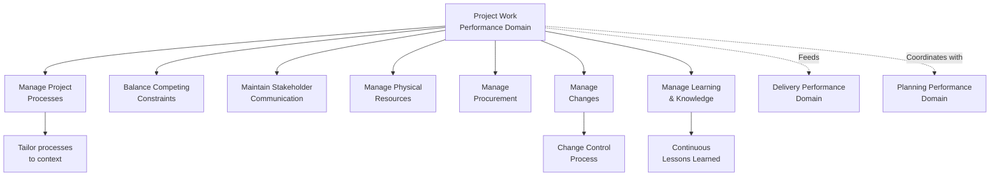

## Project Work Performance Domain

### Definition and Purpose

The Project Work Performance Domain is one of the eight Performance Domains in PMBOK 7. It addresses activities and functions associated with establishing project processes, managing physical and procurement resources, and fostering a learning environment throughout project execution. This domain covers much of the operational "doing" work that keeps a project running smoothly day to day — the connective tissue between planning and delivery.

Where the Planning Performance Domain determines *what* will be done and *how*, the Project Work Performance Domain addresses the ongoing execution mechanics: managing the flow of work, resources, procurement, and organizational learning as the project unfolds.

### Desired Outcomes

- Efficient and effective project performance
- Project processes that are appropriate for the project and its environment
- Appropriate communication and engagement with stakeholders
- Efficient management of physical resources
- Effective management of procurement

### Core Focus Areas

**1. Managing Project Processes**

Establishing and continuously improving the processes used to manage the project — determining which processes are needed, tailoring them to context, and eliminating unnecessary bureaucracy that does not add value.

**2. Balancing Competing Constraints**

Ongoing management of the interdependent constraints of scope, schedule, cost, resources, quality, and risk, recognizing that a change to one typically affects the others.

**3. Maintaining Stakeholder Engagement and Communication**

Ensuring project communications remain timely, relevant, and appropriately targeted — operationally connecting this domain to the Stakeholder Performance Domain.

**4. Managing Physical Resources**

Planning, acquiring, and managing materials, equipment, supplies, and facilities needed to execute the project, including logistics and supply chain considerations specific to the project's industry.

**5. Managing Procurement**

Determining make-or-buy decisions, selecting and managing vendors and contracts, and overseeing supplier performance throughout the engagement.

**6. Managing Changes**

Operating a change control process to evaluate, approve, reject, or defer proposed changes to scope, schedule, cost, or other baselines.

**7. Managing Learning and Knowledge**

Capturing lessons learned throughout the project (not only at closure) and applying them in near-real-time to improve ongoing performance, as well as documenting knowledge for future projects.

### Domain Structure

**Key Points**

- This domain is heavily operational — it is where planning intentions meet the practical realities of executing work day to day
- Process management includes actively removing unnecessary steps, not only adding controls; efficiency is an explicit desired outcome
- Knowledge management is framed as continuous, not confined to project closure retrospectives

### Managing Competing Constraints in Practice

The classic "triple constraint" (scope, schedule, cost) is expanded in modern practice to include quality, resources, and risk as interdependent variables. A change to any one typically forces trade-offs among the others:

| Constraint Change | Common Trade-off Impacts |
| --- | --- |
| Scope increase | Schedule extension, cost increase, or resource reallocation |
| Schedule compression | Cost increase (overtime, added resources), quality risk |
| Cost reduction | Scope reduction, schedule extension, or resource constraints |
| Resource loss | Schedule extension, scope reduction, or quality risk |

[Inference] Because these constraints are interdependent rather than independent, experienced practitioners generally treat any single-constraint change request with suspicion until its ripple effects on the others have been explicitly assessed — a request framed as "just add scope, nothing else changes" is a common red flag warranting scrutiny.

### Procurement Management Considerations

- **Make-or-buy analysis** — determining whether work should be performed internally or sourced externally, typically based on cost, capability, capacity, and strategic considerations
- **Contract types** — fixed-price, cost-reimbursable, and time-and-materials contracts each allocate risk differently between buyer and seller
- **Vendor selection criteria** — technical capability, cost, past performance, delivery timeline, and financial stability
- **Contract administration** — ongoing monitoring of vendor performance against contractual terms, managing changes to procurement scope, and resolving disputes

### Example

**Scenario**: A manufacturing company is executing a factory automation upgrade project.

- **Physical resources**: The team coordinates delivery logistics for specialized robotic equipment with a six-week lead time, sequencing installation around existing production schedules to minimize downtime.
- **Procurement**: A fixed-price contract is selected for the equipment vendor to transfer cost-overrun risk, while a time-and-materials contract is used for the systems integrator given uncertain integration complexity.
- **Managing changes**: Mid-project, the automation vendor identifies a firmware compatibility issue requiring additional integration work. The change is evaluated through the change control process, weighing schedule impact against the cost of expedited vendor support.
- **Learning and knowledge**: A recurring issue with power supply specifications across two work packages prompts an immediate process adjustment (a shared specifications checklist) rather than waiting until project closure to document the lesson.
- **Balancing constraints**: The firmware issue's schedule impact is partially absorbed by reallocating internal engineering resources from a lower-priority work package, avoiding a full schedule slip.

### Common Pitfalls

- **Over-engineering project processes** — adding controls and approval steps without evaluating whether they add proportional value, contradicting the "efficient and effective" desired outcome
- **Reactive procurement management** — treating vendor contracts as "set and forget" after signing, rather than actively managing performance and risk throughout
- **Deferring lessons learned to project closure** — losing the opportunity to apply improvements while the project is still in progress
- **Addressing constraint trade-offs in isolation** — approving a schedule compression request without assessing downstream cost or quality impact
- **Underestimating physical resource lead times** — particularly in projects involving specialized equipment, materials, or facilities with long procurement cycles

### Practical Workflow

1. Establish project processes appropriate to project size, complexity, and organizational context — avoiding unnecessary bureaucracy
2. Monitor the interdependent constraints (scope, schedule, cost, quality, resources, risk) continuously, not only at formal review points
3. Maintain active, appropriately targeted stakeholder communication throughout execution
4. Plan and manage physical resource acquisition with attention to lead times and logistics
5. Select procurement and contract strategies that appropriately allocate risk for each component of work
6. Operate a disciplined change control process for evaluating proposed changes against project baselines
7. Capture and apply lessons learned continuously throughout execution, not only at project closure
8. Periodically reassess whether current processes remain fit for purpose as the project evolves

**Related Topics**

- Planning Performance Domain
- Delivery Performance Domain
- Procurement Contract Types and Risk Allocation
- Integrated Change Control
- Lessons Learned and Knowledge Management
- Resource Management (Physical and Human)