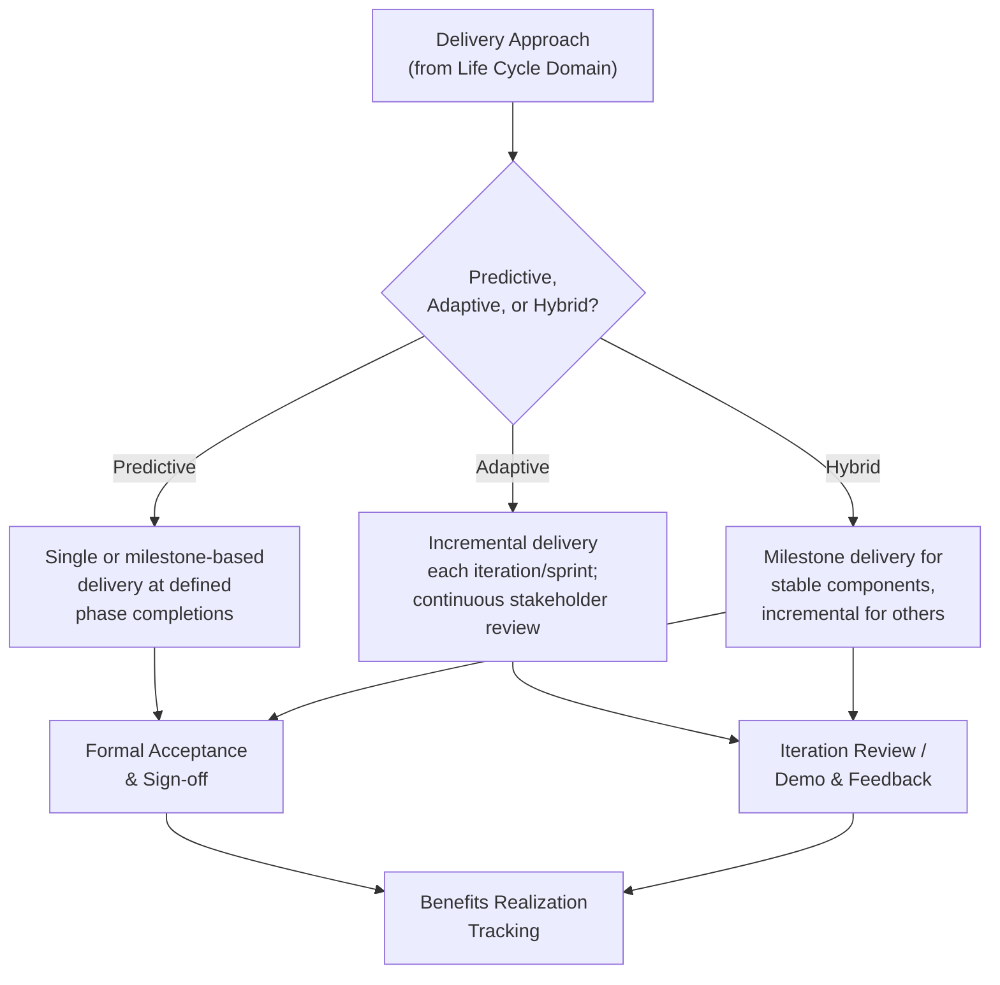

## Delivery Performance Domain

### Definition and Purpose

The Delivery Performance Domain is one of the eight Performance Domains in PMBOK 7. It addresses activities and functions associated with delivering the scope and quality that the project was undertaken to achieve. This domain is where the project's intended value is actually produced and handed over — connecting the abstract goal of "value" (Principle 4: Focus on Value) to concrete, verified deliverables.

This domain directly builds on decisions made in the Development Approach and Life Cycle domain: how deliverables are produced, verified, and released depends heavily on whether the project follows a predictive, adaptive, or hybrid approach.

### Desired Outcomes

- Projects contribute to business objectives and advancement of strategy
- Projects realize the outcomes they were initiated to deliver
- Project benefits are realized in the time frame in which they were planned, or continuously realized over the course of the program
- The project team has a clear understanding of requirements
- Stakeholders accept and are satisfied with project deliverables

### Core Concepts

**1. Delivering Value**

Value is not automatically realized simply by producing a deliverable — it materializes when the deliverable is put to use and produces the intended benefit. This domain treats value delivery as the central measure of success, aligned with the principle-level focus on value over mere output completion.

**2. Deliverables**

Any unique and verifiable product, result, or capability produced to complete a process, phase, or project. Deliverables can be:

- **Tangible** — a physical product, a completed facility, installed equipment
- **Intangible** — a trained workforce, an improved process, a changed organizational capability

**3. Requirements**

Conditions or capabilities that a deliverable must satisfy. Requirements management includes elicitation, documentation, traceability, and validation against stakeholder needs — a persistent thread from initiation through acceptance.

**4. Quality**

Ensuring deliverables meet defined acceptance criteria and fitness-for-use standards, distinguishing **quality control** (inspecting outputs) from **quality assurance** (improving the process that produces outputs).

**5. Business Value and Benefits Realization**

Recognizing that project outputs (deliverables) and project outcomes (business value/benefits) are distinct — a deliverable can be completed on time and to specification while still failing to produce the intended benefit if the underlying business assumption was flawed.

### Delivery Across Development Approaches

**Key Points**

- Delivery is distinct from mere task completion — it explicitly includes verification that scope and quality requirements have been met
- Value realization can lag behind deliverable completion; this domain calls for tracking benefits over the timeframe in which they were intended to materialize, not just at handover
- The chosen development approach determines whether stakeholder feedback on deliverables arrives once (predictive) or continuously (adaptive)

### Requirements Traceability

A common technique within this domain is maintaining a **Requirements Traceability Matrix (RTM)**, linking each requirement to its source, related deliverables, and verification method, ensuring nothing is lost between elicitation and final acceptance.

| Requirement ID | Description | Source | Deliverable | Verification Method | Status |
| --- | --- | --- | --- | --- | --- |
| REQ-001 | System supports 10,000 concurrent users | Business case | Load-balanced application tier | Load testing | Verified |
| REQ-002 | Data encrypted at rest | Compliance mandate | Database encryption module | Security audit | Verified |
| REQ-003 | Mobile-responsive UI | User research | Front-end interface | UAT sign-off | In progress |

### Outputs vs. Outcomes

- **Output** — the deliverable itself (e.g., a new customer portal is deployed)
- **Outcome** — the business result the output enables (e.g., customer self-service reduces call center volume by 20%)

[Inference] Distinguishing outputs from outcomes is one of the more commonly under-applied disciplines in practice — project teams frequently measure and report success in terms of deliverable completion (on time, on budget, to spec) because it is directly within their control, even though the intended business outcome may take longer to materialize and depends on factors outside the project's boundary.

### Example

**Scenario**: An airline undertakes a project to replace its customer check-in kiosks with a new self-service platform.

- **Requirements**: The RTM traces each requirement (e.g., "average check-in time under 90 seconds") back to the original business case and forward to the specific kiosk software module responsible for meeting it.
- **Quality**: Quality assurance activities review the kiosk software development process itself (code review standards, testing coverage), while quality control activities test the finished kiosks against defined acceptance criteria before rollout.
- **Delivery approach applied**: Kiosk hardware installation follows a predictive, milestone-based delivery (fixed rollout dates per airport), while the underlying software is developed and refined through adaptive sprints with pilot-airport feedback incorporated before full rollout.
- **Outputs vs. outcomes**: The output — kiosks installed and functioning at all airports — is achieved on schedule. The intended outcome — reduced average check-in time and lower staffing costs — is tracked for six months post-launch, revealing that check-in time targets are met but staffing reductions lag due to a slower-than-expected customer adoption curve, prompting a targeted awareness campaign.

### Common Pitfalls

- **Equating deliverable completion with project success** — a completed, on-spec deliverable does not guarantee the intended business value was realized
- **Weak requirements traceability** — losing the link between original stakeholder needs and final deliverables increases the risk of scope drift or missed acceptance criteria
- **Confusing quality assurance with quality control** — focusing only on inspecting finished output while neglecting process improvements that prevent defects in the first place
- **Treating acceptance as a formality** — rushing sign-off without genuine stakeholder validation risks late-discovered dissatisfaction or rework
- **Stopping measurement at handover** — failing to track benefits realization over the intended timeframe misses whether the project actually achieved its business purpose

### Practical Workflow

1. Establish and maintain a requirements traceability approach from elicitation through acceptance
2. Define clear, verifiable acceptance criteria for each deliverable before development begins
3. Apply quality assurance to the production process and quality control to the finished deliverables
4. Align the delivery cadence (single, milestone-based, or incremental) with the development approach selected earlier in the project
5. Conduct formal or iterative acceptance reviews appropriate to the delivery cadence
6. Distinguish and separately track deliverable completion (outputs) from business value realization (outcomes)
7. Continue monitoring benefits realization beyond project handover, for the timeframe in which value was expected to materialize
8. Feed acceptance and benefits-realization findings back into stakeholder communication and lessons learned

**Related Topics**

- Development Approach and Life Cycle Domain
- Measurement Performance Domain
- Requirements Traceability Matrix Design
- Quality Assurance vs. Quality Control
- Benefits Realization Management
- Project Work Performance Domain