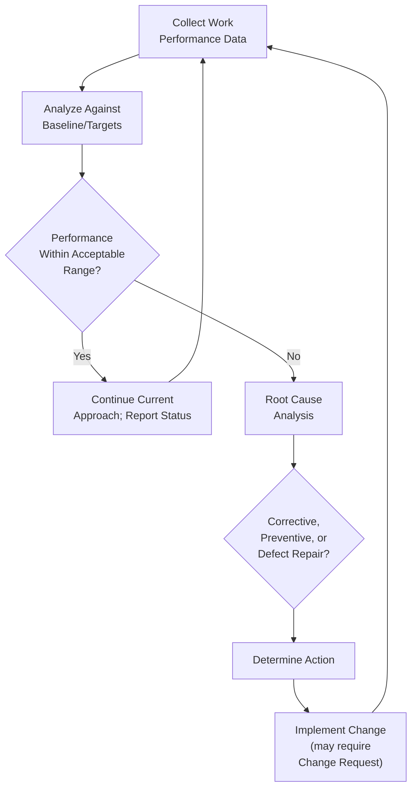

## Measurement Performance Domain

### Definition and Purpose

The Measurement Performance Domain is one of the eight Performance Domains in PMBOK 7. It addresses activities and functions associated with assessing project performance and taking appropriate actions to maintain acceptable performance. This domain provides the feedback mechanism that tells the project team, sponsor, and stakeholders whether the project is actually on track — and, critically, whether "on track" against the plan also means on track toward the intended value.

This domain works closely with the Delivery Performance Domain (which defines what value and outcomes look like) and the Uncertainty Performance Domain (which measurement helps surface early).

### Desired Outcomes

- A reliable understanding of the status of the project
- Actionable data to facilitate decision-making
- Timely and appropriate actions to keep project performance on track
- Achieving targets and generating business value by making informed and timely decisions based on reliable forecasts and evaluations

### Core Concepts

**1. Metrics**

A description of a project or product attribute and how a measurement system evaluates it. Effective metrics are typically:

- Meaningful to the decision they inform
- Understandable to their audience
- Cost-effective to collect and maintain
- Accurate and precise enough to support decisions
- Timely, providing information while it is still actionable

**2. Establishing Effective Metrics**

Common categories of project metrics:

- **Delivery metrics** — scope completed, features delivered, deliverable acceptance rate
- **Schedule metrics** — schedule variance, milestone achievement rate
- **Cost/financial metrics** — cost variance, cost performance index, burn rate
- **Quality metrics** — defect density, rework rate, customer satisfaction scores
- **Resource metrics** — resource utilization, team velocity, capacity vs. demand
- **Stakeholder metrics** — stakeholder satisfaction, engagement level trends
- **Business value metrics** — return on investment, benefits realized to date

**3. Presenting Information**

Effective measurement requires presenting data in formats appropriate to the audience — dashboards, burn-up/burn-down charts, status reports, and trend graphs — favoring visual and trend-based representation over raw numeric tables for executive audiences.

**4. Troubleshooting Performance**

When metrics indicate performance is diverging from targets, this domain calls for identifying root causes and determining corrective, preventive, or defect-repair actions before variance compounds.

### Common Predictive Measurement Techniques

**Earned Value Management (EVM)**

A widely used technique for predictive projects, integrating scope, schedule, and cost measures into a single analytical framework:

- **Planned Value (PV)** — the authorized budget for scheduled work
- **Earned Value (EV)** — the value of work actually completed, measured in budgeted terms
- **Actual Cost (AC)** — the actual cost incurred for the work performed

Key derived metrics:

$$CV = EV - AC$$

$$SV = EV - PV$$

$$CPI = \frac{EV}{AC}$$

$$SPI = \frac{EV}{PV}$$

Where $CV$ is cost variance, $SV$ is schedule variance, $CPI$ is the cost performance index, and $SPI$ is the schedule performance index. A $CPI$ or $SPI$ below 1.0 indicates unfavorable performance (over budget or behind schedule, respectively); above 1.0 indicates favorable performance.

**Estimate at Completion (EAC)**

Forecasting the total expected cost of the project based on current performance:

$$EAC = \frac{BAC}{CPI}$$

where $BAC$ is the Budget at Completion — used when current cost performance is expected to continue for the remainder of the project.

### Common Adaptive Measurement Techniques

- **Velocity** — the amount of work (typically in story points) a team completes per iteration, used to forecast future delivery capacity
- **Burn-down/burn-up charts** — visualizing remaining work against time (burn-down) or completed work against total scope over time (burn-up)
- **Cycle time and lead time** — measuring how long work items take to move through the workflow, common in Kanban-style measurement
- **Cumulative flow diagrams** — visualizing work item status across workflow stages over time to identify bottlenecks

### Measurement Feedback Loop

**Key Points**

- Measurement is meant to drive decisions and action, not simply produce reports — an unread or unactioned dashboard fails the domain's desired outcomes
- Different development approaches favor different metric sets: EVM is most naturally suited to predictive projects with a fixed baseline, while velocity and cycle time suit adaptive, iteration-based work
- Metrics should be selected deliberately per project rather than applied as a universal template; tracking excessive or poorly chosen metrics increases cost without improving decision quality

### Leading vs. Lagging Indicators

- **Leading indicators** — predictive signals that suggest future performance (e.g., declining team velocity trend, increasing defect discovery rate during development)
- **Lagging indicators** — measures of outcomes already realized (e.g., final cost variance, customer satisfaction post-delivery)

[Inference] Teams that rely primarily on lagging indicators tend to discover problems only after they have already materially affected cost or schedule; a more mature measurement practice deliberately builds in leading indicators specific to the project's known risk areas, even though leading indicators are often harder to define reliably than straightforward lagging metrics.

### Example

**Scenario**: A predictive infrastructure project (data center expansion) is at the midpoint of execution.

- **Metrics selected**: EVM-based cost and schedule performance indices, plus a quality metric tracking inspection failure rate on installed equipment.
- **Data collected**: At the 50% schedule mark, $PV = \$2.4M$, $EV = \$2.1M$, $AC = \$2.3M$.
- **Analysis**: $CPI = 2.1/2.3 \approx 0.91$ and $SPI = 2.1/2.4 \approx 0.88$, indicating the project is both over budget and behind schedule relative to the baseline.
- **Troubleshooting**: Root cause analysis reveals a subcontractor staffing shortfall driving both delays and premium labor costs.
- **Action**: The team negotiates additional subcontractor resources for a defined period, accepting a short-term cost increase to recover schedule, and submits a formal change request to adjust the cost baseline given the revised forecast $EAC = BAC / CPI$.
- **Reporting**: Updated dashboards communicate the revised forecast and recovery plan to the steering committee, supporting an informed decision on whether to approve the additional spend.

### Common Pitfalls

- **Tracking metrics without acting on them** — data collection without a defined decision-action link produces reporting overhead with no performance benefit
- **Applying EVM to adaptive projects rigidly** — EVM assumes a stable scope baseline that adaptive projects, by design, do not maintain in the same way; velocity-based metrics are usually more appropriate there
- **Vanity metrics** — tracking numbers that look favorable but do not inform meaningful decisions (e.g., total hours logged without connecting to output or value)
- **Ignoring leading indicators** — waiting for lagging, outcome-based metrics to reveal problems that leading indicators could have surfaced earlier
- **Metric overload** — tracking too many metrics dilutes attention and increases collection cost without proportional decision value

### Practical Workflow

1. Identify decisions that measurement needs to support (go/no-go, resource reallocation, escalation)
2. Select metrics appropriate to the development approach and the decisions they inform
3. Establish baselines or targets against which performance will be measured
4. Collect work performance data at a cadence appropriate to project risk and pace
5. Analyze data against baselines/targets, distinguishing leading from lagging signals
6. Where performance diverges from acceptable ranges, conduct root cause analysis before acting
7. Determine and implement corrective, preventive, or defect-repair actions, routing through change control where needed
8. Present findings to stakeholders in formats appropriate to their needs and decision authority
9. Periodically reassess whether the current metric set remains relevant as the project evolves

**Related Topics**

- Delivery Performance Domain
- Uncertainty Performance Domain
- Earned Value Management (EVM) Deep Dive
- Agile Metrics: Velocity, Burn-down, Cumulative Flow
- Forecasting Techniques (EAC, ETC, TCPI)
- Dashboard and Status Reporting Design