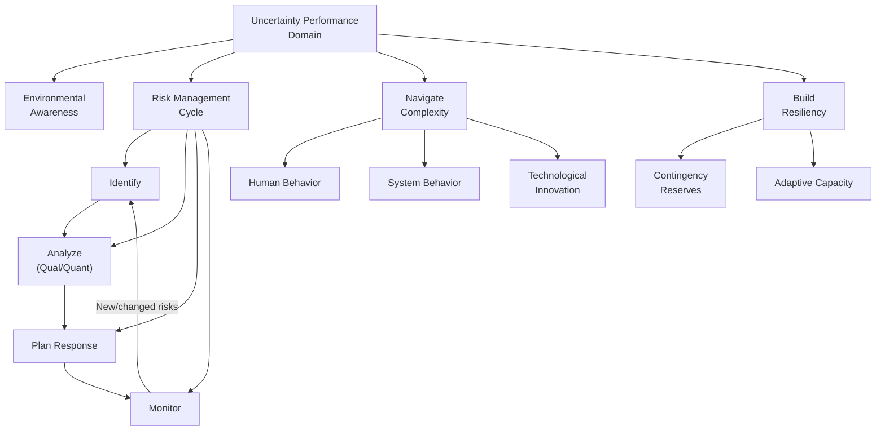

## Uncertainty Performance Domain

### Definition and Purpose

The Uncertainty Performance Domain is one of the eight Performance Domains in PMBOK 7. It addresses activities and functions associated with risk and uncertainty. This domain is the final of the eight domains and, in many respects, is the most pervasive — uncertainty touches every other Performance Domain, since stakeholder attitudes, team dynamics, planning assumptions, delivery quality, and measurement accuracy are all subject to it.

This domain operationalizes Principle 9 (Navigate Complexity), Principle 10 (Optimize Risk Responses), and Principle 11 (Embrace Adaptability and Resiliency), reflecting how central uncertainty is to the principles-based framework as a whole.

### Desired Outcomes

- An awareness of the environment in which projects occur, including, but not limited to, the technological, social, political, market, and economic environments
- Proactively explored and responded to uncertainty
- An awareness of the interdependence of multiple variables on the project
- The capacity to anticipate threats and opportunities and understand the consequences of issues
- Little to no negative impact from unforeseen events or conditions on project outcomes and/or project performance

### Distinguishing Related Concepts

- **Risk** — an uncertain event or condition that, if it occurs, has a positive or negative effect on project objectives. Risk is quantifiable to some degree
- **Uncertainty** — a broader condition of unpredictability that may not be specific enough to identify as a discrete risk (e.g., general market volatility)
- **Ambiguity** — a state in which conditions or events cannot be clearly distinguished, understood, or predicted, often due to insufficient information
- **Complexity** — a characteristic of a program, project, or environment that is difficult to manage due to human behavior, system behavior, ambiguity, and technological innovation
- **Volatility** — the possibility for rapid and unpredictable change

[Inference] These terms are frequently used loosely and interchangeably in casual project conversation, but PMBOK 7 treats them as related, distinct concepts — a well-run uncertainty practice generally benefits from distinguishing them because each implies a different type of response (a discrete risk can be planned for with a specific mitigation; ambiguity often calls for information-gathering or experimentation instead).

### Core Risk Management Activities

**1. Risk Identification**

Systematically surfacing potential threats and opportunities through techniques such as brainstorming, checklists, assumption analysis, and SWOT analysis.

**2. Risk Analysis**

- **Qualitative analysis** — assessing probability and impact, often via a probability-impact matrix, to prioritize risks for further attention
- **Quantitative analysis** — numerically modeling the combined effect of risks on project objectives, using techniques such as Monte Carlo simulation or expected monetary value (EMV) analysis

**3. Risk Response Planning**

For threats:

- **Avoid** — eliminate the threat by changing the plan
- **Mitigate** — reduce the probability or impact of the threat
- **Transfer** — shift the impact to a third party (e.g., insurance, contractual terms)
- **Accept** — acknowledge the risk without proactive action, often for low-priority items

For opportunities:

- **Exploit** — ensure the opportunity is realized
- **Enhance** — increase the probability or impact of the opportunity
- **Share** — allocate ownership to a third party better positioned to capture it
- **Accept** — take advantage if it occurs, without proactive pursuit

**4. Risk Monitoring**

Continuously tracking identified risks, watching for new risks, and evaluating the effectiveness of response strategies throughout the project.

### Navigating Complexity

Complexity in projects typically arises from:

- **Human behavior** — differing motivations, communication styles, and decision-making patterns among stakeholders and team members
- **System behavior** — interdependencies and feedback loops within organizational or technical systems
- **Uncertainty and ambiguity** — incomplete information about outcomes, requirements, or environmental conditions
- **Technological innovation** — rapid or disruptive change in tools, methods, or the competitive landscape

### Uncertainty Domain Structure

**Key Points**

- Risk management within this domain covers both threats and opportunities — treating uncertainty as purely negative misses half the intended scope
- Complexity and risk are related but distinct: complexity describes an inherent characteristic of the project environment, while risk management is one of the tools used to navigate it
- Resiliency (the capacity to recover from setbacks) is treated as a deliberate capability to build, not an incidental byproduct of good planning

### Probability-Impact Matrix

A common qualitative analysis tool for prioritizing identified risks:

|  | Low Impact | Medium Impact | High Impact |
| --- | --- | --- | --- |
| **High Probability** | Medium priority | High priority | Critical priority |
| **Medium Probability** | Low priority | Medium priority | High priority |
| **Low Probability** | Low priority | Low priority | Medium priority |

### Building Resiliency and Adaptability

- **Contingency reserves** — time or budget set aside for identified risks that materialize
- **Management reserves** — additional reserves for unknown-unknowns, typically controlled at a higher governance level than the project team
- **Adaptive capacity** — the project's structural ability to absorb disruption, such as modular scope design, cross-trained team members, or flexible vendor arrangements
- **Scenario planning** — preparing alternative courses of action for plausible future states, particularly useful under high ambiguity where discrete risk identification is difficult

### Example

**Scenario**: A pharmaceutical company is running a clinical trial logistics project involving multiple international sites.

- **Environmental awareness**: The team tracks evolving regulatory requirements across jurisdictions as a source of ongoing uncertainty, not a one-time compliance check.
- **Risk identification**: Cold-chain shipment delays are identified as a discrete, quantifiable risk with historical carrier performance data available.
- **Qualitative analysis**: Using a probability-impact matrix, a potential customs delay at one site is rated high probability, high impact — placing it in the critical priority tier.
- **Response planning**: The team **mitigates** the customs risk by pre-clearing documentation with local regulatory liaisons, and **transfers** cold-chain failure risk to the logistics vendor via contractual penalty clauses.
- **Navigating complexity**: Divergent site-level decision-making authority (system behavior) combined with varying local regulatory interpretation (ambiguity) requires the team to build in additional coordination checkpoints rather than assuming uniform process across sites.
- **Resiliency**: A management reserve is held specifically for unforeseen regulatory delays, distinct from the contingency reserve allocated to the already-identified customs risk.

### Common Pitfalls

- **Treating risk management as a one-time register exercise** — risks and the broader project environment evolve; monitoring must be continuous
- **Focusing only on threats** — neglecting to identify and pursue opportunities leaves potential value on the table
- **Conflating risk with ambiguity or complexity** — applying discrete risk-response planning to conditions that are genuinely ambiguous can create false confidence; some situations call for experimentation or information-gathering instead
- **Underfunding reserves** — insufficient contingency or management reserves leave the project unable to absorb realized risks without escalation or rework
- **Ignoring interdependencies** — evaluating risks in isolation without considering how they interact with other project variables (schedule, stakeholder attitudes, resource availability) understates true exposure

### Practical Workflow

1. Establish awareness of the broader environmental context (technological, social, political, market, economic) surrounding the project
2. Continuously identify risks (threats and opportunities) throughout the project lifecycle, not only at initiation
3. Apply qualitative analysis to prioritize risks, and quantitative analysis where the decision stakes justify the additional effort
4. Select and implement appropriate response strategies for both threats and opportunities
5. Distinguish risks from broader ambiguity or complexity, applying appropriate techniques to each (response planning vs. experimentation/information-gathering)
6. Establish contingency and management reserves proportional to identified and unknown risk exposure
7. Build adaptive capacity into project structure where feasible (modularity, cross-training, flexible agreements)
8. Monitor risk response effectiveness and reassess the risk landscape as the project and its environment evolve

**Related Topics**

- Measurement Performance Domain
- Delivery Performance Domain
- Quantitative Risk Analysis and Monte Carlo Simulation
- Risk Response Strategies for Threats and Opportunities
- Contingency vs. Management Reserves
- Complexity Navigation Techniques