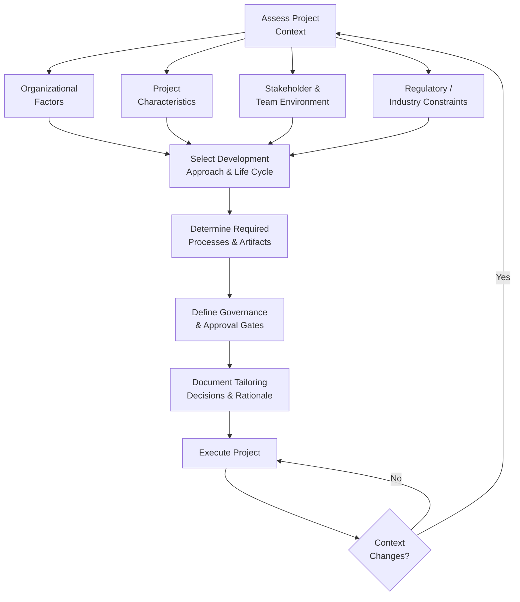

## Tailoring the Project Approach

### Definition and Purpose

Tailoring is the deliberate adaptation of the development approach, governance, processes, and artifacts used to manage a project so that they fit the specific context, scale, and needs of that project — rather than applying a fixed, one-size-fits-all methodology. It directly operationalizes Principle 7 (Tailor Based on Context) from the twelve PMBOK 7 principles and serves as the connective thread linking all eight Performance Domains, since each domain's application must itself be tailored.

Tailoring is not the same as skipping rigor. It is the disciplined judgment of applying the *right amount and right kind* of process, documentation, and control for a given project — too little tailoring produces wasted effort on irrelevant process; too much (i.e., insufficient rigor) produces uncontrolled risk.

### Why Tailoring Matters

- No two projects share identical scope, stakeholders, risk profile, organizational culture, and constraints
- Rigid application of a single methodology across dissimilar projects tends to produce either excessive bureaucratic overhead on simple projects or dangerously insufficient controls on complex ones
- Tailoring supports efficient use of limited project resources (time, budget, team attention) by directing rigor where it is genuinely needed
- Organizations operating a Project Management Office (PMO) or portfolio of varied projects rely on tailoring guidelines to maintain consistency in governance while allowing appropriate flexibility at the project level

### What Can Be Tailored

- **Development approach** — predictive, iterative, incremental, adaptive, or hybrid
- **Life cycle and phase structure** — number, sequence, and formality of project phases
- **Processes** — which planning, monitoring, and control processes are performed, and at what level of formality
- **Engagement and communication practices** — frequency, channel, and depth of stakeholder and team engagement
- **Tools and artifacts** — which documents, templates, and tracking mechanisms are used (e.g., a full WBS and Gantt chart versus a lightweight backlog)
- **Governance structure** — approval gates, escalation paths, and decision-making authority
- **Team structure and roles** — dedicated versus part-time staffing, degree of self-organization

### Factors That Drive Tailoring Decisions

**1. Project Characteristics**

- Size, complexity, and duration
- Level of innovation and uncertainty in scope or technology
- Criticality and visibility to the organization

**2. Organizational Context**

- Organizational structure (functional, matrix, projectized)
- Organizational culture and maturity in project management practices
- Availability of skilled resources and tools

**3. Industry and Regulatory Environment**

- Compliance requirements that mandate specific documentation or approval processes
- Industry norms and standards (e.g., construction versus software development)

**4. Stakeholder Environment**

- Number, diversity, and geographic distribution of stakeholders
- Stakeholder expectations regarding formality, reporting, and involvement

**5. Team Environment**

- Team size, co-location versus distribution, experience level
- Team familiarity with a given delivery approach

### Tailoring Decision Flow

**Key Points**

- Tailoring is a continuous discipline, not a single upfront decision — significant changes in project context should trigger a re-evaluation of the tailored approach
- Documenting the rationale behind tailoring decisions provides an audit trail useful for governance review and for informing future similar projects
- Tailoring operates at every level: the overall methodology, the development approach, individual processes, and even specific document templates

### A Practical Tailoring Framework

Many organizations formalize tailoring through a structured set of guiding questions, commonly organized around:

1. **What is the appropriate development approach for this project's deliverables?**
2. **What level of formality is required for governance, given regulatory and organizational context?**
3. **Which processes add genuine value for this project, and which can be simplified or omitted?**
4. **What artifacts are necessary to support stakeholder decision-making and compliance, and which are optional?**
5. **How should team structure and engagement practices be adapted to team size, location, and experience?**

### Example

**Scenario**: A single organization runs two concurrent projects — a small internal process-improvement initiative and a large multi-vendor infrastructure build.

| Tailoring Dimension | Internal Process Improvement | Infrastructure Build |
| --- | --- | --- |
| Development approach | Lightweight iterative | Predictive with milestone gates |
| Governance | Single sponsor approval | Formal steering committee, staged gate reviews |
| Documentation | Brief charter, informal backlog | Detailed WBS, formal risk register, contract documentation |
| Team structure | Small, part-time, self-organizing | Larger dedicated team plus multiple vendor teams |
| Reporting cadence | Informal biweekly check-in | Formal monthly status report to executive sponsor |
| Change control | Verbal agreement with sponsor | Formal change request process routed through steering committee |

Applying the infrastructure project's full governance and documentation load to the internal process-improvement initiative would introduce unnecessary overhead disproportionate to its risk and value; applying the internal project's lightweight approach to the infrastructure build would leave significant regulatory and financial risk unmanaged.

### Common Pitfalls

- **Treating tailoring as an excuse to skip necessary rigor** — under-tailoring by omitting genuinely needed controls (e.g., skipping risk management on a high-uncertainty project) is a misuse of the concept, not a legitimate application of it
- **Applying a fixed organizational template regardless of project fit** — mandating identical documentation and governance for all projects defeats the purpose of a tailoring-oriented framework
- **Failing to document tailoring rationale** — undocumented deviations from standard organizational process can create governance or audit friction later
- **One-time tailoring without reassessment** — failing to revisit tailoring decisions as project scope, risk, or stakeholder environment changes materially over time
- **Conflating tailoring with informality** — tailoring is about fit-for-purpose rigor, not a blanket reduction in discipline

### Practical Workflow

1. Assess the project's size, complexity, uncertainty, and criticality
2. Evaluate organizational culture, structure, and available project management maturity
3. Identify regulatory, compliance, or industry-specific requirements that constrain tailoring options
4. Understand stakeholder and team environment factors (distribution, experience, expectations)
5. Select an appropriate development approach and life cycle structure based on the above factors
6. Determine which processes, artifacts, and governance mechanisms genuinely add value for this specific project
7. Document the tailoring decisions and their rationale for governance and future reference
8. Reassess the tailored approach when project context changes materially (scope shifts, new regulatory requirements, team restructuring)

**Related Topics**

- Development Approach and Life Cycle Domain
- The Twelve Project Management Principles
- PMO Governance and Methodology Standards
- Hybrid Project Management Models
- Organizational Process Assets and Tailoring Guidelines
- Agile, Predictive, and Hybrid Delivery Approaches