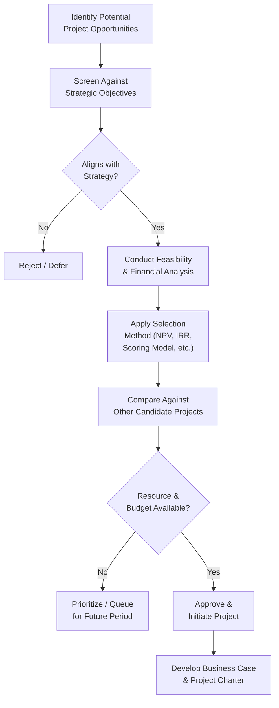

## Identifying and Selecting Projects

### Definition and Purpose

Identifying and Selecting Projects is the organizational-level activity of recognizing potential project opportunities and choosing which of them to pursue, based on strategic alignment, resource availability, and expected value. This activity sits upstream of individual project initiation — it occurs at the portfolio or program level, where organizations evaluate competing demands on limited capital, staffing, and time.

Where project initiation (charter development, stakeholder identification) begins once a project has been approved, project identification and selection determines *whether* a proposed initiative becomes a project at all.

### Purpose Within the Organization

- Ensure limited organizational resources are allocated to initiatives with the greatest strategic and financial value
- Maintain alignment between the project portfolio and overall business strategy
- Provide a disciplined, defensible basis for accepting or rejecting proposed initiatives
- Balance the portfolio across risk levels, time horizons, and strategic objectives
- Avoid resource overcommitment across simultaneously running projects

### Sources of Project Identification

- **Strategic planning initiatives** — projects generated to close gaps between current and desired organizational capability
- **Market demand** — new products or services required to respond to competitive or customer pressure
- **Regulatory or legal requirements** — mandatory compliance projects with limited discretion on whether to proceed
- **Technological advancement** — opportunities or necessities arising from new tools, platforms, or infrastructure
- **Customer requests** — projects initiated at the request of a specific customer or contract obligation
- **Internal process improvement** — efficiency or quality initiatives identified through operational review
- **Social or environmental need** — projects addressing community, sustainability, or stakeholder-driven concerns

### Project Selection Methods

**1. Benefit Measurement (Comparative) Methods**

Evaluate and compare projects based on quantifiable financial or scoring criteria:

- **Net Present Value (NPV)** — the present value of expected cash inflows minus the present value of cash outflows, discounted at the organization's required rate of return

$$NPV = \sum_{t=0}^{n} \frac{CF_t}{(1+r)^t}$$

where $CF_t$ is the cash flow in period $t$ and $r$ is the discount rate. A positive NPV indicates the project is expected to add value.

- **Internal Rate of Return (IRR)** — the discount rate at which a project's NPV equals zero; projects with an IRR exceeding the organization's cost of capital are generally favorable
- **Payback Period** — the time required to recover the initial investment from net cash inflows; simpler to calculate but does not account for the time value of money or cash flows beyond the payback point
- **Benefit-Cost Ratio (BCR)** — the ratio of the present value of benefits to the present value of costs; a BCR above 1.0 indicates benefits exceed costs
- **Scoring/weighted models** — assigning weighted scores across multiple criteria (strategic fit, risk, cost, resource availability) to produce a comparative ranking, particularly useful when benefits are not purely financial

**2. Constrained Optimization (Mathematical) Methods**

Complex algorithmic models (linear programming, integer programming) used primarily in large organizations with sophisticated portfolio management needs to optimize project selection subject to resource constraints. [Inference] These methods are less commonly applied in day-to-day practice than benefit measurement methods, since they require more rigorous, quantifiable input data and specialized analytical capability that many organizations do not maintain in-house.

### Comparing Financial Selection Methods

| Method | Accounts for Time Value of Money | Output Type | Common Limitation |
| --- | --- | --- | --- |
| NPV | Yes | Absolute dollar value | Requires reliable discount rate and cash flow estimates |
| IRR | Yes | Percentage rate | Can produce multiple or misleading results with non-conventional cash flows |
| Payback Period | No (typically) | Time duration | Ignores cash flows after payback and time value of money |
| BCR | Yes | Ratio | Requires reliable quantification of both benefits and costs |

### Selection Workflow

**Key Points**

- Financial selection methods are most reliable when projects can be compared on similar quantifiable terms; scoring models are typically necessary when strategic, regulatory, or qualitative benefits dominate
- Selection is inherently comparative and resource-constrained — approving one project often means deferring or rejecting others competing for the same budget or team capacity
- Selection decisions should be revisited periodically as strategic priorities, market conditions, or resource availability shift, rather than treated as permanent once made

### Weighted Scoring Model Example

A common non-financial (or blended) selection technique, particularly useful when comparing projects with disparate benefit types:

| Criterion | Weight | Project A Score (1-5) | Project A Weighted | Project B Score (1-5) | Project B Weighted |
| --- | --- | --- | --- | --- | --- |
| Strategic alignment | 30% | 4 | 1.2 | 3 | 0.9 |
| Expected ROI | 25% | 3 | 0.75 | 5 | 1.25 |
| Risk level (inverse scored) | 20% | 3 | 0.6 | 2 | 0.4 |
| Resource availability | 15% | 5 | 0.75 | 3 | 0.45 |
| Regulatory urgency | 10% | 2 | 0.2 | 4 | 0.4 |
| **Total** | 100% |  | **3.5** |  | **3.4** |

In this example, Project A scores marginally higher overall despite a lower ROI score, because its strong strategic alignment and resource fit outweigh Project B's superior financial return.

### Example

**Scenario**: A mid-sized logistics company has three candidate projects competing for a limited annual capital budget: a warehouse automation upgrade, a customer-facing tracking app, and a mandatory safety-compliance retrofit.

- **Safety-compliance retrofit**: Regulatory in nature; while its NPV analysis shows a modest positive return, its primary selection driver is compliance necessity rather than financial return — it proceeds regardless of comparative ranking against the other two.
- **Warehouse automation**: NPV analysis using a 4-year cash flow projection and the company's 8% discount rate yields a positive NPV, with an IRR of 14%, comfortably above the company's 10% cost of capital.
- **Customer tracking app**: Lower NPV than the warehouse project but scores highly on a weighted strategic model due to anticipated competitive differentiation, a benefit not fully captured by NPV alone.
- **Decision**: With capital sufficient for two of the three initiatives, the safety retrofit proceeds as mandatory, the warehouse automation project is selected based on strong financial return, and the tracking app is deferred to the following budget cycle pending reassessment of available capital.

### Common Pitfalls

- **Relying exclusively on financial metrics** — non-financial benefits (strategic positioning, regulatory necessity, employee morale, brand value) can be understated or excluded entirely by a purely NPV/IRR-driven process
- **Ignoring resource constraints during selection** — approving multiple projects based on financial merit alone, without checking combined resource demand against actual capacity, leads to overcommitment
- **Treating selection as a one-time annual event** — market conditions, strategic priorities, and resource availability change; rigid annual-only selection cycles can miss time-sensitive opportunities or fail to defund underperforming approved projects
- **Using payback period as the sole criterion** — its simplicity is appealing, but ignoring the time value of money and post-payback cash flows can favor short-term projects over more valuable long-term ones
- **Inconsistent or biased scoring criteria** — poorly defined or inconsistently applied weighted-scoring criteria can introduce political or subjective bias into what should be a defensible, comparative process

### Practical Workflow

1. Establish a pipeline or intake process for capturing candidate project opportunities from all relevant sources
2. Screen candidates against strategic objectives to filter out clearly misaligned proposals early
3. Conduct feasibility assessment and gather financial and non-financial data for remaining candidates
4. Apply appropriate selection method(s) — financial (NPV, IRR, payback, BCR) and/or weighted scoring — consistently across candidates
5. Compare candidates against one another, accounting for shared resource and budget constraints
6. Prioritize, approve, defer, or reject each candidate based on the comparative analysis and available capacity
7. Document selection rationale to support governance review and future portfolio decisions
8. Periodically reassess the approved portfolio against shifting strategic priorities and resource realities

**Related Topics**

- Business Case Development
- Project Charter Development
- Portfolio and Program Management
- Feasibility Studies
- Cost-Benefit Analysis Techniques
- Strategic Alignment and Prioritization Frameworks