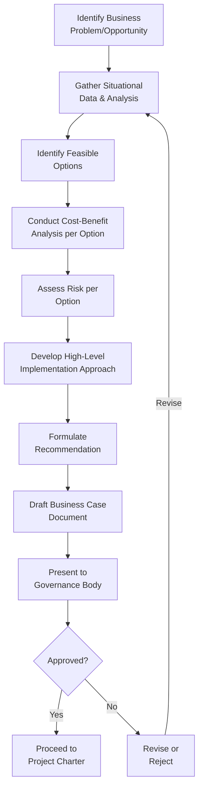

## Building a Business Case

### Definition and Purpose

A Business Case is a documented, structured justification for undertaking a project, articulating the problem or opportunity, the proposed solution, expected benefits, costs, risks, and alternatives considered. It provides the formal decision-making artifact that governance bodies (steering committees, portfolio boards, sponsors) use to determine whether a proposed initiative merits investment.

Where project identification and selection determines *which* candidate projects are worth evaluating, the business case provides the detailed evidence and reasoning behind a specific candidate — it is typically developed for a project that has already passed initial screening and now requires formal justification and approval.

### Purpose and Role in the Project Lifecycle

- Provides the economic and strategic justification needed to secure funding and organizational commitment
- Establishes the baseline definition of expected value, against which benefits realization will later be measured
- Documents alternatives considered and why the recommended approach was chosen over them
- Serves as an input to the Project Charter, translating business justification into project authorization
- Provides a reference point throughout the project to confirm continued strategic and financial viability, particularly at phase gates

### Typical Structure and Components

**1. Executive Summary**

A concise overview of the problem, proposed solution, and expected outcome, intended for senior decision-makers who may not read the full document.

**2. Problem or Opportunity Statement**

A clear articulation of the business need driving the initiative — a gap between current and desired state, a market opportunity, or a compliance obligation.

**3. Analysis of the Situation**

Context on root causes, contributing factors, and the consequences of inaction, often supported by data or market research.

**4. Options Analysis**

Evaluation of feasible alternatives, typically including:

- **Do nothing** — the baseline scenario, useful for comparison
- **Minimal investment option** — a lower-cost, lower-benefit approach
- **Recommended option** — the proposed solution, with justification for its selection over alternatives
- **Alternative or expanded option** — a higher-investment approach, if relevant, to demonstrate a broader range was considered

**5. Cost-Benefit Analysis**

Financial evaluation of each option, typically incorporating the selection techniques covered in project selection (NPV, IRR, payback period, BCR), alongside qualitative benefits where financial quantification is impractical.

**6. Risk Assessment**

High-level identification of key risks associated with pursuing (or not pursuing) the initiative, including risks specific to each option considered.

**7. Implementation Approach and Timeline**

A high-level outline of how the recommended option would be delivered, including rough timeline and major milestones — deliberately less detailed than the schedule that will later be developed during formal planning.

**8. Recommendation**

A clear statement of the preferred option and the rationale supporting it, directly addressing the decision the governance body is being asked to make.

### Business Case Development Workflow

**Key Points**

- A well-constructed business case presents multiple options, not just the preferred one — a single-option document reads as advocacy rather than analysis and weakens governance confidence in the recommendation
- The business case establishes the benefits baseline that benefits-realization tracking (part of the Delivery Performance Domain) will later measure against
- Business cases are typically revisited at major phase gates to confirm the original justification still holds, particularly on long-duration projects where market or organizational conditions may have shifted

### Business Case vs. Project Charter

| Aspect | Business Case | Project Charter |
| --- | --- | --- |
| Primary purpose | Justify whether to invest | Formally authorize the project and PM |
| Audience | Governance/investment decision-makers | Project team, sponsor, key stakeholders |
| Content focus | Problem, options, cost-benefit, risk, recommendation | Objectives, high-level scope, PM authority, milestones |
| Timing | Developed before project approval | Developed once the project is approved |
| Level of detail | Broad, comparative across options | Specific to the approved, single option |

### Example

**Scenario**: A regional retail chain is evaluating whether to replace its aging point-of-sale (POS) system.

- **Problem statement**: Current POS hardware experiences frequent outages, causing an estimated 3% of transactions to be lost or delayed during peak hours, and the vendor has announced end-of-support within 18 months.
- **Options considered**:
  - *Do nothing*: Continue operating unsupported hardware, accepting rising outage risk and no vendor support
  - *Minimal investment*: Extend support contract with the current vendor at a premium, delaying replacement by two years
  - *Recommended option*: Full POS replacement across all 40 stores with a modern cloud-based system
  - *Expanded option*: Full replacement plus integrated inventory and loyalty program modules
- **Cost-benefit analysis**: The recommended option shows a positive NPV over five years driven by reduced transaction loss and lower long-term maintenance costs, with a payback period of approximately 2.3 years; the expanded option has a longer payback period but higher long-term strategic value.
- **Risk assessment**: Implementation risk during peak holiday season is flagged as significant; vendor dependency risk is noted for the do-nothing and minimal-investment options.
- **Recommendation**: The business case recommends the standard replacement option (not the expanded option), citing a stronger near-term financial case, with the loyalty and inventory modules proposed as a follow-on project once the core POS replacement is stable.

### Common Pitfalls

- **Presenting only the preferred option** — omitting genuine alternatives (including a credible "do nothing" baseline) weakens the analytical credibility of the recommendation
- **Overstating benefits or understating costs** — optimism bias in benefit estimation undermines the business case's later use as a benefits-realization baseline
- **Neglecting qualitative or strategic benefits** — over-reliance on purely financial metrics can undervalue options with strong strategic but harder-to-quantify value
- **Treating the business case as a one-time document** — failing to revisit and validate the business case at major phase gates risks continuing a project whose original justification no longer holds
- **Insufficient risk assessment at the option level** — evaluating risk only for the recommended option, without comparing risk exposure across alternatives, gives decision-makers an incomplete picture

### Practical Workflow

1. Clearly articulate the business problem or opportunity driving the potential project
2. Gather supporting data and situational analysis to substantiate the need
3. Identify a realistic range of options, including a "do nothing" baseline
4. Conduct cost-benefit analysis for each option using appropriate financial techniques
5. Assess risk exposure associated with each option, including the risk of inaction
6. Develop a high-level implementation approach and timeline for the recommended option
7. Formulate a clear, well-supported recommendation
8. Draft the business case document, tailoring length and formality to organizational governance expectations
9. Present to the governance body and be prepared to defend or revise based on feedback
10. Retain the approved business case as the benefits baseline for use throughout project execution and closure

**Related Topics**

- Identifying and Selecting Projects
- Project Charter Development
- Cost-Benefit Analysis Techniques
- Benefits Realization Management
- Delivery Performance Domain
- Stakeholder Engagement in Governance Decisions