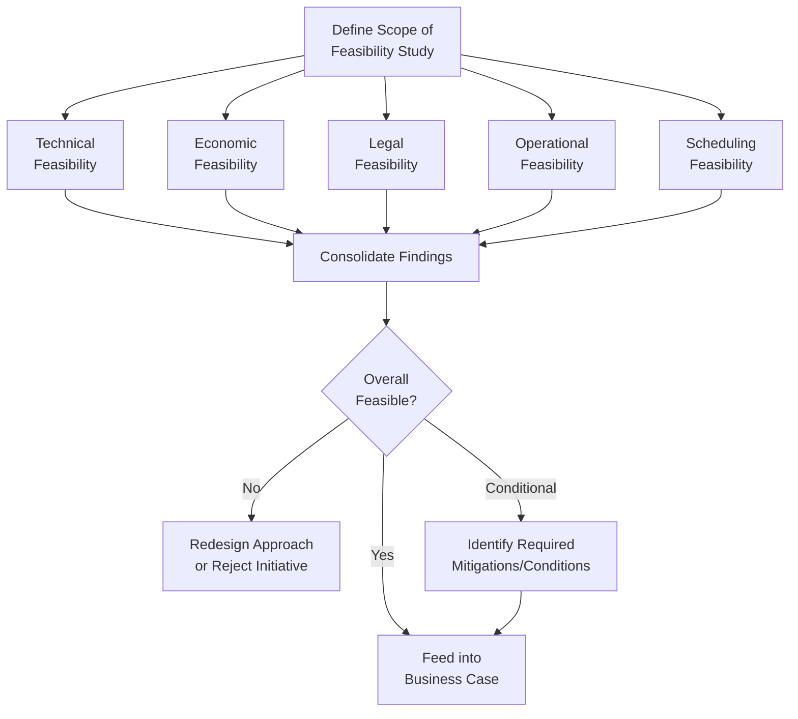

## Feasibility Studies

### Definition and Purpose

A Feasibility Study is a structured analysis conducted to determine whether a proposed project is practically achievable and worth pursuing, evaluating it across multiple dimensions — technical, economic, operational, legal, and scheduling — before significant resources are committed. It provides an evidence-based answer to the question "can this be done, and should it be done," distinct from the business case, which addresses "should we invest given the expected value."

Feasibility studies are commonly conducted alongside or as an input to business case development, particularly for projects involving significant technical uncertainty, novel technology, or substantial capital investment where the risk of infeasibility is non-trivial.

### Purpose Within Project Initiation

- Reduce the risk of committing resources to a project that cannot realistically be delivered as conceived
- Surface technical, operational, or regulatory obstacles early, when redirection is least costly
- Provide objective, structured input to the business case's options analysis and risk assessment
- Validate underlying assumptions before they become embedded in project scope, schedule, or budget commitments
- Support informed go/no-go decision-making at the earliest practical point in the project lifecycle

### The TELOS Framework

A widely used framework for structuring feasibility analysis across five dimensions:

**1. Technical Feasibility**

Whether the required technology, technical expertise, and infrastructure exist or can reasonably be acquired to deliver the proposed solution. Considerations include technology maturity, integration complexity with existing systems, and availability of technical skills.

**2. Economic Feasibility**

Whether the projected costs are justified by projected benefits, using techniques similar to those in project selection (NPV, IRR, payback period, cost-benefit analysis), but focused specifically on whether the numbers make the project viable at all, rather than comparing it against competing candidates.

**3. Legal Feasibility**

Whether the proposed project can be legally executed given applicable laws, regulations, contractual obligations, intellectual property considerations, and permitting requirements.

**4. Operational Feasibility**

Whether the organization has the operational capacity, processes, and change-readiness to implement and sustain the solution once delivered — including whether end users will actually adopt it and whether existing operations can absorb the transition.

**5. Scheduling Feasibility**

Whether the project can realistically be completed within the timeframe required by the business need, accounting for resource availability, dependencies, and known constraints.

### Feasibility Study Structure

**Key Points**

- A feasibility study can produce three outcomes, not just a binary pass/fail — feasible, infeasible, or conditionally feasible pending specific mitigations
- Feasibility across the five TELOS dimensions is interdependent; a technically feasible solution can still be operationally infeasible if the organization lacks change-readiness or user buy-in
- Feasibility studies are most valuable early, before significant planning investment — conducting one after major resources are already committed defeats much of their risk-reduction purpose

### Feasibility Assessment Matrix

A common way to consolidate findings across dimensions for decision-makers:

| Dimension | Assessment | Key Risk/Concern | Mitigation Available? |
| --- | --- | --- | --- |
| Technical | Feasible | Integration with legacy ERP system | Yes — phased integration approach |
| Economic | Feasible | Payback period longer than typical threshold | Yes — extended evaluation horizon justified by strategic value |
| Legal | Conditionally feasible | Pending data residency regulation clarification | Yes — legal review in progress |
| Operational | Conditionally feasible | Significant change management required for field staff | Yes — phased rollout with training program |
| Scheduling | Feasible | Vendor lead time is a critical path dependency | Partial — early vendor engagement recommended |

### Depth and Rigor of Feasibility Studies

[Inference] The appropriate depth of a feasibility study is itself a tailoring decision — a small, low-risk internal initiative typically warrants a brief, informal feasibility assessment, while a large capital project, a novel technology adoption, or a regulated-industry initiative usually justifies a formal, documented study with dedicated subject matter expert input, since the cost of discovering infeasibility late scales with project size and commitment.

### Example

**Scenario**: A regional hospital network is considering deploying an AI-assisted diagnostic imaging tool across its facilities.

- **Technical feasibility**: Assessment confirms the required imaging infrastructure exists at flagship facilities but would require hardware upgrades at two smaller regional sites; the vendor's integration API is compatible with the hospital's existing PACS (Picture Archiving and Communication System).
- **Economic feasibility**: Cost-benefit analysis projects a positive return driven primarily by reduced diagnostic turnaround time and fewer repeat imaging studies, though the payback period exceeds the hospital's typical three-year threshold, requiring executive justification based on quality-of-care benefits.
- **Legal feasibility**: Regulatory review identifies that the AI tool's diagnostic outputs must be used as a decision-support aid rather than an autonomous diagnostic authority, per current medical device regulations — a constraint that shapes but does not block implementation.
- **Operational feasibility**: Radiologist and clinical staff interviews reveal cautious openness contingent on adequate training time and a clear liability framework for AI-assisted findings; a phased rollout with a defined feedback loop is identified as a mitigating approach.
- **Scheduling feasibility**: Vendor implementation timeline is compatible with the hospital's target launch window, though hardware procurement lead time at the two smaller sites is flagged as a scheduling risk requiring early ordering.
- **Outcome**: The study concludes the project is **conditionally feasible**, with specific mitigations (phased rollout, early hardware procurement, defined liability framework) carried forward into the business case's risk assessment and implementation approach.

### Common Pitfalls

- **Conducting feasibility analysis after major commitments are made** — sunk-cost pressure can bias findings or reduce willingness to act on discovered infeasibility
- **Focusing narrowly on technical or economic feasibility alone** — neglecting operational or legal feasibility can allow a technically sound, financially attractive project to fail on adoption or compliance grounds
- **Treating a "conditionally feasible" finding as equivalent to "feasible"** — proceeding without genuinely addressing the identified conditions carries forward unmitigated risk
- **Insufficient stakeholder input during operational feasibility assessment** — assessing operational feasibility without consulting the people who will actually use or be affected by the solution risks an inaccurate readiness picture
- **Over-scoping feasibility studies for low-risk initiatives** — applying the same rigor and cost to a small, well-understood project as to a large novel one wastes resources disproportionate to the risk being managed

### Practical Workflow

1. Define the scope and appropriate depth of the feasibility study based on project size, novelty, and risk
2. Assess technical feasibility, including technology maturity, integration complexity, and skills availability
3. Assess economic feasibility using cost-benefit techniques appropriate to the investment scale
4. Assess legal feasibility, including regulatory, contractual, and intellectual property considerations
5. Assess operational feasibility, incorporating input from the people and processes that will be affected
6. Assess scheduling feasibility against required timelines and known resource or vendor constraints
7. Consolidate findings across all dimensions, identifying interdependencies and conflicts between them
8. Determine an overall feasibility conclusion — feasible, infeasible, or conditionally feasible — with clearly identified mitigations where applicable
9. Feed findings into the business case's options analysis and risk assessment

**Related Topics**

- Building a Business Case
- Identifying and Selecting Projects
- Risk Assessment Techniques
- Change Management and Operational Readiness
- Regulatory Compliance in Project Planning
- Cost-Benefit Analysis Techniques