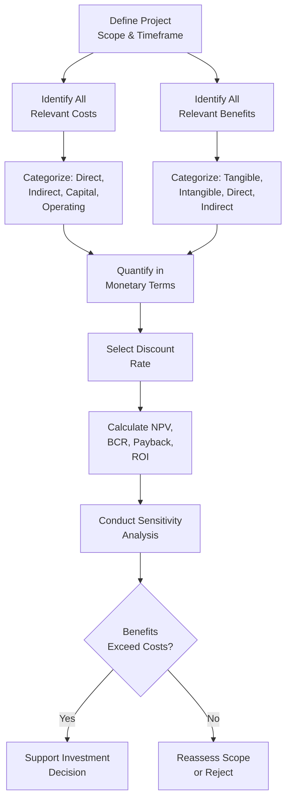

## Cost Benefit Analysis

### Definition and Purpose

Cost Benefit Analysis (CBA) is a systematic technique for estimating and comparing the total expected costs of a project against its total expected benefits, expressed in comparable terms (typically monetary), to support investment decision-making. It provides the quantitative backbone underlying project selection, business case development, and feasibility economic assessment — a single analytical technique applied across multiple stages of project initiation.

CBA answers a specific question: does the value this project is expected to generate exceed what it will cost to deliver, and by how much relative to alternatives?

### Purpose and Applications

- Determine whether a proposed project's benefits justify its costs in absolute terms
- Compare competing project alternatives on a consistent quantitative basis
- Support the economic feasibility dimension of a feasibility study
- Provide the financial evidence underlying a business case's options analysis
- Establish a benefits baseline for later benefits-realization tracking

### Core Components

**1. Cost Identification**

- **Direct costs** — labor, materials, equipment directly attributable to the project
- **Indirect costs** — overhead, administrative support, shared infrastructure
- **Capital costs** — one-time investment in assets, equipment, or infrastructure
- **Operating costs** — ongoing costs to maintain and run the delivered solution post-implementation
- **Opportunity costs** — the value of alternatives foregone by committing resources to this project instead

**2. Benefit Identification**

- **Tangible/financial benefits** — direct revenue increase, cost savings, cost avoidance
- **Intangible benefits** — improved customer satisfaction, brand reputation, employee morale, strategic positioning
- **Direct benefits** — accrue immediately or predictably from project outputs
- **Indirect benefits** — secondary effects, harder to attribute directly and quantify

**3. Time Value of Money**

Because costs and benefits typically occur at different points in time, CBA generally discounts future cash flows to present value using an appropriate discount rate, reflecting the principle that a dollar received in the future is worth less than a dollar received today.

$$PV = \frac{FV}{(1+r)^n}$$

where $PV$ is present value, $FV$ is future value, $r$ is the discount rate, and $n$ is the number of periods.

### Core Analytical Techniques

**Net Present Value (NPV)**

$$NPV = \sum_{t=0}^{n} \frac{B_t - C_t}{(1+r)^t}$$

where $B_t$ and $C_t$ are the benefits and costs in period $t$. A positive NPV indicates the project is expected to generate more value than it costs, in present-value terms.

**Benefit-Cost Ratio (BCR)**

$$BCR = \frac{\text{Present Value of Benefits}}{\text{Present Value of Costs}}$$

A BCR greater than 1.0 indicates benefits exceed costs; a BCR below 1.0 indicates the reverse. BCR is particularly useful for comparing projects of different absolute scale, since it expresses value relative to investment size rather than as a single dollar figure.

**Payback Period**

The time required for cumulative net benefits to equal the initial investment, calculated simply as:

$$\text{Payback Period} = \frac{\text{Initial Investment}}{\text{Annual Net Cash Inflow}}$$

for projects with roughly even cash flows; for uneven cash flows, it is calculated by cumulative summation until the investment is recovered.

**Return on Investment (ROI)**

$$ROI = \frac{\text{Net Benefit}}{\text{Total Cost}} \times 100\%$$

A straightforward percentage measure of value generated per unit of cost invested, often used alongside NPV/BCR for intuitive communication to non-financial stakeholders.

### CBA Process Flow

**Key Points**

- CBA quantifies value in monetary terms wherever feasible, but should explicitly acknowledge intangible benefits and costs that resist quantification rather than silently omitting them from the decision picture
- The discount rate selected can materially change the outcome of an NPV analysis; organizations typically use a standard rate tied to their cost of capital or required rate of return, applied consistently across comparable projects
- No single metric tells the complete story — NPV, BCR, payback period, and ROI each highlight different aspects of value and are typically presented together

### Sensitivity Analysis

Because cost and benefit estimates carry inherent uncertainty, a robust CBA tests how sensitive the conclusion is to changes in key assumptions:

| Variable Tested | Base Case NPV | Pessimistic Case NPV | Optimistic Case NPV |
| --- | --- | --- | --- |
| Discount rate (8% base) | $420,000 | $310,000 (at 12%) | $560,000 (at 5%) |
| Benefit realization delay | $420,000 | $280,000 (12-month delay) | $420,000 (no delay) |
| Implementation cost overrun | $420,000 | $190,000 (+25% cost) | $420,000 (on budget) |

[Inference] A conclusion that remains positive across a reasonable range of pessimistic assumptions is generally treated as more decision-worthy than one that depends heavily on optimistic, best-case inputs — though what counts as a "reasonable range" itself requires judgment specific to the project's risk profile.

### Example

**Scenario**: A logistics company is evaluating whether to invest in automated sorting equipment at a distribution center.

- **Costs identified**: $1.2M capital investment for equipment and installation; $80,000 annual maintenance; $150,000 one-time staff retraining cost
- **Benefits identified**: $320,000 annual labor cost reduction; $95,000 annual reduction in mis-sorted package claims; intangible benefit of improved on-time delivery reputation (not quantified in the base case)
- **Discount rate**: The company applies its standard 9% cost of capital
- **Analysis over a 5-year horizon**: NPV calculates to approximately $480,000 positive; BCR of 1.28; payback period of approximately 3.1 years
- **Sensitivity check**: Even under a pessimistic scenario assuming only 70% of projected labor savings materialize (accounting for slower-than-expected adoption), NPV remains positive at approximately $180,000
- **Decision**: The positive NPV under both base and pessimistic scenarios, combined with the unquantified reputational benefit, supports proceeding with the investment

### Common Pitfalls

- **Omitting intangible benefits or costs entirely** — because they are hard to quantify, intangible factors are sometimes dropped from analysis rather than acknowledged qualitatively alongside the quantified figures
- **Selecting an inappropriate or inconsistent discount rate** — using a rate that does not reflect the organization's actual cost of capital, or using different rates across comparable projects, undermines comparability
- **Ignoring opportunity costs** — evaluating a project in isolation without considering what else the same resources could achieve overstates its relative attractiveness
- **Overconfidence in point estimates** — presenting a single NPV figure without sensitivity analysis conceals the underlying uncertainty in the input assumptions
- **Double-counting benefits** — particularly common when a benefit contributes to multiple downstream effects that are each separately quantified, inflating the apparent total value

### Practical Workflow

1. Define the project scope and the time horizon over which costs and benefits will be assessed
2. Identify all relevant costs, categorized as direct, indirect, capital, and operating
3. Identify all relevant benefits, distinguishing tangible/quantifiable from intangible/qualitative
4. Quantify costs and benefits in monetary terms wherever reasonably possible
5. Select an appropriate, organizationally consistent discount rate
6. Calculate NPV, BCR, payback period, and ROI as appropriate to the decision context
7. Conduct sensitivity analysis across key uncertain assumptions
8. Present findings alongside unquantified intangible factors, avoiding a false sense of complete quantification
9. Use the analysis to support — not replace — the broader business case and feasibility decision

**Related Topics**

- Building a Business Case
- Identifying and Selecting Projects
- Feasibility Studies
- Benefits Realization Management
- Discount Rate and Cost of Capital
- Sensitivity and Scenario Analysis