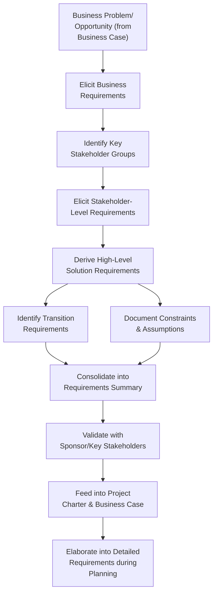

## Defining High Level Requirements

### Definition and Purpose

Defining High Level Requirements is the process of capturing broad, top-level statements of what a project must achieve or deliver, expressed at a level of detail appropriate for initiation-stage documents such as the business case and project charter. High-level requirements describe the essential capabilities, constraints, and outcomes the project must satisfy — without yet specifying the detailed functional, technical, or design specifications that will be elaborated during formal planning.

This activity bridges the gap between a business case's problem/opportunity statement and the detailed requirements gathering that occurs once a project is formally chartered and scope definition begins in earnest.

### Purpose Within Project Initiation

- Provide enough definition of project outcomes to support charter development and initial scope boundaries
- Establish a shared, high-level understanding among sponsors, stakeholders, and the project team of what success looks like
- Prevent premature over-specification that could constrain solution design before detailed analysis occurs
- Serve as the foundation from which detailed requirements will later be elaborated during the Planning Performance Domain
- Support initial resource, schedule, and cost estimation, which requires some definition of scope even before detailed planning

### Distinguishing High-Level from Detailed Requirements

| Aspect | High-Level Requirements | Detailed Requirements |
| --- | --- | --- |
| Timing | Initiation stage | Planning/execution stage |
| Level of detail | Broad capability or outcome statements | Specific, testable, unambiguous specifications |
| Purpose | Define scope boundaries for charter/business case | Guide design, development, and acceptance testing |
| Example | "System shall support online customer payments" | "System shall process Visa/Mastercard transactions with 3D Secure authentication within 2 seconds" |
| Owner | Sponsor, business stakeholders | Business analysts, product owners, technical teams |

### Categories of High-Level Requirements

**1. Business Requirements**

The high-level needs of the organization as a whole, describing why the project exists (e.g., "reduce customer onboarding time by 50%").

**2. Stakeholder Requirements**

Needs of specific stakeholder groups or classes, describing what particular stakeholders need from the solution (e.g., "field technicians require offline access to job data").

**3. Solution Requirements**

High-level characteristics the delivered solution must have, often further divided into:

- **Functional requirements** — what the solution must do (e.g., "generate monthly compliance reports")
- **Non-functional requirements** — quality attributes the solution must exhibit (e.g., performance, security, availability, usability)

**4. Transition Requirements**

High-level needs related to moving from the current state to the future state (e.g., "legacy data must be migrated without loss," "staff require training prior to go-live").

**5. Constraints and Assumptions**

Boundaries within which the solution must operate (budget ceilings, regulatory mandates, technology standards) and assumptions being made in the absence of confirmed information.

### High-Level Requirements Development Flow

**Key Points**

- High-level requirements should be specific enough to bound scope and support estimation, but not so detailed that they prematurely lock in a specific technical solution before design work begins
- Requirements at this stage typically originate from multiple sources (business objectives, stakeholder needs, regulatory mandates) that must be reconciled and prioritized
- The requirements captured here are expected to be elaborated — not finalized — during subsequent planning; treating them as immutable at this stage risks unnecessary scope rigidity later

### Requirements Elicitation Techniques (High-Level Stage)

- **Stakeholder interviews** — direct conversations with sponsors and key stakeholder representatives to surface primary needs
- **Workshops and facilitated sessions** — group sessions to align on shared high-level objectives across stakeholder groups
- **Document analysis** — reviewing existing business strategy documents, regulatory mandates, or prior related initiatives
- **Benchmarking** — comparing against how similar organizations or competitors have addressed comparable needs
- **Observation** — direct observation of current-state processes to identify gaps that inform requirement statements

### Prioritization at the High Level

Even at this early stage, not all requirements carry equal weight. A simple prioritization scheme helps focus subsequent planning:

- **Must-have (Mandatory)** — required for the solution to be viable or compliant; the project cannot succeed without it
- **Should-have (High priority)** — significant value, but the project could proceed without it if constrained
- **Could-have (Desirable)** — beneficial but not essential; often deferred if resources are constrained
- **Won't-have (Out of scope for this phase)** — explicitly excluded, documented to manage expectations and prevent scope ambiguity

[Inference] This MoSCoW-style categorization is more commonly formalized in agile-influenced initiation practices, but the underlying discipline — distinguishing mandatory needs from desirable ones — is broadly useful regardless of the eventual development approach, since it directly informs how the business case's "minimal investment" option is defined.

### Example

**Scenario**: A university is initiating a project to modernize its student registration system.

- **Business requirement**: Reduce average registration processing time from 15 minutes to under 3 minutes per student.
- **Stakeholder requirements**: Students require mobile-accessible registration; academic advisors require real-time visibility into prerequisite conflicts; registrar's office requires audit-compliant record-keeping.
- **High-level solution requirements**:
  - Functional: "System shall allow students to register for courses, view real-time seat availability, and receive prerequisite conflict alerts."
  - Non-functional: "System shall support 5,000 concurrent users during peak registration periods with page load times under 2 seconds."
- **Transition requirements**: "Historical enrollment records for the past 10 years must be migrated without data loss"; "Registrar staff require training prior to the first live registration cycle."
- **Constraints**: Budget ceiling of $2M; must integrate with existing financial aid disbursement system; must comply with FERPA data privacy requirements.
- **Prioritization**: Mobile accessibility and prerequisite conflict alerts are classified as must-have; a self-service waitlist feature is classified as should-have; an AI-based course recommendation engine is classified as could-have and flagged as a potential future-phase addition.

### Common Pitfalls

- **Over-specifying at the high-level stage** — drafting requirements with implementation-level detail before design work begins can prematurely constrain solution options
- **Under-specifying to the point of ambiguity** — requirements so vague they cannot meaningfully bound scope or support cost/schedule estimation undermine the business case and charter
- **Failing to distinguish requirement categories** — conflating business, stakeholder, and solution requirements can obscure whose need is actually being addressed and why
- **Skipping validation with stakeholders** — drafting high-level requirements without confirming them against actual stakeholder and sponsor input risks basing the business case on incorrect assumptions
- **Treating high-level requirements as final** — failing to plan for elaboration during detailed planning can create false confidence in scope certainty that has not yet been rigorously tested

### Practical Workflow

1. Review the business case's problem/opportunity statement as the starting point for requirements elicitation
2. Elicit business-level requirements describing why the project exists and what organizational outcome is sought
3. Identify key stakeholder groups and elicit their high-level needs
4. Derive high-level solution requirements (functional and non-functional) from business and stakeholder input
5. Identify transition requirements related to moving from current to future state
6. Document constraints and assumptions bounding the solution space
7. Apply a simple prioritization scheme to distinguish mandatory from desirable requirements
8. Validate the consolidated set of high-level requirements with the sponsor and key stakeholders
9. Feed validated requirements into the business case and project charter, flagging them for detailed elaboration during formal planning

**Related Topics**

- Building a Business Case
- Project Charter Development
- Requirements Traceability Matrix Design
- Scope Definition and the Work Breakdown Structure
- Stakeholder Analysis and Mapping
- Planning Performance Domain